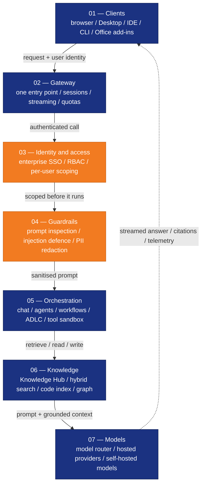

<p align="center">
  <!-- Brand-approved lockups from assets/Logo/. The light file is the transparent
       version for light backgrounds; the dark file is the navy-plate version, which
       stays legible on GitHub's dark theme. PNG rather than SVG because GitHub
       sanitises inline SVG in Markdown. -->
  <picture>
    <source media="(prefers-color-scheme: dark)" srcset="assets/Logo/ainxt-wordmark-dark.png">
    
  </picture>
</p>

# AiNxt Enterprise

[](OSSMETADATA)

> **One Intelligence. Works for Everyone.**
>
> AiNxt brings intelligence into enterprise work, development environments,
> command-line workflows, and the foundations used to build new AI experiences.
> **This repository is AiNxt Enterprise** — the enterprise experience, across
> web and desktop: conversational, agentic, Office and software-lifecycle.
>
> An initiative of [NPCI](https://www.npci.org.in/) — National Payments Corporation of India.

<details>
<summary><b>🆕 New to AiNxt? Start here — no technical knowledge needed</b></summary>

### What is AiNxt Enterprise?

AiNxt Enterprise is a **web application** — like Gmail or Slack, but for working with AI inside your organisation. You open it in a browser, log in, and start chatting with AI that knows your company's documents, follows your organisation's rules, and keeps a record of everything it does.

**You do not need to know how to code to use it.** The setup below is done once by someone on your IT or engineering team. After that, everyone else just opens a browser.

### What can I do with it?

| I want to… | AiNxt can… |
|---|---|
| Ask questions about company documents | Read and summarise PDFs, Word files, spreadsheets |
| Get help writing emails, reports, presentations | Draft, rewrite, translate — in your organisation's tone |
| Automate a repeating task | Build a workflow that runs on a schedule or a trigger |
| Let AI help my team write code | Connect AiNxt Code (the editor plugin) to this platform |
| Make sure AI usage is tracked and governed | Every question and answer is logged, budgeted and auditable |

### What does my IT team need to set it up?

One tool: **Docker** — a program that runs applications in a self-contained box on a server. If your team already uses Docker, setup takes about 15 minutes. If not, [Docker Desktop](https://docs.docker.com/get-docker/) is a free download.

**No cloud account required.** AiNxt Enterprise runs entirely on your own infrastructure — your data never leaves your servers unless you choose a cloud AI model.

### Which AI model does it use?

Whichever one you choose. AiNxt Enterprise works with:
- **Anthropic Claude** (cloud, requires an API key from [anthropic.com](https://www.anthropic.com))
- **OpenAI GPT** (cloud, requires an API key from [platform.openai.com](https://platform.openai.com))
- **Ollama** (free, runs entirely on your own machine — no API key, no internet required)
- Any other AI service that speaks the standard OpenAI format

An **API key** is like a password that lets AiNxt talk to the AI service on your behalf. You create one on the AI provider's website and paste it into AiNxt's settings.

### Where do I go next?

| I am… | Start here |
|---|---|
| **An end user** (just want to use it) | Ask your IT team to set it up, then open the URL they give you |
| **IT / DevOps setting it up for a team** | [Run from source code](#run-from-source-code) · [Enterprise deployment guide](docs/ENTERPRISE_DEPLOYMENT.md) — full multi-user setup |
| **IT / DevOps trying it on one machine first** | [Your first 15 minutes](#your-first-15-minutes) — one command gets you running |
| **A developer building on top of it** | [`docs/GETTING_STARTED.md`](docs/GETTING_STARTED.md) — full configuration reference |
| **Evaluating AiNxt for your organisation** | Read [What the platform actually gives you](#what-the-platform-actually-gives-you) |

</details>

[](LICENSE)


[](CONTRIBUTING.md)
[](SECURITY.md)

<p align="center">
  
</p>
<p align="center">
  <sub>A real answer from a running install — note the model, token counts, cost and
  latency recorded against every turn, and the spend gauge bottom-left. More screens
  under <a href="#what-the-platform-actually-gives-you">What the platform actually gives you</a>.</sub>
</p>

---

## Which path is right for you?

| I want to… | My path |
|---|---|
| **Try AiNxt on my own machine** — one person, see what it does | ↓ Run the one-liner below. Done in 15 minutes. |
| **Set up AiNxt for my team or organisation** — multi-user, production, SSO, LDAP | → [Run from source code](#run-from-source-code) · [Enterprise deployment guide](docs/ENTERPRISE_DEPLOYMENT.md) |

---

## Try it — one command

**You only need Docker** (~10 GB memory, ~16 GB disk). Nothing else to install.

```bash
# macOS and Linux
curl -fsSL https://raw.githubusercontent.com/npci/ainxt-enterprise/main/install.sh | bash
```

> **Windows:** you need WSL2 + Docker Desktop with WSL integration enabled before running this. First time? [Step-by-step Windows setup](#-windows) in Your first 15 minutes walks you through it.

```powershell
# Windows (runs inside WSL2 — complete the setup above first)
wsl bash -lc "curl -fsSL https://raw.githubusercontent.com/npci/ainxt-enterprise/main/install.sh | bash"
```

The installer clones the repository into an `ainxt-enterprise/` folder in your current directory, brings up PostgreSQL, Redis, Kafka, Ollama, the API and the web UI, creates the schema, and **prints your login at the end**:

```
  AiNxt — Default admin user created
  Email    : admin@ainxt.local
  Password : <generated once, shown here only>
```

First run takes 5–15 minutes while images build. Then open **<http://localhost:5173/portal/>**.

> **After the install, `cd ainxt-enterprise/`** — that is where `./doctor.sh`, `./kb-setup.sh`, `./stop-local.sh` and `docker-compose.yml` live. All commands in this README that start with `./` are run from inside that folder.

Step-by-step walkthrough: [**Your first 15 minutes**](#your-first-15-minutes)

---

## What is AiNxt?

AiNxt is not four separate tools that happen to share a name. It is one
intelligence layer that shows up differently depending on where you work — and
every one of those surfaces stands on the same foundation, passes through the
same guardrails and draws on the same choice of models.

**For individuals** — ask questions, understand information, create and modify
software, automate routine work, and work alongside agents, from whichever
surface you already use.

**For organisations** — bring AI into teams and enterprise workflows with
governed access, organisational context, security, accountability, and the
ability to build capabilities tailored to the business.

You would run AiNxt if you want your own agents, on your own infrastructure,
against your own models and data — rather than sending your documents to
somebody else's service.

<p align="center">
  
</p>

<p>
  Four layers, read top-down: <b>where you work</b> (browser · desktop · Office) →
  <b>the experiences</b> (Chat · Buddy · Coach · Agent Studio · ADLC — Agentic Development Lifecycle) →
  <b>enterprise context &amp; control</b> (knowledge · role scoping · guardrails · observability) →
  <b>models — BYOM</b> (hosted · self-hosted · chosen per use case).
  Whichever surface you open, it draws on the same spine and passes the same controls.
</p>

---

## Four products, one suite

AiNxt is four products sharing one intelligence layer. **This repository is
AiNxt Enterprise.**

| | Product | What it provides | Primary users |
|---|---|---|---|
| 01 | **AiNxt Enterprise** ← *this repo* | The governed enterprise AI environment, across web and desktop | Individuals, teams, organisations |
| 02 | **[AiNxt OS](https://github.com/npci/ainxt-os)** | The foundation for building your own applications, agents and workflows | Developers, platform teams |
| 03 | **[AiNxt Code](https://github.com/npci/ainxt-code)** | AI inside the editor — complete, rewrite, explain, fix | Developers |
| 04 | **[AiNxt CLI](https://github.com/npci/ainxt-cli)** | AI in the terminal — ask, build, fix, automate, execute | Developers, technical teams |

None of them is a satellite of another: they are peers on a shared foundation.
See [How this fits with the other AiNxt repositories](#how-this-fits-with-the-other-ainxt-repositories).

----
**Are the four products the same product?** 

    No. AiNxt Suite is the umbrella, each product addresses a different way of working with AI.

**Is AiNxt OS the user interface for AiNxt Enterprise?** 

    No — they are distinct products. AiNxt OS is a foundation for building AI experiences; 
    AiNxt Enterprise is an enterprise-facing experience across web and desktop.

**Where do I find the other repositories?** Each product has its own, and each
README is that product's documentation:

| Product | Source | Documentation |
|---|---|---|
| AiNxt Enterprise | [`npci/ainxt-enterprise`](https://github.com/npci/ainxt-enterprise) | you are reading it |
| AiNxt OS | [`npci/ainxt-os`](https://github.com/npci/ainxt-os) | [README](https://github.com/npci/ainxt-os#readme) |
| AiNxt Code | [`npci/ainxt-code`](https://github.com/npci/ainxt-code) | [README](https://github.com/npci/ainxt-code#readme) |
| AiNxt CLI | [`npci/ainxt-cli`](https://github.com/npci/ainxt-cli) | [README](https://github.com/npci/ainxt-cli#readme) |

---

## What AiNxt Enterprise gives you

| Capability | What it is | Docs |
|---|---|---|
| **AiNxt Chat** | Conversational access to enterprise-aware intelligence for questions, analysis and everyday work | [chat](docs/chat/chat.md) · [core chat](docs/chat/core_chat.md) |
| **AiNxt Buddy** | A coworker-like assistant on the local machine that connects to external apps and organises routine work — with your own persona | [cowork desktop](docs/cowork/cowork_desktop.md) · [canvas](docs/cowork/cowork_canvas.md) |
| **Enterprise Knowledge Hub** | Organisational knowledge in one place, discoverable and usable | [knowledge base](docs/knowledge/knowledge_base.md) · [knowledge graph](docs/knowledge/knowledge_graph.md) · [setup guide](docs/KB_SETUP.md) |
| **AiNxt Coach** | An AI mentor that helps people learn effective AI usage | [coach](docs/coach/coach.md) · [coach system](docs/coach/coach_system.md) |
| **Agent Studio** | Build specialised agents around business needs and workflows | [agent system](docs/agents/agent_system.md) · [orchestration](docs/agents/agent_orchestration.md) · [swarm](docs/agents/swarm.md) |
| **[Office add-ins](#office-add-in-outlook-word-excel-powerpoint)** | Intelligence inside Outlook, Word, Excel and PowerPoint, where people already work | [office](docs/documents/office.md) |
| **ADLC** | Agentic Development Lifecycle — intelligence across the software lifecycle | [SDLC pipeline](docs/sdlc/sdlc_pipeline.md) · [governance](docs/sdlc/sdlc_governance.md) · [setup guide](docs/SDLC_CLI_SETUP.md) |
| **Eval & observability** | Quality, usage, performance and cost, per request | [evals dashboard](docs/observability/evals_dashboard.md) · [monitoring](docs/observability/monitoring.md) · [LLM spend](docs/analytics/llm_spend.md) |
| **Built-in guardrails** | Defence against jailbreaks, prompt injection and unsafe interactions | [security](docs/auth/authentication.md) · [RBAC](docs/auth/authentication_rbac.md) |
| **Bring Your Own Model** | Model choice per use case, not per product — see below | [model routing](docs/llm/model_routing.md) · [profiles](docs/llm/profiles.md) · [LLM proxy](docs/llm/llm_proxy.md) |

Screen-by-screen detail: [What the platform actually gives you](#what-the-platform-actually-gives-you).

### Under the hood

| Layer | What ships | Docs |
|---|---|---|
| **Document pipeline** | PDF, DOCX, PPTX, XLSX, HTML → chunking → vector embedding → RAG (retrieval-augmented generation) | [document processing](docs/documents/document_processing.md) · [indexing & search](docs/knowledge/indexing_and_search.md) · [embedding service](docs/knowledge/embedding_service.md) |
| **Model routing** | Unified path to Claude, GPT, Gemini and any OpenAI-compatible endpoint; circuit breaking, retry, spend tracking | [model routing](docs/llm/model_routing.md) · [LLM proxy](docs/llm/llm_proxy.md) · [budget](docs/llm/budget.md) |
| **Integrations** | Jira, Confluence, GitLab, GitHub, Teams, Zoho CRM, Google Workspace, Microsoft 365 | [connectors](docs/connectors/connectors.md) · [integrations](docs/connectors/connectors_integrations.md) |
| **Auth** | JWT, LDAP/AD, Keycloak and Entra (OIDC), SCIM provisioning (automated user sync from your directory), RBAC | [authentication](docs/auth/authentication.md) · [SSO](docs/auth/authentication_sso.md) · [LDAP](docs/auth/authentication_ldap.md) · [RBAC](docs/auth/authentication_rbac.md) · [SCIM](docs/auth/scim_router.md) |
| **Sandbox** | Docker-isolated code execution; fails closed rather than running unsandboxed | [core infrastructure](docs/core/core_infrastructure.md) |
| **Observability** | OTLP (OpenTelemetry Protocol) tracing, Prometheus metrics, structured JSON logs | [observability](docs/core/core_infrastructure_observability.md) · [health & monitoring](docs/observability/health_and_monitoring.md) |

---

## From a question to a governed answer

A single request — typed in a browser, an editor, a terminal or a Word
document — travels down seven stages and comes back up. **Nothing skips a
stage:** the same identity check, the same guardrails and the same telemetry
apply whether the request came from AiNxt Chat or a script in a terminal.



Queries are **scoped before they run, never filtered after**, and tools run
isolated — credentials are never handed to the model.

---

## Bring your own model (BYOM)

AiNxt does not bind the platform to one vendor. Providers and models live in the
database, managed from the **LLM Providers** admin screen — so an administrator
adds a provider, tests it, and its models become selectable everywhere **without
a code change or a restart**.

Five provider families are supported:

| Family | Examples | Needs API key | Needs base URL | Model discovery |
|---|---|:--:|:--:|---|
| **Anthropic** | Claude | ✅ | | ✅ |
| **OpenAI** | GPT | ✅ | | ✅ |
| **Google Gemini** | Gemini | ✅ | | ✅ |
| **OpenAI-compatible** | **OpenRouter**, Together, Groq, vLLM, LiteLLM, or your own internal proxy | ✅ | ✅ | ✅ |
| **Ollama** | Llama, Qwen, DeepSeek, Mistral — self-hosted | | ✅ | tags only |

**OpenRouter** is the `openai_compatible` family: add it with its base URL and
key, discover its catalogue, and route to any model it fronts. The same path
covers Together, Groq, an Azure OpenAI deployment behind an OpenAI-shaped proxy,
or a gateway you run yourself.

Each provider supports **test-connection** before you enable it, and
**discover-models** to preview its catalogue read-only rather than typing model
IDs by hand.

An admin-picked model has **no cross-vendor fallback** — by design. If it fails,
you get an error rather than a silent switch to a different vendor's model, so a
request never quietly leaves the provider you chose
(`gateway_generic_openai.py`).

Of the five families, three also read plain environment variables directly on startup —
`ANTHROPIC_API_KEY`, `OPENAI_API_KEY`, `GEMINI_API_KEY` — and a self-hosted
endpoint via `LOCAL_LLM_BASE_URL`, which is what `./install.sh` configures.
Ollama and OpenAI-compatible providers are configured via base URL only (no env-var shortcut).
Set-up detail in [LLM configuration](#llm-configuration).

> **Scope, stated plainly:** there is no dedicated **AWS Bedrock** or **Vertex
> AI** adapter — those speak their own wire protocols and need an
> OpenAI-compatible proxy in front. Everything that speaks the OpenAI
> chat-completions API works directly.

---

## LLM Providers screen

**LLM Providers** is the admin screen where you register, test and manage every
AI provider the platform can call. It is the primary way to configure models —
no `.env` edits, no restarts.

Open it from the left sidebar (admin section) → **LLM Providers**.

### What you can do here

| Action | How |
|---|---|
| **Add a provider** | Click **Add provider**, choose the family (Anthropic, OpenAI, Gemini, OpenAI-compatible, or Ollama), enter the API key and/or base URL |
| **Test the connection** | Hit **Test connection** before enabling — confirms the key is valid and the endpoint is reachable |
| **Discover models** | Click **Discover models** to pull the provider's catalogue read-only, rather than typing model IDs by hand |
| **Enable / disable** | Toggle a provider on or off without deleting it — useful for maintenance or cost control |
| **Set a default model** | Mark one model as the platform default; users and agents that do not specify a model get this one |
| **Remove a provider** | Delete it when it is no longer needed; any governance rules referencing it are cleared automatically |

### Provider families

| Family | API key | Base URL | Model discovery |
|---|:--:|:--:|---|
| **Anthropic** (Claude) | ✅ | — | ✅ auto |
| **OpenAI** (GPT) | ✅ | — | ✅ auto |
| **Google Gemini** | ✅ | — | ✅ auto |
| **OpenAI-compatible** — OpenRouter, Together, Groq, vLLM, LiteLLM, Azure OpenAI proxy, your own gateway | ✅ | ✅ | ✅ auto |
| **Ollama** — Llama, Qwen, DeepSeek, Mistral, self-hosted | — | ✅ | tags only |

### How it connects to the rest of the platform

Once a provider is registered and enabled here, its models become available
everywhere — **Model Governance** (which users/departments may use which models),
**Budget** (spend limits per model), **Endpoints** (named API routes scoped to a
model), and the per-question model picker in Chat. Nothing else needs to change.

An admin-picked model has **no cross-vendor fallback** by design: if it fails,
the request errors rather than silently switching to a different vendor's model.

### The installer pre-configures one provider

When you run `./install.sh` and choose a provider at the prompt, the installer
writes the API key to `.env` and seeds the LLM Providers table with that
provider already enabled. You can add more providers, or switch the default,
from this screen at any time after first boot — no reinstall needed.

> **Running from source or `.env` only?** Anthropic, OpenAI and Gemini read
> `ANTHROPIC_API_KEY`, `OPENAI_API_KEY` and `GEMINI_API_KEY` directly on startup.
> Ollama and OpenAI-compatible providers use `LOCAL_LLM_BASE_URL` / `OPENAI_COMPATIBLE_BASE_URL`.
> Full env-var reference: [LLM Configuration](#llm-configuration).

---

## Contents

| | |
|---|---|
| **🚀 Trying it out** | [Which path is right for you?](#which-path-is-right-for-you) · [Try it — one command](#try-it--one-command) · [Your first 15 minutes](#your-first-15-minutes) · [Users and roles](#users-and-roles) |
| **🏢 Deploying for an organisation** | [Run from source](#run-from-source-code) · [Configuration](#environment-variables) · [LLM Providers screen](#llm-providers-screen) · [LLM env-var setup](#llm-configuration) · [Enterprise deployment guide](docs/ENTERPRISE_DEPLOYMENT.md) |
| **🔍 What it does** | [What is AiNxt?](#what-is-ainxt) · [What the platform gives you](#what-the-platform-actually-gives-you) · [Four products](#four-products-one-suite) · [BYOM](#bring-your-own-model-byom) |
| **💻 Other ways to use it** | [Desktop app](#desktop-application) · [CLI and IDE](#cli-and-ide-access) · [Office add-in](#office-add-in-outlook-word-excel-powerpoint) · [Document generation](#document-generation-word-powerpoint-excel-pdf) |
| **⚙️ Operating it** | [Is it working?](#is-it-working) · [Event pipeline](#the-event-pipeline-kafka) · [Everyday commands](#everyday-commands) · [Architecture](#architecture) · [Enterprise on-premise deployment](#reference-architecture-enterprise-on-premise-deployment) · [Quick reference](docs/QUICK_REFERENCE.md) |
| **🔗 Other repos** | [How AiNxt fits together](#how-this-fits-with-the-other-ainxt-repositories) · [FAQ](#faq) |
| **📚 Documentation** | [Full index (587 pages)](docs/README.md) · [Getting started](docs/GETTING_STARTED.md) · [Enterprise deployment](docs/ENTERPRISE_DEPLOYMENT.md) · [Knowledge base setup](docs/KB_SETUP.md) · [Codebase indexing](docs/CODEBASE_INDEXING_SETUP.md) · [SDLC CLI setup](docs/SDLC_CLI_SETUP.md) |

---


## Your first 15 minutes

> **This section is for individuals trying AiNxt on their own machine.**
> Setting it up for a team or organisation? → [Run from source code](#run-from-source-code) · [Enterprise deployment guide](docs/ENTERPRISE_DEPLOYMENT.md)

Steps 1–3 get you a running platform. Steps 4–5 are what to do once it is up.

### Step 1 — run the installer

> Already ran the one-liner at the top of this page? **Skip to Step 2.**

---

#### 🪟 Windows

| You need | Why |
|---|---|
| **Windows 10 21H2+ / Windows 11** | WSL2 requirement |
| **WSL2 + a Linux distro** (Ubuntu is fine) | The installer is a bash script; it will not run in PowerShell or `cmd` |
| **Docker Desktop** with **WSL integration enabled** | Otherwise `docker` is not visible inside WSL |
| **~10 GB memory** to Docker, **~16 GB free disk** | Same stack as macOS/Linux |
| Clone inside the WSL filesystem (`~/`), not `/mnt/c` | Avoids Windows/Linux permission and line-ending problems |

The installer is a bash script — it cannot run in PowerShell or `cmd`. You need three things set up first: **WSL2**, **Ubuntu**, and **Docker Desktop** with WSL integration turned on.

**1 — Install WSL2 and Ubuntu**

Open **Command Prompt as Administrator** and run:

```cmd
wsl --install -d Ubuntu
```

Restart Windows when prompted. Open the **Ubuntu** app in the Start menu and complete the one-time username/password setup. Confirm WSL2 is active:

```cmd
wsl -l -v
```

Ubuntu should show `VERSION 2`. If it shows `1`, run `wsl --set-version Ubuntu 2`.

**2 — Install Docker Desktop and enable WSL integration**

1. Download and install [Docker Desktop for Windows](https://www.docker.com/products/docker-desktop/).
2. Open Docker Desktop → **Settings → Resources → WSL Integration**.
3. Toggle **Ubuntu** on and click **Apply & Restart**.

**3 — Verify Docker works inside Ubuntu**

Open the **Ubuntu** terminal and run:

```bash
docker --version && docker compose version && docker info
```

All three must succeed. If `docker` is not found, go back to step 2 and make sure Ubuntu is toggled on, then restart Docker Desktop.

**4 — Clone the repository inside WSL**

> **Important:** clone inside the Ubuntu filesystem (`~/`), not on a Windows drive (`/mnt/c/...`). Windows drives use CRLF line endings which break the installer with the error `env: $'bash\r': No such file or directory`.

```bash
cd ~
git clone https://github.com/npci/ainxt-enterprise.git ainxt-enterprise
cd ainxt-enterprise
```

If you already cloned on a Windows drive and see the `\r` error, fix it with:

```bash
sed -i 's/\r$//' install.sh
```

**5 — Run the installer**

```bash
./install.sh
```

**6 — Verify the install**

```bash
./doctor.sh
```

All checks should pass. Then open **<http://localhost:5173/portal/>** and sign in with `admin@ainxt.local` and the password the installer printed.

---

#### 🍎 macOS and 🐧 Linux

```bash
curl -fsSL https://raw.githubusercontent.com/npci/ainxt-enterprise/main/install.sh | bash
```

| You need | macOS | Linux |
|---|---|---|
| **Docker** | [Docker Desktop](https://www.docker.com/products/docker-desktop/) | Docker Engine 20+ |
| **Memory** | ~10 GB available to Docker | ~10 GB available to Docker |
| **Disk** | ~16 GB free | ~16 GB free |
| **OS** | macOS 13+ (Apple silicon or Intel) | Ubuntu 22.04+ or any modern distro |
| **Anything else** | Nothing — no Python, Node, PostgreSQL or Kafka to install | Nothing — no Python, Node, PostgreSQL or Kafka to install |

> **Linux only:** if `docker info` says permission denied, add yourself to the `docker` group and re-open the shell:
> ```bash
> sudo usermod -aG docker "$USER" && newgrp docker
> ```

---

> **All platforms:** first run takes 5–15 minutes while images build. The installer will ask you one question (which AI provider to use) then print your login at the end — details in Step 2 below.

### Step 2 — choose a model provider, then wait

The installer asks one question before it starts:

```
Which AI provider do you want to use?
  1) Ollama  — free, local, no API key needed  [default]
  2) Anthropic (Claude)
  3) OpenAI (GPT)
  4) Google Gemini
  5) Decide later
```

**Pick Ollama** if you want everything to run locally with no API key and no data
leaving your machine. The installer pulls `llama3.2` (~2 GB) automatically.
Pick a cloud provider if you want frontier-model quality — you will need a paid
API key from that provider. Choose **Decide later** and add a key to `.env`
afterwards.

> **You are not locked in here.** Once the platform is running, you add, remove
> and switch providers at any time from the **LLM Providers** admin screen —
> no restart needed. See [LLM Providers screen](#llm-providers-screen).

First run takes **5-15 minutes** while images build. The installer checks Docker,
generates every secret, starts PostgreSQL, Redis, Kafka, the Kafka consumer,
Ollama (if chosen), the API and the web UI, creates the database schema — then
prints your login at the end:

```
  AiNxt — Default admin user created
  Email    : admin@ainxt.local
  Password : <generated once, shown here only>
```

**Copy that password now.** It is generated per install, not a shared default,
and it is printed once. If you lose it before logging in:

```bash
docker compose logs gateway | grep -A3 'admin user created'
```

### Step 3 — log in

Open **<http://localhost:5173/portal/>** and sign in with the `admin@ainxt.local` email and the password printed above. You will be prompted to change it immediately.

Not sure it worked? From inside the `ainxt-enterprise/` folder, run `./doctor.sh` — it checks every part of the install and tells you exactly what is broken. See [Is it working?](#is-it-working).

### Users and roles

The installer creates **one admin account**. Here is what that means and what to do next.

| Role | Who | What they see and can do |
|---|---|---|
| **Admin** | The person who ran the installer — you | Everything: LLM Providers, Model Governance, Budget, RBAC, SCIM (automated user provisioning), Monitoring, Analytics, all admin screens in the sidebar |
| **Regular user** | Everyone else | Chat, Knowledge Base, Agent Studio, Codebase, SDLC, Buddy, Code — the day-to-day AI features |

> **The sidebar shows different items depending on your role.** Admin screens are only visible to admins. Regular users see the AI features only.

### Step 4 — what to do first

**As the admin — set things up:**

| Do this | Where | Why |
|---|---|---|
| Change the admin password | Profile → Security | You are prompted on first login |
| Create your personal account | Open the login page in a different browser or incognito window → Register | Use this for day-to-day work, not the admin account |
| Add a model provider | left sidebar (admin) → **LLM Providers** | Register, test and enable providers — no restart needed |
| Set model governance | left sidebar (admin) → **Model Governance** | Control which models each user or department may use |
| Let your team register | Share the platform URL — users self-register at the login page | Set `ENABLE_SELF_REGISTRATION=false` in `.env` to require admin-created accounts |

**As a user — explore what it can do:**

| Try this | Where | What it shows you |
|---|---|---|
| Ask a question in **Chat** | left sidebar → Chat | Model routing, and the cost, tokens and latency recorded against every turn |
| Upload a PDF, then ask about it | **Knowledge Base** → upload → Chat | The document pipeline: parse → chunk → embed → retrieve with citations |
| Point **Codebase** at a git repo | left sidebar → Codebase | Repository indexing, so Chat and Code can retrieve from your own source |
| Open **Agent Studio** | left sidebar | Building a specialised agent without writing code |
| Check **Monitoring** | left sidebar (admin) | Spend, usage and quality per user and per model |

Every screen in the sidebar is inventoried in [What the platform actually gives you](#what-the-platform-actually-gives-you), including which ones need the desktop app and which ship switched off.

### Step 5 — the other ways in

Once the platform is running, the same account reaches it from four more places:

| Surface | Get started |
|---|---|
| **Desktop app** — local files, local tools, Buddy | [Desktop application](#desktop-application) |
| **Terminal** — `ainxt` CLI | [CLI and IDE access](#cli-and-ide-access) |
| **IDE** — VS Code / IntelliJ | [CLI and IDE access](#cli-and-ide-access) |
| **Office** — Outlook, Word, Excel, PowerPoint | [Office add-in](#office-add-in-outlook-word-excel-powerpoint) |

> **Kafka is required for data persistence.** It is part of the default stack and the
> installer sets it up for you — there is nothing extra to run. It is called out
> here because the platform does **not** write most of its rows synchronously:
> the gateway publishes an event and returns, and a separate consumer performs
> the `INSERT`. Without it, chat history, audit entries and usage rows are never written.
> (`KAFKA_ENABLED=false` queues events to Redis as a short-term fallback, but is not a production substitute.)
> See [The event pipeline](#the-event-pipeline-kafka) for full detail.
### Supported platforms

| Platform | Status | Notes |
|---|---|---|
| **macOS** (Apple silicon / Intel) | Verified | Docker Desktop. Tested on macOS 14, arm64 |
| **Linux** (x86_64 / arm64) | Verified | Tested on Ubuntu 24.04. `lsof` and `openssl` are optional — the installer falls back if either is missing. If `docker info` says permission denied, add yourself to the `docker` group |
| **Windows** | Via WSL2 | Run the installer from a **WSL2 shell** with Docker Desktop's WSL integration enabled for your distro. It is a bash script and will not run in PowerShell or `cmd` |

The default stack uses named volumes only — no host bind mounts — so paths behave
identically on all three. (The opt-in `observability` profile does bind-mount
`prometheus.yml` and `grafana/provisioning`; on Windows run that profile from
inside WSL2 so the paths resolve.)

---

## What the platform actually gives you

Everything below is a screen in the left sidebar of the running platform. The
grouping is the sidebar's own. Nothing here is aspirational — if it is listed, it
is in this repository.

**📚 Deep-dive docs for every feature listed here:** [`docs/README.md`](docs/README.md) — 587 pages grouped by topic (chat, agents, analytics, connectors, auth, SDLC, security, UI, and more). Each screen in the table below has one or more dedicated reference pages.

Two columns need reading before the table: **Desktop** means the feature is
unavailable in a browser and needs the desktop application; **Default** flags
screens that are switched *off* on a fresh install (or admin-only) — you will not see
them until you enable them or log in as admin.

| Screen | What it is for | Docs | Desktop | Default |
|---|---|---|:--:|---|
| **Chat** | Retrieval-augmented chat over indexed code and documents, with per-question model routing | [chat](docs/chat/chat.md) · [core logic](docs/chat/core_chat_logic.md) · [settings](docs/chat/chat_settings.md) | | on |
| **Buddy** | AI office assistant — reads documents, drafts content, produces Office files, acts through connectors | [desktop app](docs/cowork/cowork_desktop.md) · [canvas](docs/cowork/cowork_canvas.md) | ✅ | on |
| **Code** | Local coding agent: opens a repo on your machine, edits files, runs commands, streams every diff | [code](docs/codebase/code.md) · [codebase manager](docs/codebase/codebase_manager.md) | ✅ | on |
| **Knowledge Base** | Upload documents into the vector index; query them with a Domain → Product → Version → Document scope picker | [knowledge base](docs/knowledge/knowledge_base.md) · [indexing & search](docs/knowledge/indexing_and_search.md) · [KB chat](docs/knowledge/kb_chat.md) · [setup guide](docs/KB_SETUP.md) | | on |
| **AiNxt Coach** | Scores how you use the platform across six practice categories and suggests better prompts | [coach](docs/coach/coach.md) · [coach system](docs/coach/coach_system.md) | | **on** in Docker; off in a native install (`ENABLE_COACH=true`) |
| **Products** | The product and department registry — see below | [product manager](docs/products/product_manager.md) · [products router](docs/products/products_router.md) | | on |
| **Codebase** | Connect and index repositories so everything else can retrieve from them | [codebase manager](docs/codebase/codebase_manager.md) · [indexing setup](docs/CODEBASE_INDEXING_SETUP.md) | | on |
| **CodeWiki** | Generated, browsable documentation for any git repository you point it at — an independent clone/generate flow, not tied to a repo already indexed via Codebase | [knowledge graph](docs/knowledge/knowledge_graph.md) | | on |
| **My Workspace** | Your own saved chats, documents, agent runs and files — see below | [dev workspace](docs/cowork/dev_workspace.md) | | on |
| **Discussions** | Internal Q&A forum with voting and accepted answers, plus an `@AiNxt` bot. Runs on **[Apache Answer](https://answer.apache.org/)**, which you install separately — see [Discussions setup](#discussions-apache-answer) | [discussions](docs/chat/discussions.md) · [discussions service](docs/chat/discussions_service.md) | | **off** — needs Answer running, then `ENABLE_DISCUSSIONS=true` |
| **Inbox** | Approvals waiting on you, job completions, digests, alerts | [inbox](docs/chat/inbox.md) · [notifications](docs/chat/notifications_router.md) | | on |
| **SDLC Pipeline** | Multi-step delivery pipelines with human approval gates that resume where they paused | [SDLC pipeline](docs/sdlc/sdlc_pipeline.md) · [governance](docs/sdlc/sdlc_governance.md) · [state machine](docs/sdlc/sdlc_state_machine.md) · [setup guide](docs/SDLC_CLI_SETUP.md) | | on |
| **Agent Studio** | Visual builder for agents and multi-step chains | [agent system](docs/agents/agent_system.md) · [agent management](docs/agents/agent_management.md) · [orchestration](docs/agents/agent_orchestration.md) · [swarm](docs/agents/swarm.md) | | on |
| **Monitoring** | Live health: service checks, queue depth, circuit breakers, error rates | [health & monitoring](docs/observability/health_and_monitoring.md) · [monitoring](docs/observability/monitoring.md) | | on |
| **Analytics** | Usage and cost across users, departments, products and models | [LLM spend](docs/analytics/llm_spend.md) · [budget utilization](docs/analytics/budget_utilization_view.md) · [monthly statement](docs/analytics/monthly_statement_router.md) | | on |
| **Eval Observatory** | Run evaluations and track output quality across models and prompt versions | [evals dashboard](docs/observability/evals_dashboard.md) · [evals evolution](docs/observability/evals_evolution.md) | | on |
| **LLM Providers** | Register the LLM providers the platform can call — Anthropic, OpenAI, Gemini, an OpenAI-compatible endpoint, or Ollama | [model routing](docs/llm/model_routing.md) · [LLM proxy](docs/llm/llm_proxy.md) · [profiles](docs/llm/profiles.md) | | on |
| **Model Governance** | Control which models each user, department or product may reach | [model governance](docs/llm/model_governance.md) · [router policy](docs/llm/router_policy.md) | | on |
| **Endpoints** | Named API endpoints and their access, for calling the platform programmatically | [endpoint manager](docs/products/endpoint_manager.md) · [API keys](docs/products/api_keys_router.md) | | on |
| **Budget** | Spend limits per user, department and product, enforced at request time | [budget](docs/llm/budget.md) · [budget manager](docs/llm/budget_manager.md) · [budget team panel](docs/analytics/budget_team_panel.md) | | on |
| **Level Overrides** | Grant or revoke a temporary access-level elevation, with an expiry | [level overrides](docs/llm/level_overrides.md) | | on |
| **Email Broadcast** | Announcements to a selected audience | [email broadcast](docs/connectors/email_broadcast.md) · [broadcast router](docs/connectors/broadcast_router.md) | | **off** — add the admin's email to `BROADCAST_ALLOWED_EMAILS` in `.env` to enable |
| **Memory** | What the platform remembers about you across sessions, and how to clear it | memory · memory system · memory panel | | on (admin only) |
| **Connectors** | Governed access to Gmail, Google Calendar, Google Drive, Microsoft 365, Slack, GitHub, GitLab, Jira, Confluence, Zoom, DocuSign — each needs its own credentials configured, and the app-side allowlist entry enabled, before it appears | [connectors overview](docs/connectors/connectors.md) · [integrations](docs/connectors/connectors_integrations.md) · [Slack](docs/connectors/slack_router.md) · [GitHub](docs/connectors/github_tools.md) · [GitLab](docs/connectors/gitlab_tools.md) · [Jira](docs/connectors/jira_tools.md) · [Confluence](docs/connectors/confluence_tools.md) · [email](docs/connectors/email_tools.md) · [calendar](docs/connectors/calendar_tools.md) | | on |
| **Marketplace** | Catalog of skills, connectors and plugins — browse and install builtin and shared items, or create your own by hand, upload, or from a description; every item passes the same automated safety gate before it is usable | [ecosystem plan](docs/ecosystem/ECOSYSTEM_PLAN.md) | | on (beta) |
| **Buddy Setup** | Desktop-side configuration: which folder the agent may use, which local tools are allowed | [desktop app](docs/cowork/cowork_desktop.md) · [settings](docs/cowork/cowork_settings.md) | ✅ | on |
| **Docs** | This same catalogue, inside the running platform | [full index](docs/README.md) | | on |

Two more screens are reachable by URL but deliberately not in the sidebar:
`/agents` (build and run individual agents — Agent Studio supersedes it for most
uses) and `/skill-proposals` (review queue for skills the platform synthesised
itself).

<p align="center">
  
</p>
<p align="center">
  <sub>The same catalogue inside the platform — <b>Docs</b> in the sidebar.</sub>
</p>

### Products vs My Workspace

These two sound alike and are not related. The distinction matters because almost
every other screen scopes by one of them.

| | **Products**                                                                                                         | **My Workspace** |
|---|----------------------------------------------------------------------------------------------------------------------|---|
| Whose | The organisation's                                                                                                   | Yours alone |
| Holds | Products, the departments that own them, and who leads each                                                          | Chats you kept, documents you generated, agent runs, files |
| Used by | Knowledge-base namespaces, budgets, governance rules, analytics breakdowns — they all scope by product or department | Nothing else. It is a personal record |
| Who can open it | Admin                                                                                                                | Everyone, and each person sees only their own |
| When you touch it | At setup, and when teams or ownership change                                                                         | Whenever a result is worth returning to |

If a budget, a governance rule or an analytics chart is grouped in a way you did
not expect, **Products** is where that grouping is defined.

### What needs the desktop application

Three screens cannot work in a browser, because they drive a local CLI process
and read and write files on your own machine — capabilities a web page does not
have:

- **Buddy** — the office assistant, so it can open your local documents
- **Code** — the coding agent, so it can edit your real working copy
- **Buddy Setup** — the folder grant and local-tool permissions for both

They are **hidden in the browser rather than shown and broken**: open the
platform in Chrome and those three are simply absent from the sidebar. That is
deliberate, and it is why the screenshots above do not show them.

Everything else in the table works identically in a browser and in the desktop
application. See [Desktop application](#desktop-application) for how to build it.

---

## Desktop application

Most of this README describes the web platform, because that is what the
one-command setup gives you. The desktop application is a separate Electron
wrapper around the same React front end, and it exists for one reason: three
features need access to your local filesystem and a local process, which a
browser cannot give them. See
[What needs the desktop application](#what-needs-the-desktop-application).

It is not a separate product and it does not have its own backend — it points at
the same gateway.

### Building it

```bash
cd desktop
npm install
```

**Set two things before running** (both optional just to *launch*, but Buddy
and Code won't work without a CLI, and the app shows "not configured" without
a gateway):

- `BUDDY_CLI_BIN` — path to an `ainxt` binary. A `npm start` run is
  **unpackaged**, so the bundled CLI is *not* used; it needs the CLI via
  `BUDDY_CLI_BIN`, `PATH`, `~/.ainxt/bin/`, or a sibling `../ainxt-cli`
  release build.
- `AINXT_GATEWAY_URL` — where the web app is served. For a local
  `docker-compose` stack that's the **ai-ui** port (`http://localhost:5173`),
  **not** the API port. Ignored in `AINXT_DEV=1` mode (dev hardcodes
  `http://localhost:5173`).

**macOS / Linux / WSL / Git Bash** (bash, zsh):

```bash
export BUDDY_CLI_BIN="/path/to/ainxt"
export AINXT_GATEWAY_URL="http://localhost:5173"
```

**Windows — PowerShell:**

```powershell
$env:BUDDY_CLI_BIN     = "C:\path\to\ainxt.exe"
$env:AINXT_GATEWAY_URL = "http://localhost:5173"
```

**Windows — cmd.exe:**

```cmd
set BUDDY_CLI_BIN=C:\path\to\ainxt.exe
set AINXT_GATEWAY_URL=http://localhost:5173
```

Then run:

```bash
# Dev — loads ai-ui's Vite dev server. Start that first:  cd ai-ui && npm run dev
AINXT_DEV=1 npm start

# Production UI — loads the built SPA from AINXT_GATEWAY_URL (set above, or the
# app opens to a "not configured" screen — you can also set it there, or via
# tray → API Server → Custom…, which persists across restarts).
npm start
```

**Package for distribution** — artifacts land in `desktop/dist/`:

```bash
npm run build:mac          # DMG + ZIP, arm64 and x64  (must run on macOS)
npm run build:win          # ZIP, x64                  (must run on Windows)
npm run build:linux        # AppImage, host arch        (must run on Linux/WSL)
npm run build:all          # chains all three — only produces valid output for
                           # the host OS; use per-OS CI runners for a real release
```

Packaged builds embed a matching `ainxt` CLI automatically (see "The CLI
dependency" below) — `BUDDY_CLI_BIN` is only needed for `npm start` dev runs.

> **`launchctl setenv` on macOS is not for `npm start`** — that's a terminal
> run, use `export` above. `launchctl` only matters for the **packaged** app
> launched from Finder, which can't see shell variables — and even then it's an
> advanced fallback with caveats. See the `launchctl` note under
> [Using a downloaded release](#using-a-downloaded-release).

Full detail, including the tray, global hotkey and icon requirements, is in
[`desktop/README.md`](desktop/README.md).

### Using a downloaded release

If you already have a packaged build (not building from source — see
"Building it" above for that), here's how to launch and configure it:

- **Windows**: extract the zip → run `AiNxt.exe` directly, or edit
  `ainxt-desktop.bat` first (set `AINXT_GATEWAY_URL` at the top) if you want
  the gateway pre-set → double-click the `.bat`. No CLI setup — it's bundled.
- **macOS**: download the **`.dmg`** (not the `.zip` — the zip is just the raw
  app with no helper script). Open it → double-click `ainxt-desktop.command`
  once (clears Gatekeeper quarantine on an unsigned build, launches with an
  editable `AINXT_GATEWAY_URL`) → then drag `AiNxt.app` to `/Applications` for
  future launches. Fallback if that script is skipped: right-click the app →
  Open, or `xattr -dr com.apple.quarantine /Applications/AiNxt.app`.
- **Linux**: make the AppImage executable if it isn't already
  (`chmod +x AiNxt-*.AppImage`) and run it: `./AiNxt-*.AppImage`. You don't
  need to set anything up front — the first-run screen (below) handles the
  gateway URL. To pre-set it, prefix the run:
  `AINXT_GATEWAY_URL="https://your-platform-url" ./AiNxt-*.AppImage`. There's
  no launcher script for Linux — an AppImage has no slot for one. If running
  it errors with `execv error` / a FUSE message, either `sudo apt-get install
  -y libfuse2`, or extract and run: `./AiNxt-*.AppImage --appimage-extract`
  then `./squashfs-root/AppRun`.
- **Common to all three**: if no gateway URL is set anywhere, the app shows a
  "not configured" screen on first launch — set it there, or later via
  tray → API Server → Custom… (persists across restarts).
- **Buddy and Code need a one-time CLI sign-in** — separate from the web
  login, once per machine. It writes `~/.ainxt/config.json`, which any `ainxt`
  binary reads, so if you already have a valid CLI login it's picked up
  automatically and you can skip this. The first time you open Buddy or Code
  without it, the app prints the exact command. To run it yourself against the
  bundled CLI:
  - **Windows** — portable zip extracted to `<folder>`:
    ```cmd
    "<folder>\resources\bin\ainxt-windows-x64.exe" login
    ```
  - **macOS** — app in `/Applications`:
    ```bash
    # Apple Silicon:
    /Applications/AiNxt.app/Contents/Resources/bin/ainxt-macos-arm64 login
    # Intel:
    /Applications/AiNxt.app/Contents/Resources/bin/ainxt-macos-x64 login
    ```
  - **Linux** — the bundled CLI is inside the AppImage; extract it once:
    ```bash
    ./AiNxt-*.AppImage --appimage-extract
    ./squashfs-root/resources/bin/ainxt-linux-x64 login     # or -arm64
    ```
    …or just use any `ainxt` already on your `PATH`: `ainxt login`.

  Follow the prompt (paste an access token, or add `--password` for
  email+password). Verify: `~/.ainxt/config.json` now has a token.

**macOS — config via env vars (advanced; prefer the in-app settings):** an app
launched from Finder can't see variables from your shell. For settings with no
in-app equivalent (mainly debug flags), use `launchctl setenv` *before*
launching:

```bash
launchctl setenv AINXT_GATEWAY_URL https://your-platform-url
launchctl setenv AINXT_CLI_TRACE 1
```

Caveats: this applies to every GUI app in your login session, does not survive
a reboot (re-run it each login), and is invisible. If you also set the gateway
URL via tray → API Server → Custom…, the two can disagree with no indication of
which one wins — so for the gateway URL specifically, use the tray setting or
`ainxt-desktop.command`, not this.

### The CLI dependency

**Buddy and Code do not work without a working `ainxt` CLI.** Everything else
in the desktop app — the main chat window, connectors, documents — talks to
the gateway directly and needs no CLI. But Buddy and Code drive the `ainxt`
CLI as a local child process, so for those two features you need, on that
machine:

1. **The CLI binary present and resolvable.** Packaged builds bundle it
   automatically (`resources/bin/`). A `npm start` dev run does *not* — provide
   it via `BUDDY_CLI_BIN`, `PATH`, `~/.ainxt/bin/`, or a sibling `../ainxt-cli`
   build.
2. **The CLI signed in** — a one-time `ainxt login` per machine, which writes
   `~/.ainxt/config.json`. This is a **separate** credential from the web-app
   login: being signed into the platform in the browser does *not* sign in the
   CLI. Windows, macOS, Linux, and WSL each have their own
   `~/.ainxt/config.json` — logging in on one does not carry to another. If
   it's missing or expired, Buddy/Code show "session not ready" /
   "not initialized" (or, on builds with the newer prompt, the exact
   `ainxt login` command to run).

If either is missing, Buddy and Code are simply unavailable — the rest of the
app still works.

The packaged app finds the CLI in this order (first hit wins):

1. `BUDDY_CLI_BIN` — an explicit absolute path
2. `resources/bin/` inside the packaged app — the bundled copy, present by default
3. `$AINXT_BIN_DIR`, default `~/.ainxt/bin` — where the CLI's own installer puts it
4. `ainxt` on your `PATH`
5. a sibling `ainxt-cli` checkout with a release build

If none match (e.g. a build made without an embedded CLI), the app tells you
the install command and offers to run it for you. It asks first, because
installing means fetching and executing a script from the network.

---

## CLI and IDE access

The CLI and the IDE extensions are separate repositories, but if you want to  authenticate
against **this** platform and are governed by it — the same model routing, budget
enforcement, compliance checks and audit trail apply whether a request arrives
from the browser, the CLI or an editor.

### Creating a key

API keys are personal, created from the running platform:

1. Sign in and open **Profile → API keys** (your avatar, bottom-left).
2. Create a key with a label describing where it will be used, e.g. `laptop-cli`.
3. **Copy it immediately.** The raw key is shown once and never again — only a
   hash is stored, so a lost key must be replaced rather than recovered.

| | |
|---|---|
| Format | `{slug}-{uuid4}` — distinguishable from a JWT, which has three dot-separated segments |
| Limit | 5 active keys per user; creating a sixth is refused until you revoke one |
| Lifetime | 180 days by default (`API_KEY_LIFETIME_DAYS`) |
| Expiry warning | An inbox notification and email 15 days before expiry (`API_KEY_EXPIRING_SOON_DAYS`) |
| Revoking | Same screen — takes effect immediately |
| Endpoint | `POST /ainxt/v1/api/profile/api-keys`, if you would rather script it |

The desktop application mints its own key labelled `desktop:*` and recycles it,
so it does not consume your five.

### Using it

Send the key as a bearer token. The platform accepts either a JWT (browser
session) or an API key (CLI, IDE, scripts) on the same header:

```
Authorization: Bearer <your-api-key>
```

An OpenAI-compatible surface is served, so most existing tooling works by
changing the base URL and key:

| Path | Purpose |
|---|---|
| `/ainxt/v1/api/v1/chat/completions` | OpenAI-compatible completions |
| `/ainxt/v1/api/v1/models` | Model catalogue you are permitted to use |
| `/ainxt/v1/api/{slug}/v1/chat/completions` | Same, scoped to a named endpoint from the **Endpoints** screen |

The `{slug}` form is what the **Endpoints** screen creates. Use it when a team or
an external system should have its own addressable, separately revocable route
rather than sharing a personal key.

Which models you actually get back depends on **Model Governance**, and spend
counts against **Budget** exactly as it does in the browser. A key does not
escape either.

---

## Office add-in (Outlook, Word, Excel, PowerPoint)

An optional task pane that puts AiNxt inside Office. Ask questions about the open
document or email, run quick actions — draft a reply, summarise, rewrite — and
insert the result straight back into the document.

It is served by **your own gateway**, not by Microsoft and not by us:
`gateway.py` mounts `office-addin/dist/` at `/office-addin` once you have built
it. Sign-in uses Entra SSO with On-Behalf-Of, so users are already signed in when
the pane opens.

### Add-in icons

The add-in uses the current AiNxt brand icons from `assets/Logo/favicons/`. The
three sizes required by Office are sourced from that folder:

| File served at | Source |
|---|---|
| `/office-addin/icon-16.png` | `assets/Logo/favicons/favicon-16x16.png` |
| `/office-addin/icon-32.png` | `assets/Logo/favicons/favicon-32x32.png` |
| `/office-addin/icon-80.png` | `assets/Logo/favicons/favicon-48x48.png` |

Before building, copy the new logo assets into `office-addin/public/`:

```bash
cp assets/Logo/favicons/favicon-16x16.png office-addin/public/icon-16.png
cp assets/Logo/favicons/favicon-32x32.png office-addin/public/icon-32.png
cp assets/Logo/favicons/favicon-48x48.png office-addin/public/icon-80.png
```

This is a one-time step after any brand refresh. The build picks them up from
`office-addin/public/` and the manifests reference them by the standard names
(`icon-16.png`, `icon-32.png`, `icon-80.png`).

```bash
cd office-addin
npm install && npm run build          # -> office-addin/dist/

# Office manifests cannot use relative paths, so generate yours:
AINXT_ADDIN_BASE_URL=https://ainxt.example.com npm run manifests
#   -> build/manifest.xml (Outlook), -word.xml, -excel.xml, -powerpoint.xml
```

Your Microsoft 365 administrator uploads those manifests to push the add-in to
users. Requires an Entra app registration you control and `SSO_PROVIDER=azure_ad`
on the gateway.

Full walkthrough, including the Entra setup and a failure table:
[`office-addin/DEPLOY.md`](office-addin/DEPLOY.md).

---

## Discussions (Apache Answer)

The Discussions screen is an internal Q&A forum — questions, voting, accepted
answers, and an `@AiNxt` bot that can answer from your indexed knowledge.

It is a **thin layer over [Apache Answer](https://answer.apache.org/)**, an
Apache-2.0 Q&A engine. AiNxt does not reimplement the forum; it drives Answer
server-to-server and maps AiNxt identities onto it with a signed assertion, so
users never log into Answer separately and the browser never talks to it.

**Apache Answer is not bundled with this repository.** There is no
`docker-compose` service for it and the engine is not vendored here — you run it
yourself. `services/discussions_svc/` (the AiNxt-side worker and agent bridge)
*is* included.

### Bringing it up

1. **Run Apache Answer.** Follow the
   [Answer installation guide](https://answer.apache.org/docs/installation).
   The simplest route is their official image; point it at its own database, not
   AiNxt's.

2. Tell **AiNxt where it is.** In `.env`:

   ```bash
   ENABLE_DISCUSSIONS=true
   DISCUSSIONS_ENGINE_BASE_URL=http://127.0.0.1:8010   # default; where Answer listens
   ANSWER_ASSERTION_SECRET=<generate one: openssl rand -hex 32>
   ```

   `ANSWER_ASSERTION_SECRET` signs the identity assertion AiNxt sends with every
   server-to-server call. Treat it like `JWT_SECRET` — if it is empty, the
   handshake fails closed and Discussions stays unavailable.


3. **Restart the gateway**, then start the worker:

   ```bash
   docker compose up -d gateway
   python -m services.discussions_svc.worker      # or run it under your process manager
   ```

4. **Confirm.** The Discussions entry appears in the sidebar. If it does not,
   check the gateway log for `discussions` — the engine being unreachable is
   logged and the feature is hidden rather than showing a broken screen.

> **Licence note.** Apache Answer is Apache-2.0, a separate work you install
> yourself, so nothing about it changes AiNxt's MIT licence. If you choose to
> vendor or redistribute Answer alongside AiNxt, its `NOTICE` and licence must
> travel with it — see [`NOTICE`](NOTICE) for how AiNxt records third-party
> obligations.

---

## Document generation (Word, PowerPoint, Excel, PDF)

Document generation runs inside an isolated Docker sandbox (`ainxt-doc-sandbox:latest`). **This image is built automatically** when you run `docker compose up -d` — a one-shot `doc-sandbox-builder` service handles it before the doc-worker starts. The first build pulls LibreOffice, pandoc, poppler and Node, so allow a few extra minutes on first run.

If document generation fails with _"Document sandbox unavailable"_, check the image and worker connectivity:

```bash
./doctor.sh          # shows "Document generation sandbox" section
```

To rebuild the sandbox image manually (e.g. after updating `docker/doc-sandbox/Dockerfile`):

```bash
bash docker/doc-sandbox/build.sh
docker compose up -d doc-worker   # restart the worker to pick up the new image
```

Prefer to run the backend and frontend directly on your machine instead of in
containers? See [Run from source](#run-from-source-code) below.

---

## CodeWiki

CodeWiki generates browsable, per-repository documentation by cloning a repo
and running it through a separate documentation-generation CLI
(`codewiki-worker`). **It does not reuse your platform chat provider key** —
it needs its own OpenAI-compatible LLM endpoint, configured independently.

### Configuration

In `.env`:

```bash
CODEWIKI_BASE_URL=<an OpenAI-compatible /v1 chat-completions endpoint>
CODEWIKI_API_KEY=<the API key for that endpoint>
# CODEWIKI_PROVIDER=   # only needed for non-default backends — see .env.example
```

Both are required — the CodeWiki panel accepts and queues requests without
them (it's on by default), but generation itself fails with a clear error
until both are set and the affected containers are restarted (see below).

### Pointing CodeWiki at your own gateway instead of an external provider

If you'd rather route CodeWiki through this platform's own gateway (so it
uses a model you've already configured here, instead of paying for/managing a
separate external endpoint), **use a Managed Endpoint — this is the only
reliable way to do it**, not the raw `/v1/chat/completions` route:

1. **Create a Managed Endpoint.** Admin → Endpoints in the sidebar → create
   one (e.g. named `codewiki`) scoped to the model(s) you want CodeWiki to
   use. If the platform's HOD-approval (Head of Department) budget mode is enabled and you include
   a cloud model, the endpoint also needs a funding `hod_email` — the create
   form tells you if one is required.

2. **Point CodeWiki at that endpoint, not the raw one:**
   ```bash
   CODEWIKI_BASE_URL=http://gateway:8000/ainxt/v1/api/<slug>/v1
   CODEWIKI_API_KEY=<the API key shown when you created the endpoint>
   ```
   Replace `<slug>` with the endpoint's slug. Note the path: the gateway
   mounts managed endpoints at `/ainxt/v1/api/<slug>/...`, not under a bare
   `/v1` — `http://gateway:8000/ainxt/v1` alone will 404.

   **Why not the raw endpoint:** it exists (`ENABLE_RAW_OPENAI_API=true`
   would unlock it), but it routes every request through the full platform
   orchestration layer — RAG retrieval, compliance scanning, system-prompt
   injection — the correct behavior for an interactive chat/IDE integration,
   but it can silently interfere with CodeWiki's own carefully-structured
   prompts. Confirmed live: a raw-endpoint call completed and billed
   successfully, but CodeWiki's parser still couldn't extract a valid page
   from the (orchestration-modified) response. The Managed Endpoint proxy is
   a near-verbatim passthrough to the model and doesn't have this problem.

3. **No separate LLM proxy service needed.** `LLM_PROXY_URL` is an optional,
   internal microservice for multi-host deployments (`services/llm_proxy/`) —
   not part of a normal single-host install, and not something you need to
   run for this to work. Managed endpoints function fine without it: when
   it's unset, tool-calling requests (which is what CodeWiki sends) are
   routed directly to the provider using the same `ANTHROPIC_API_KEY` /
   `OPENAI_API_KEY` / `GEMINI_API_KEY` already configured elsewhere.

### Applying changes

Containers don't re-read `.env` after they're created, so after changing any
`CODEWIKI_*` value, recreate the worker rather than just waiting:

```bash
docker compose up -d --build codewiki-worker
```

If generation still fails after that, the CLI's own stdout/stderr (not just
the summary shown in the panel) is captured per-job in Postgres — check
`ainxt.codewiki_doc_jobs.logs` for the failing job's `id`, or the "See job
logs for details" link in the CodeWiki panel, for the underlying error.

---

## Requirements (running from source code)

| Requirement | Version | Notes |
|-------------|---------|-------|
| Python | 3.10+ | 3.12 recommended |
| Node.js | 18+ | 20 LTS recommended |
| PostgreSQL | 16+ | With [`pgvector`](https://github.com/pgvector/pgvector) extension — adds vector similarity search, needed for the Knowledge Base (the Docker stack ships `pgvector/pgvector:pg16`) |
| Redis | 7+ | For caching and job queues |
| Kafka | 3.7+ | **Required.** Carries chat history, audit and usage events; `workers/kafka_consumer.py` must run alongside it or those rows are never written — see [The event pipeline](#the-event-pipeline-kafka) |
| Docker | 20+ | Optional — for sandbox execution |

---

## Run from source code

> **This section is for teams and organisations** setting up AiNxt for multiple users — with full control over configuration, SSO/LDAP, model governance, and production deployment.
> Just trying it out on your own machine? → [Try it — one command](#try-it--one-command)

> **Full setup guide:** [`docs/GETTING_STARTED.md`](docs/GETTING_STARTED.md)
> covers prerequisites, LLM configuration, the required Kafka event pipeline,
> optional features (SMTP, LDAP), seed scripts, Docker quickstart, and
> troubleshooting.

### 1. Prerequisites

- Python 3.10+
- Node.js 18+
- PostgreSQL 16+ with [pgvector](https://github.com/pgvector/pgvector) extension
- Redis 7+
- Kafka 3.7+ — required; `docker compose up -d kafka` gives you one
- An LLM: [Ollama](https://ollama.ai) (free, local) **or** OpenAI/Anthropic API key

### 2. Clone and configure

```bash
git clone https://github.com/npci/ainxt-enterprise.git
cd ainxt-enterprise

# Copy the default config — safe defaults, no organisation-specific infrastructure needed
cp .env.example .env
```

Edit `.env` — at minimum set these:

```env
# Database (required)
POSTGRES_HOST=localhost
POSTGRES_PASSWORD=your-db-password
JWT_SECRET=your-strong-random-secret

# Event pipeline (required — see "The event pipeline")
KAFKA_ENABLED=true
KAFKA_BOOTSTRAP=localhost:9092   # kafka:19092 when the gateway runs in Docker

# LLM — choose one:
LOCAL_LLM_BASE_URL=http://localhost:11434   # Ollama (free, no API key)
# OPENAI_API_KEY=sk-...                     # OpenAI
# ANTHROPIC_API_KEY=sk-ant-...              # Anthropic / Claude
```

### 3. Backend setup

```bash
# Create virtual environment
python -m venv venv
source venv/bin/activate        # Windows: venv\Scripts\activate

# Install dependencies
pip install -r requirements.txt

# Run database migrations (creates all tables including OSS-required ones)
python db/migrate.py

# (Optional) Seed example data — agents, skills, and HOD
# (Head of Department) budget/approval mappings
# - The default admin user is auto-created on first gateway boot — no need to run this first
# - Without this, the platform works fine but the HOD budget/governance
#   screens show empty data
python scripts/seed.py

# Start the platform.
# NOT `python gateway.py` — that file defines the FastAPI `app` but has no
# `__main__` block, so running it directly imports the module and exits without
# binding a socket. Use an ASGI server:
gunicorn gateway:app -c gunicorn.conf.py
# ...or, for a single-process dev server:
#   python -m uvicorn gateway:app --host 127.0.0.1 --port 8000
```

Then, in another terminal, start the event consumer — **not optional**. The
gateway publishes chat turns, audit entries and usage events rather than
writing them; this process performs the `INSERT`. Skip it and the platform will
look fine and persist almost nothing:

```bash
python workers/kafka_consumer.py
```

On first boot, the platform will:
1. Auto-create a default admin user if the database is empty
2. Print the credentials to the console — the password is randomly generated
   and shown **once**, so copy it before clearing the terminal:
   ```
   ============================================================
     AiNxt — Default admin user created
   ============================================================
     Email    : admin@ainxt.local
     Password : <generated — shown once>
   ============================================================
   ```
   To choose the password yourself instead, set `SEED_ADMIN_PASSWORD` in `.env`
   before first boot. If you lose a generated password, use **Forgot password**
   on the login page.
3. Show a startup config check — what's working and what needs configuration

Backend available at: **http://localhost:8000**
API docs at: **http://localhost:8000/docs** (ReDoc: **/redoc**, spec: **/openapi.json**)

> **Why 8000 and not 9001?** `gunicorn.conf.py` binds `${BIND:-0.0.0.0:8000}`
> and does **not** load `.env`, so the `BIND=0.0.0.0:9001` line in
> `.env.example` has no effect unless you export it yourself
> (`set -a; . ./.env; set +a`). 8000 is also what the `Dockerfile` exposes and
> health-checks. Note that `PLATFORM_BASE_URL` still defaults to `:9001`; set it
> to match wherever you actually bound if your deployment emits absolute URLs.

### 4. Frontend setup

```bash
cd ai-ui
npm install
npm run dev
```

Frontend available at: **http://localhost:5173**

Open the browser, log in with `admin@ainxt.local` and the password printed at first boot, then change it in **Profile → Security**.

**Adding users:** by default, anyone who opens the login page can self-register (`ENABLE_SELF_REGISTRATION=true`). To require admin-created accounts only, set `ENABLE_SELF_REGISTRATION=false` in `.env` and restart the gateway — then create accounts via `POST /auth/users` (admin API, requires `Authorization: Bearer <admin-token>`).

---

### Compact version

```bash
# 1. Clone and configure
git clone https://github.com/npci/ainxt-enterprise.git ainxt-enterprise && cd ainxt-enterprise
cp .env.example .env
# Edit .env: set POSTGRES_PASSWORD, JWT_SECRET, and one LLM provider

# 2. Start infrastructure (Postgres + Redis + Kafka + Ollama)
docker compose up -d
docker exec ainxt-ollama ollama pull llama3.2        # free local LLM

# Optional — Knowledge Base (document parsing/search).
# Run ./kb-setup.sh at any time — no reinstall needed. Skip to run without it.
# See docs/KB_SETUP.md for full setup guide.
./kb-setup.sh

# 3. Backend (Terminal 1)
python -m venv venv && source venv/bin/activate
pip install -r requirements.txt
python db/migrate.py      # create all tables (required)
# python scripts/seed.py  # optional — seeds example agents, skills, HOD mappings
gunicorn gateway:app -c gunicorn.conf.py   # :8000, auto-creates admin on first boot

# 4. Event consumer (Terminal 2) — REQUIRED
# Writes chat history, audit and usage rows. Without it they are never written.
python workers/kafka_consumer.py

# 5. Frontend (Terminal 3)
cd ai-ui && npm install && npm run dev   # starts on :5173

# 6. Login
# Email: admin@ainxt.local  |  Password: printed once in the backend console
# Change password after first login: Profile → Security
```

<p align="center">
  
</p>

---

## Environment Variables

All configurable variables are documented in [`.env.example`](.env.example).

| Section | Key Variables | Description |
|---------|--------------|-------------|
| **Deployment** | `APP_ENV`, `DEPLOYMENT_MODE` | `development` / `production` |
| **Auth** | `JWT_SECRET`, `SECRET_KEY` | Token signing secrets |
| **PostgreSQL** | `DATABASE_URL`, `POSTGRES_DB`, `POSTGRES_PASSWORD` | Main database |
| **PGVector** | `PGVECTOR_DB`, `PGVECTOR_PASSWORD` | Vector database |
| **Redis** | `REDIS_URL`, `REDIS_PASSWORD` | Cache and job queues |
| **Kafka** *(required)* | `KAFKA_ENABLED`, `KAFKA_BOOTSTRAP`, `KAFKA_TOPIC_PREFIX` | Async event pipeline. `KAFKA_ENABLED=false` queues events to Redis on a 7-day TTL instead of writing rows |
| **LLM Providers** | `OPENAI_API_KEY`, `ANTHROPIC_API_KEY`, `OLLAMA_BASE_URL` | AI model access |
| **CORS** | `CORS_ALLOWED_ORIGINS` | Comma-separated allowed origins. Unset = no cross-origin browser requests allowed (same-origin/API calls still work) |
| **CORS (optional dev convenience)** | `CORS_DEFAULT_ORIGINS`, `CORS_DEV_EXTRA_ORIGIN` | Only used when `CORS_ALLOWED_ORIGINS` is unset; both default to empty (no origins added) |
| **SSL/TLS** | `SSL_VERIFY`, `SSL_CA_BUNDLE` | TLS verification settings |
| **LDAP** | `LDAP_URL`, `LDAP_BASE_DN`, `LDAP_BIND_PASSWORD` | Directory auth |
| **Integrations** | `JIRA_URL`, `GITLAB_TOKEN`, `SLACK_BOT_TOKEN` | External services |
| **OAuth2 connectors** | `CONNECTOR_OAUTH_REDIRECT_BASE`, `GOOGLE_CLIENT_ID`, `GOOGLE_CLIENT_SECRET` | Required for Gmail, Google Drive, Google Calendar (and Microsoft 365, once configured). See [Connectors](docs/connectors/connectors.md#enabling-an-oauth2-connector-eg-gmail) for setup. |
| **Observability** | `OTLP_ENDPOINT`, `LOG_LEVEL` | Tracing and logging |


> **Security note:** Never commit `.env` to version control. `.env` is listed in `.gitignore`.

---

## LLM Configuration

> **Most users don't need this section.** If you used `./install.sh`, the
> installer configured your provider at the prompt and seeded the database.
> Add or change providers at any time from the **LLM Providers** admin screen
> — no `.env` edits or restarts needed. See [LLM Providers screen](#llm-providers-screen).

This section covers the **environment-variable path** — used when running from
source, scripting a deployment, or bootstrapping before the UI is available.
Anthropic, OpenAI and Gemini read their keys directly from env vars on startup;
Ollama and OpenAI-compatible providers use a base URL instead.
The LLM Providers screen reads from the database and takes precedence once seeded.

### Option A — Local model via Ollama (dev / offline)

No API key. No data leaves your machine. The installer pulls `llama3.2` for you;
swap `FACTORY_MODEL` for any model you have pulled with `ollama pull`.

```env
# OPENAI_COMPATIBLE_BASE_URL — the default model endpoint (used by most features)
OPENAI_COMPATIBLE_BASE_URL=http://localhost:11434/v1
OPENAI_COMPATIBLE_API_KEY=not-needed
# FACTORY_BASE_URL / FACTORY_MODEL — the "factory" fallback model used by internal workers
FACTORY_BASE_URL=http://localhost:11434/v1
FACTORY_API_KEY=not-needed
FACTORY_MODEL=llama3.2
LLM_PROXY_TOKEN=
```

> `LOCAL_LLM_BASE_URL` (used in some older docs and the Run from source section) is an alias
> that the installer writes to `.env`; `OPENAI_COMPATIBLE_BASE_URL` is the canonical name.

### Option B — Cloud providers (OpenAI / Anthropic / Gemini)

Set whichever keys you have. The gateway detects which are present and makes
those providers available. You can set all three and switch between them from
the **LLM Providers** screen without touching `.env` again.

```env
OPENAI_API_KEY=<your-key>
ANTHROPIC_API_KEY=<your-key>
GEMINI_API_KEY=<your-key>
```

### Option C — Via LLM Proxy service

Route all LLM calls through the platform's built-in proxy (`services/llm_proxy/`)
for compliance, PII redaction, circuit breaking, and spend tracking. Use this
when you want a single controlled egress point for all model traffic.

```env
OPENAI_COMPATIBLE_BASE_URL=http://YOUR_PROXY_HOST:8003   # replace with your proxy hostname
FACTORY_BASE_URL=http://YOUR_PROXY_HOST:8003             # replace with your proxy hostname
FACTORY_MODEL=claude-sonnet-4-6
LLM_PROXY_TOKEN=your-llm-proxy-token-here                # replace with your shared secret
```

**Models available in proxy mode:**

| Model | Provider |
|-------|----------|
| `claude-sonnet-4-6` | Anthropic |
| `claude-haiku-4-5-20251001` | Anthropic |
| `claude-opus-4-7` | Anthropic |
| `gpt-5-mini` | OpenAI |
| `gpt-5.4` | OpenAI |
| `gemini-2.5-flash` | Google |
| Any Ollama model | Local |

### Which model classifies each message's intent? (`CIL_INTENT_MODEL`)

Every message you send is looked at twice: once by an internal **intent
classifier**, which quietly decides *what kind of request this is* (a normal
question? a request for a Word/PowerPoint document? an image? a video?), and
then by the actual model that writes your answer. This happens on **every
single turn**, even a one-word "thanks" — so, by default, it uses a small,
fast, cheap model (`local_mini`, an in-house model that never leaves your
infrastructure) instead of the same model that writes the answer. That keeps
ordinary chat fast and inexpensive.

You do not need to touch this to use the platform — it works out of the box.
Change it only if you want to test whether a different model classifies
requests more accurately (for example, if you notice the platform
misunderstanding what you're asking for).

```env
CIL_INTENT_MODEL=haiku
CLAUDE_HAIKU=claude-haiku-4-5-20251001
```

| `CIL_INTENT_MODEL` value | Uses | Also set |
|---|---|---|
| *(blank/unset — default)* | in-house `local_mini` model, no cloud egress | `OPENAI_OSS_MODEL` |
| `haiku` | Claude Haiku | `CLAUDE_HAIKU` |
| `mini` | GPT-5-mini | `OPENAI_SIMPLE_MODEL` |
| `gemini` | Gemini text tier | `GEMINI_TEXT_MODEL` |

After changing either variable, restart the gateway so it picks up the new
value — see [restarting a single container](#restarting-a-single-container-after-an-env-change)
below (`docker compose restart` alone will **not** pick up `.env` changes;
you need `docker compose up -d gateway`).

---

## Is it working?

The installer runs this for you at the end, and you can run it again at any time:

```bash
./doctor.sh
```

It reports every part of the install as ✓ working, ✗ broken, or · not enabled,
and each ✗ comes with the command to fix it. Exit status is 0 only when nothing
**required** is broken, so it also works as a CI gate:

```bash
./doctor.sh --json      # machine-readable, same exit status
./doctor.sh --local     # for the native install
```

The checks assert on artifacts rather than exit codes — table counts in the
`ainxt` schema, the per-database KV probes inside `/health`, whether a
deliberately-wrong login is *rejected* rather than raising a 500, whether
`index.html` actually references a built bundle. A container being "up" is not
taken as evidence that the thing inside it works.

## The event pipeline (Kafka)

Kafka and its consumer are in the default stack. `./install.sh` starts both and
`./doctor.sh` checks both as **required**, so on the one-command path you do not
need to do anything. This section is here because the reason it is mandatory is
not obvious from the outside, and because a broken pipeline looks like a healthy
install.

**Most rows are written asynchronously.** For chat turns, audit entries,
`model_usages`, and thread, SDLC, budget, agent and Coach events, the gateway
does not `INSERT`. It publishes an event to a topic and returns — and
`workers/kafka_consumer.py` performs the write. The two halves are:

| Piece | Container | What it does |
|---|---|---|
| Broker | `ainxt-kafka` | Carries the events |
| Consumer | `ainxt-kafka-consumer` | Reads them and writes the rows to Postgres |

**Both must be up.** If either is missing, the platform keeps answering
requests and the UI keeps rendering — `/health` stays green — while the rows
quietly never appear. You notice when you reopen a conversation and the history
is empty, or when Analytics shows no spend.

With `KAFKA_ENABLED=false`, `core/kafka_producer.py` does not drop events: it
queues them to Redis lists named `kafka:fallback:{topic}` under a **7-day TTL**.
That queue is drained only when `kafka_consumer.py` next starts. Start a
consumer within the week and the backlog is written; leave it and the events
expire unread. `./doctor.sh` reports a non-empty backlog, and the only
`KAFKA_ENABLED=false` path with a direct synchronous write is the
compliance-blocked audit entry.

```bash
docker compose logs -f kafka-consumer    # is it writing?
./doctor.sh                              # broker, consumer and backlog, as required checks
```

Running natively (`./install.sh --local`)? The broker still runs in Docker, and
the installer starts the consumer as a host process — `log/kafka-consumer.out`,
stopped by `./stop-local.sh`.

## Everyday commands

| | |
|---|---|
| `docker compose logs -f gateway` | follow the API logs |
| `docker compose logs -f kafka-consumer` | follow the event → Postgres writer |
| `docker compose ps` | what is running, and whether it's healthy |
| `docker compose stop` | turn everything off for now — data is kept, start again later |
| `docker compose start` | turn everything back on after `stop` |
| `docker compose down` | remove the containers, **data is kept** (see below) |
| `docker compose down -v` | remove the containers **and delete all data** (see below) |
| `docker compose up -d --build` | rebuild after pulling changes |
| `docker compose run --rm gateway python db/migrate.py` | run migrations on their own |
| `./doctor.sh` | re-check the install and print what is broken |

If you are not comfortable with Docker, the safe rule of thumb is: **only ever
run `stop`, `start`, `restart`, `up -d`, `ps`, and `logs`.** Never run `down -v`
unless you have specifically decided you want to erase everything and start
over — there is no undo.

### Stopping and restarting a single container

You don't need to touch the whole stack to fix or reconfigure one piece of it.
Every container has a short **service name** — `gateway`, `ai-ui`,
`kafka-consumer`, `postgres`, `redis`, `kafka`, `doc-worker`, `codewiki-worker`,
and so on. Run `docker compose ps` to see the exact names currently running on
your machine (the left `NAME` column, minus the `ainxt-` prefix and any
number suffix).

The same three commands work for **any** of them — just swap in the service
name:

```bash
docker compose stop    <service>     # turn it off, keep its data
docker compose start   <service>     # turn it back on
docker compose restart <service>     # stop + start in one step
```

Example — the web UI misbehaving and you just want to kick it:

```bash
docker compose restart ai-ui
```

#### Restarting a single container after an `.env` change

This is the one exception worth memorizing: `docker compose restart` reboots
the container **without re-reading `.env`**. If you changed a value in `.env`
(an API key, a model name, a feature flag), `restart` will silently keep using
the *old* value. Use this instead, which recreates the container and picks up
the new `.env` value:

```bash
docker compose up -d <service>
```

This is safe to run any time — it does not touch your data, only the
container itself, and any service you don't name is left alone.

### What `docker compose down` and `down -v` actually do

These two look almost identical but behave very differently — this is the
single most common way people accidentally lose data, so read this before
running either:

| Command | Containers | Your data (chats, users, uploaded files, KB index) | When to use it |
|---|---|---|---|
| `docker compose stop` | stopped, not removed | kept | End of day, pausing the platform |
| `docker compose down` | removed | **kept** — stored in named Docker volumes, separate from the containers | Freeing up container slots, or before a `--build` |
| `docker compose down -v` | removed | **permanently deleted** — every chat, every user, every uploaded document, the entire database | Only when you deliberately want a completely fresh install, e.g. for testing |

The `-v` flag means "also remove volumes." Your Postgres data, uploaded KB
documents, and Redis cache all live in Docker volumes (`postgres_data`,
`kb_docs_data`, `ainxt_uploads`, etc. — see the `volumes:` block at the bottom
of `docker-compose.yml`). Removing those volumes is exactly as destructive as
deleting the database by hand — **there is no confirmation prompt and no way
to undo it.** If you only want to stop the platform, use `stop` or plain
`down`, never `down -v`.

## After changing configuration

When you edit `.env` or any config, only the affected service needs to restart —
you do not need to rebuild everything.

| What you changed | Command |
|---|---|
| A value in `.env` (gateway config, API keys, etc.) | `docker compose up -d gateway` |
| `docker-compose.yml` or a Dockerfile | `docker compose up -d --build` |
| Restart everything without rebuilding | `docker compose restart` |
| Check everything is healthy after the change | `./doctor.sh` |

**Which services to restart for common changes:**

| Change | Restart |
|---|---|
| `KAFKA_ENABLED`, `KAFKA_BOOTSTRAP` | `docker compose up -d gateway kafka-consumer` |
| `OPENAI_API_KEY`, `ANTHROPIC_API_KEY`, model vars | `docker compose up -d gateway` |
| `POSTGRES_PASSWORD`, `JWT_SECRET`, `AUDIT_SIGNING_KEY` | `docker compose up -d gateway kafka-consumer` |
| Frontend code (`ai-ui/`) | `docker compose up -d --build ai-ui` |
| Python code (`gateway.py`, `routers/`, `core/`) | `docker compose up -d --build gateway` |

---

## Inspecting the database

To browse tables and verify data is being written (e.g. after enabling Kafka),
use any PostgreSQL client pointed at `localhost:5432`:

| Client | How to connect |
|---|---|
| **pgAdmin** | Host `localhost`, port `5432`, user/db from `.env` |
| **DBeaver** | New connection → PostgreSQL → same details |
| **psql** (inside WSL) | `psql -h localhost -U postgres -d ainxt_memory` |
| **Docker exec** | `docker exec ainxt-postgres psql -U postgres -d ainxt_memory -c "select count(*) from ainxt.chats;"` |

Key tables to check: `ainxt.chats`, `ainxt.chat_messages`, `ainxt.model_usages`.

## Architecture

```
┌─────────────────────────────────────────────────────────────┐
│                        Clients                              │
│          ai-ui (React/Vite)   ABStudio (React/Vite)         │
└────────────────────┬────────────────────┬───────────────────┘
                     │                    │
┌────────────────────▼────────────────────▼────────────────────┐
│                  gateway.py  (FastAPI)                       │
│   routers/  │  middleware/  │  agents/  │  guardrails/       │
└──────┬──────────────┬──────────────────┬─────────────────────┘
       │              │                  │
┌──────▼──────┐ ┌─────▼──────┐ ┌─────────▼───────┐
│  PostgreSQL │ │    Redis   │ │  services/      │
│  + pgvector │ │  (cache/   │ │  embed_svc      │
│  (main DB + │ │   queues)  │ │  privacy_svc    │
│  vector DB) │ └────────────┘ │  translate_svc  │
└──────▲──────┘                │  llm_proxy      │
       │                       │  discussions_svc│
       │                       └─────────────────┘
       │  rows are written here, not by the gateway
┌──────┴───────────────────┐        ▲
│ workers/kafka_consumer.py│◄───────┤ chat turns, audit, model_usages,
└──────────────────────────┘        │ thread/SDLC/budget/agent/Coach
                            ┌───────┴────────┐
                            │  Kafka broker  │◄── gateway publishes
                            └────────────────┘
```

**Key components:**

| Component | Description |
|-----------|-------------|
| `gateway.py` | FastAPI application entrypoint — all HTTP routes |
| `agents/` | AI agent definitions, tool registry, memory |
| `guardrails/` | Runtime safety, PII detection, compliance |
| `core/` | Document parsing, config, crypto, key management |
| `services/llm_proxy/` | Outbound LLM proxy (Claude, OpenAI, Gemini) |
| `services/embed_svc/` | Embedding microservice |
| `ABStudio/` | Visual agent/workflow builder (full-stack) |
| `ai-ui/` | Main platform React UI |
| `sandbox/` | Docker-based isolated code execution |
| `connectors/` | External system connectors (Git, Jira, etc.) |
| `db/` | SQLAlchemy models, migrations, SQL scripts |
| `workers/` | Background job workers (RQ) |
| `workers/kafka_consumer.py` | **Required.** Consumes platform events and writes chat history, audit, usage and pipeline rows into Postgres |

### Knowledge Base

Document parsing, embedding, and reranking run in a separate container
(`services/embed_svc/`, the `embed-svc` service above) so their ML
dependencies stay isolated from the main app. It's **optional and off by
default** — `./install.sh` offers to set it up interactively as its last
step, and it can be enabled (or re-enabled later, with no fresh install
needed) at any time by running `./kb-setup.sh`. If you skip it, the
Knowledge Base page in the app shows a banner pointing back at that script.
It ships today with open-source defaults (Docling parsing, Ollama
`nomic-embed-text` embeddings, a BGE cross-encoder reranker), all swappable
via environment variables — see [`docs/KB_SETUP.md`](docs/KB_SETUP.md) for
the full model list and setup guide.

### Privacy service and PII redaction

PII detection and redaction run in a dedicated `privacy_svc` microservice
(`services/privacy_svc/`). Every prompt passes through it **before** it is
routed to a model — so if a request is destined for a cloud provider, personal
data has already been scrubbed before it leaves the estate.

**Default implementation — OpenAI open weights model**

Out of the box, `privacy_svc` uses an **OpenAI open-weights model** for PII
detection and redaction. This is a locally-hosted, open-weights model released
by OpenAI — it runs entirely on your own infrastructure and sends no data to
OpenAI's API or any external service. It is the same model family used in
OpenAI's privacy-focused tooling, run as a self-hosted inference process
alongside the embedding and Ollama services on the inference tier.

```bash
PRIVACY_SVC_URL=http://localhost:8002   # or app-ai-01 in a multi-host deployment
PRIVACY_SVC_PORT=8002
PRIVACY_FLOOR_ENFORCE=true             # enforce redaction rather than warn
```

**Enterprise: bring your own PII service**

Enterprise deployments can replace the default with any PII/redaction service
that exposes a compatible HTTP interface — a commercial DLP solution, an
internally-approved model, or a custom service. Set `PRIVACY_SVC_URL` to point
at your chosen endpoint; the gateway and guardrails layer are agnostic to what
runs behind it.

See [`docs/ENTERPRISE_DEPLOYMENT.md`](docs/ENTERPRISE_DEPLOYMENT.md) §10 for
the full privacy and guardrails configuration, including the request lifecycle
diagram showing where redaction sits relative to model routing.

---

## Reference architecture: enterprise on-premise deployment

**Want to know how to deploy this platform at scale inside a regulated enterprise?**

Refer to
[**`docs/ENTERPRISE_DEPLOYMENT.md`**](docs/ENTERPRISE_DEPLOYMENT.md).

AiNxt Enterprise is designed for large regulated organisations that need to run
AI infrastructure entirely on-premise — behind a segmented internal network, with
no data leaving the estate.

The Quick Start above puts everything on one machine — the right way to try the
platform, and the wrong way to run it for an organisation.

That document covers a full production deployment: multi-server topology with
active–passive redundancy, in-house AI model serving, a single controlled
internet egress point for external model traffic, and air-gapped build pipelines.

It is written as a **reference architecture, not just a case study** — every
decision carries its reasoning, so you can adapt the shape to your own estate
instead of copying it directly.

Inside: physical topology and network zoning with a full port matrix, pm2 process
management with complete `ecosystem.json` files per host role, LLM serving split
between in-house models and a single internet-facing proxy, Active Directory
mapped onto the `ad_level` 0–6 permission scale (if you opted for enterprise
hierarchy), separate relational and vector databases, disaster recovery and
failover, air-gapped builds against internal mirrors, an ordered bring-up
sequence with per-step verification, and sizing guidance.

Hostnames, IP ranges and vendor names in that document are placeholders.

---

## How this fits with the other AiNxt repositories

AiNxt is published as four separate repositories. They are **not** a monorepo
and you do not need all of them — but they do have a required order, and
picking the wrong starting point is the most common way to get stuck.

**You are here: `ainxt-enterprise`** — the Platform, and the thing everything else points at.

```
   ainxt-code                ┌────────────────────────────────────────┐
   IDE plugins ─────────────►│   AiNxt Enterprise  (ainxt-enterprise) │
   VS Code / IntelliJ        │   FastAPI  ·  http://localhost:8000    │
                             │   /ainxt/v1/api/*  (+ .../v1/chat/…)   │
   ainxt-cli ───────────────►│   React UI ·  http://localhost:5173    │
   terminal agent            └───────┬──────────────────────┬─────────┘
                                     │                      │
         PostgreSQL · Redis · Kafka ─┘                      │ optional sidecar
         + kafka-consumer, which writes                     │ (RUNTIME_URL)
           the event rows                                   │
         + a model provider                                 │
           (Ollama, vLLM, OpenAI, ...)                      ▼
                                              ┌───────────────────────────┐
                                              │ AiNxt Runtime (ainxt-os)  │
                                              │ ainxt-runtimed  ·  :8080  │
                                              └───────────────────────────┘
```

| Repository | What it is | Port | Do you need it? |
|---|---|---|---|
| **[`ainxt-enterprise`](https://github.com/npci/ainxt-enterprise)** — AiNxt Enterprise | The gateway. Python/FastAPI. Serves `/ainxt/v1/api/*` (auth, budgets, skills, admin) and an OpenAI-compatible `/ainxt/v1/api/v1/chat/completions`. Ships a React UI. The OpenAI-compatible route is `/ainxt/v1/api/v1/chat/completions` (not `/v1/chat/completions`) and is **disabled by default** — set `ENABLE_RAW_OPENAI_API=true`, or use a managed endpoint. | `8000` (API), `5173` (UI) | **Start here.** The CLI's `login` and the IDE plugins both depend on it. |
| **[`ainxt-cli`](https://github.com/npci/ainxt-cli)** — terminal agent | A TUI coding agent, also runs headless for CI. | — | Optional. Works against the Platform, or against any OpenAI-compatible endpoint if you only want raw model access and no accounts. |
| **[`ainxt-code`](https://github.com/npci/ainxt-code)** — IDE plugins | VS Code extension and IntelliJ plugin. | — | Optional. **Requires the Platform** — it calls `/ainxt/v1/api/*`, so an OpenAI-compatible server such as vLLM is not a substitute. |
| **[`ainxt-os`](https://github.com/npci/ainxt-os)** — AiNxt Runtime | A Rust network service (`ainxt-runtimed`) for governed turns: compliance gates, replay, ledger, graph. | `8080` | Optional. The Platform can use it as a sidecar (`RUNTIME_URL`), and it also runs standalone behind any authenticating front end. |

**The dependency you cannot skip:** 

PostgreSQL, Redis and Kafka for the
Platform — plus the Kafka consumer that turns published events into rows — and
at least one model provider somewhere. Nothing in this suite bundles a model.
All four run in the default `docker compose` stack; only the model is on you.

**A note on ports.** The Platform binds **`8000`** by default and
`ainxt-runtimed` binds `8080`. If a client reports "gateway not reachable",
check the port first.

`.env.example` does not set `BIND` at all, and `gunicorn.conf.py` never loads
`.env` files itself — it reads `BIND` straight from the process environment via
`os.getenv("BIND", "0.0.0.0:8000")`. 

So unless you explicitly `export BIND=...` before starting the server, **8000 is what you get**, which is also what the
`Dockerfile` exposes and health-checks. To bind somewhere else, export `BIND`
into the environment before starting the server, and set `AINXT_GATEWAY_URL`
on the clients to match.

---

## 📖 Documentation

All documentation is markdown in this repository — there is no separate docs site to
build or host, and nothing to download.

**Start here:** [Quick start](#your-first-15-minutes) above takes a clean machine to a
running platform. [Compact version](#compact-version) is the same thing as a copy-paste block.

**📚 Full documentation index — 587 pages across 17 topic areas:**
[`docs/README.md`](docs/README.md) — every module, router and feature documented, grouped by topic
(API, agents, auth, chat, connectors, analytics, SDLC, security, UI, workflows, and more).

| Document | What it covers |
|---|---|
| [`docs/GETTING_STARTED.md`](docs/GETTING_STARTED.md) | Prerequisites, install, configuration, first login, optional features, troubleshooting |
| [`docs/ENTERPRISE_DEPLOYMENT.md`](docs/ENTERPRISE_DEPLOYMENT.md) | On-premise topology, network zoning, pm2, LLM egress, dual-site DR |
| [`docs/KB_SETUP.md`](docs/KB_SETUP.md) | Knowledge base setup — connecting your documents so AI can search them |
| [`docs/CODEBASE_INDEXING_SETUP.md`](docs/CODEBASE_INDEXING_SETUP.md) | Indexing your code repositories for AI-assisted development |
| [`docs/SDLC_CLI_SETUP.md`](docs/SDLC_CLI_SETUP.md) | SDLC pipeline CLI setup |
| [`docs/README.md`](docs/README.md) | Index of all 587 per-module reference pages |
| [`CONTRIBUTING.md`](CONTRIBUTING.md) | Development setup, coding standards, DCO sign-off |
| [`SUPPORT.md`](SUPPORT.md) | Where to ask questions |
| [`SECURITY.md`](SECURITY.md) | Reporting vulnerabilities — **do not open a public issue** |
| [`compliance/`](compliance/) | SBOMs and third-party notices |

---


## Project Structure

```
ainxt-enterprise/
├── gateway.py                  # FastAPI entrypoint
├── requirements.txt            # Python runtime dependencies
├── pyproject.toml              # Project metadata + optional extras ([dev])
├── .env.example                # Environment variable template (108 vars)
├── .npmrc                      # Pins public npm registry for contributors
│
├── ai-ui/                      # Main platform UI (React + Vite)
├── Agent Studio/               # Visual agent/workflow builder
│   ├── frontend/               #   React UI
│   ├── backend/                #   FastAPI backend
│   └── skills/                 #   AiNxt skill scripts
│
├── agents/                     # AI agent definitions and tool registry
├── guardrails/                 # Runtime safety, PII detection, NeMo guardrails
├── core/                       # Config, document parsing, crypto, key management
├── db/                         # SQLAlchemy models, Alembic migrations, SQL scripts
├── routers/                    # FastAPI route handlers
├── services/                   # Microservices
│   ├── llm_proxy/              #   Outbound LLM proxy
│   ├── embed_svc/              #   Embedding service
│   ├── privacy_svc/            #   PII/privacy service
│   └── discussions_svc/        #   Discussions/comments service
├── workers/                    # Background job workers (RQ)
├── workflows/                  # Workflow definitions
├── connectors/                 # External connectors (Git, Jira, MCP)
├── sandbox/                    # Docker-based isolated code execution
├── tools/                      # Agent tool implementations
├── scripts/                    # Seed and utility scripts
└── tests/                      # Test suite
```

---

## Contributing

**Contributions are not open yet.** This project is published under the MIT License as
source-available: you may use, modify and redistribute it under the licence. External
pull requests and issues are **not currently accepted or triaged**, and no commitment
is made to review or respond to them. See [CONTRIBUTING.md](CONTRIBUTING.md) for the
posture and for the workflow the maintaining team follows — which is the workflow
external contributions will follow when they open.

**Security vulnerabilities are the exception** and may be reported privately at any
time — see [SECURITY.md](SECURITY.md).

When contributions do open, every commit will require a
[DCO sign-off](CONTRIBUTING.md#developer-certificate-of-origin-dco) (`git commit -s`),
and [CODE_OF_CONDUCT.md](CODE_OF_CONDUCT.md) applies.

---

## Security

To report a security vulnerability, please see [SECURITY.md](SECURITY.md) for our responsible disclosure process.

Do **not** open a public GitHub issue for security vulnerabilities.

---


## License

AiNxt Enterprise is licensed under the **MIT License**.
See [LICENSE](LICENSE) for the full license text.

Third-party components keep their own licences. The dependency licences that
require notice preservation are listed in [NOTICE](NOTICE).


## Disclaimer

Licensed under the MIT License. The full text is in [`LICENSE`](LICENSE).

This software is provided **"AS IS", WITHOUT WARRANTY OF ANY KIND**, express or
implied, including but not limited to the warranties of merchantability, fitness
for a particular purpose and noninfringement. In no event shall the authors or
copyright holders be liable for any claim, damages or other liability arising
from, out of or in connection with the software or its use.

<!-- Worded from the MIT licence's own text on purpose. The more familiar
     "free software / redistribute / no warranty" disclaimer paragraph that many
     projects use is the GPL's own "How to Apply These Terms" boilerplate. Pasting
     it into an MIT project reads as a GPL notice and a licence scanner will
     classify it as one, so it is avoided here rather than reproduced.

     Note that MIT, unlike Apache-2.0, grants no express patent licence and has
     no trademark clause — see NOTICE for the trademark position. -->

---

## FAQ

<details>
<summary>Why does <code>./install.sh</code> fail with <code>Permission denied</code>?</summary>

Some checkouts may not preserve the executable bit on `install.sh`. Run the
installer explicitly with Bash instead:

```bash
AINXT_PROVIDER=anthropic bash ./install.sh --yes
```

Export `ANTHROPIC_API_KEY` in your shell before running that command, or omit
`--yes` and paste the key at the hidden prompt. The installer writes the key to
the gitignored `.env` file with owner-only permissions.

</details>

<details>
<summary>How do I run Claude without downloading Ollama?</summary>

The default installer starts every core Compose service, including the large
Ollama image. A Claude-only installation does not need Ollama. Configure the
Anthropic key with the installer, then start only the required services:

```bash
docker compose up -d --build postgres redis gateway ai-ui
```

Ollama remains stopped and is not downloaded by this command.

</details>

<details>
<summary>How do I enable the bundled Kafka broker?</summary>

Kafka is in the **default stack** — no profile flag needed. Enable it in `.env`
using its Docker-network hostname and port so the gateway container can reach it:

```dotenv
KAFKA_ENABLED=true
KAFKA_BOOTSTRAP=kafka:19092
```

Start the broker and recreate the gateway so it reads the updated variables:

```bash
docker compose up -d kafka kafka-consumer
docker compose up -d gateway
```

Inside Docker, do not use `localhost:9092` for `KAFKA_BOOTSTRAP`: `localhost`
would refer to the gateway container itself rather than the Kafka container.
Use `kafka:19092` (the internal listener) for container-to-container traffic.

</details>

<details>
<summary>Which services provide the complete web chat without local AI or embeddings?</summary>

The complete Claude web-chat path consists of PostgreSQL, Redis, Kafka, the
`gateway` backend, the Kafka consumer, and `ai-ui`. Build the backend and UI
first, then start the consumer from the completed backend image:

```bash
docker compose up -d --build postgres redis kafka kafka-consumer gateway ai-ui
```

This does not start `ollama` or the opt-in `embed_svc`. The gateway runs database
migrations before starting, serves the API on port 8000, and publishes Kafka
events. The consumer persists chat-history and usage events to PostgreSQL.

</details>

<details>
<summary>Where are web-chat generated documents stored in Docker?</summary>

Generated Word, PDF, PowerPoint, spreadsheet, text, and Markdown files are
stored at `/var/lib/ainxt/docs` inside the gateway and document-worker
containers. Both paths point to the same Docker named volume, `ainxt_docs`, so
the backend that handles `/ainxt/v1/api/docs/download/{file_id}` can read files
created by the worker and the files survive container recreation.

On Docker Desktop for Mac, the volume lives inside Docker's Linux VM rather
than as a normal Finder directory. Inspect it with:

```bash
# The volume prefix is the compose project name, which defaults to the
# directory name. Ask compose rather than guessing:
docker compose config --volumes
docker volume inspect "$(basename "$PWD")_ainxt_docs"
docker compose exec gateway find /var/lib/ainxt/docs -maxdepth 3 -type f
```

Starting `gateway` automatically starts `doc-worker`; no separate embedding or
Ollama service is required for Claude-backed document generation and download.

If document generation returns `404 Document not found` or `410 Document has expired or been deleted`, the doc-worker or its shared volume is likely not running. Recreate the services:

```bash
docker compose up -d --force-recreate doc-worker gateway ai-ui
```

</details>

<details>
<summary>How do I view logs from the Docker services?</summary>

Each Python service has its own application log inside its container. Follow the
gateway application log with:

```bash
docker compose exec gateway tail -n 200 -f /app/log/app/agent.log
```

Follow document-generation activity in the document worker with:

```bash
docker compose exec doc-worker tail -n 200 -f /app/log/app/agent.log
```

The document worker's RQ startup, queue, and job lifecycle messages are also
available from Docker's stdout log:

```bash
docker compose logs -f --tail=200 doc-worker
```

For the optional Kafka consumer, use:

```bash
docker compose exec kafka-consumer tail -n 200 -f /app/log/app/agent.log
docker compose logs -f --tail=200 kafka-consumer
```

To follow the stdout and stderr streams from the main web-chat services
together, run:

```bash
docker compose logs -f --tail=200 gateway doc-worker kafka-consumer ai-ui
```

The gateway and document worker bind-mount `./log` to `/app/log`, so their
structured logs can also be tailed directly from the host without `exec`:

```bash
tail -n 200 -f log/app/agent.log
```

Both services share that one file; filter by the `service` field to separate
them (`ainxt-gateway` vs `ainxt-doc-worker`):

```bash
tail -f log/app/agent.log | jq 'select(.service == "ainxt-doc-worker")'
```

Press `Ctrl-C` to stop following a log; this does not stop the containers. The
Kafka consumer has no such mount — its `/app/log/app` files live in the
container's writable filesystem and are lost when it is recreated.

</details>
