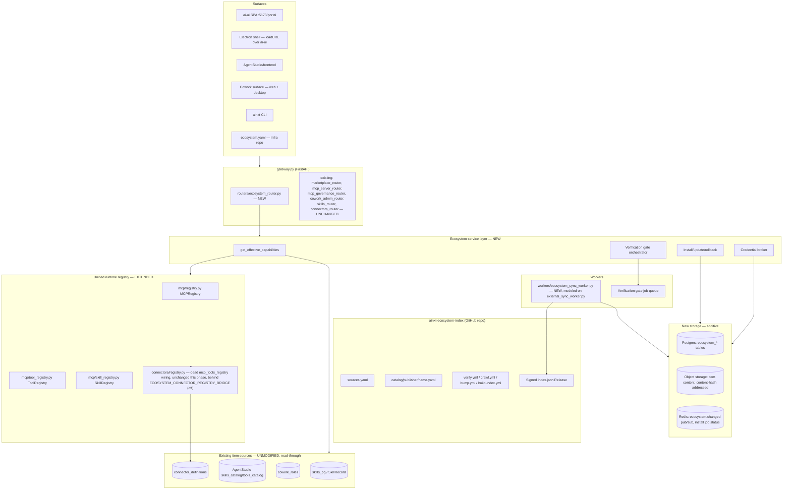
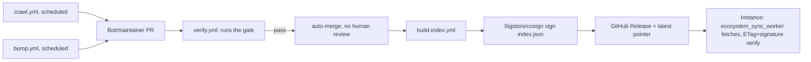
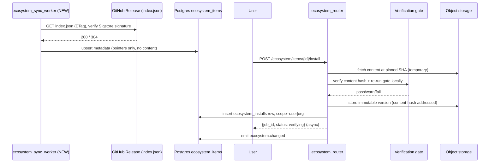
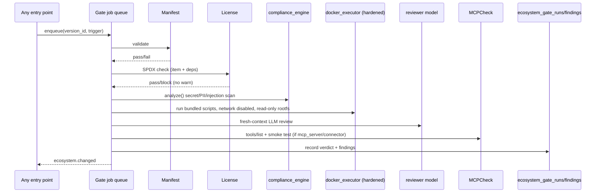
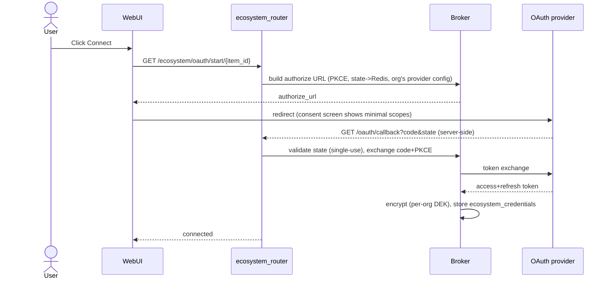
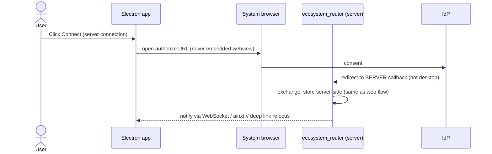
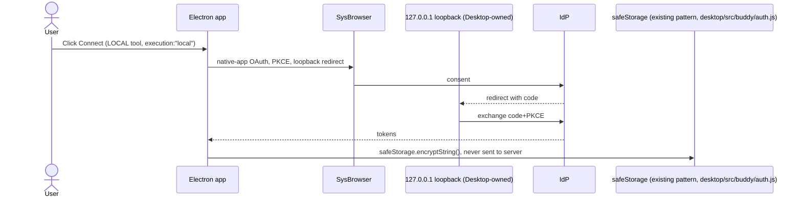

# AiNxt Ecosystem Marketplace — Implementation Plan & Design

Status: DESIGN — no implementation code included, per instruction. All current-state claims below cite `file:line`. All claims about Hermes are cited to `docs/ecosystem/hermes_pattern_pack/**`. Claims about Claude are marked `[INFERRED — public UX knowledge + docs/ecosystem/claude_ui_refs/ainxt_customize_mock.html only]` since no Claude architecture report equivalent to the Hermes pack was provided to this task — only a UI mock. **Nothing here proposes deleting or disabling any existing code.** Per explicit instruction, the new Ecosystem system is built **additively alongside** every system below; old tables/routers/UIs keep serving traffic unmodified until an explicit, late-phase, gradual deprecation (§13).

---

## 1. Current-state map

### 1.1 Skill systems — **four** independent systems exist today, not two

**System A — AgentStudio "Skill Factory"** (Postgres, AgentStudio's own connection pool, separate from the platform's `SessionLocal`):
- Tables `skills_catalog` (`AgentStudio/backend/app/core/workflow_repo.py:6810-6834`: name PK, description, category, `content` = full SKILL.md text, `generated`, `source` ∈ {builtin,ai,upload}) and `skill_files` (`workflow_repo.py:6840-6856`: `(skill_name, rel_path)` PK, content, size_bytes, kind ∈ {reference,script}, `abs_path`).
- SKILL.md format: YAML frontmatter allow-listed to `name/description/license/allowed-tools/metadata/compatibility` (`AgentStudio/backend/skill_factory/pipeline.py:179,201`), hand-rolled regex parser (not PyYAML).
- Creation: conversational "Skill Factory" SSE pipeline (`skill_factory/pipeline.py:826-1661`, intent→clarify→blueprint→content→bundle-decide→critique→quality-loop→assemble), manual CRUD (`AgentStudio/backend/app/api/catalog.py:251-364`), or `.zip`/`.skill` upload (`catalog.py:452-643`, path-traversal + zip-bomb guarded).
- Invocation: progressive disclosure — only the SKILL.md body + a file manifest enters the system prompt (`AgentStudio/backend/app/core/skill_manifest.py:131`, gated by `SKILL_DISCLOSURE` env); bundled files are fetched on demand via the `read_skill_file` tool, which does a **live Postgres read** (`AgentStudio/backend/app/tools/platform_tools.py:604-631`) — content is never pre-materialized to a sandbox filesystem. **Known gap**: `abs_path` is always `""` for AI-generated/uploaded skills (`skill_factory/pipeline.py:1400`) despite prompt guidance telling the model to invoke scripts "via `code_executor` using the absolute path" (`skill_manifest.py:210-220`) — likely a broken/incomplete feature, flagged, not fixed here.
- Governance: **not a column on `skills_catalog`** — every create/edit mirrors a status-only row into `SkillRecord`/`skills_pg` (System B) via `AgentStudio/backend/app/core/governance_client.py:346,468,546` (`submit_for_governance`/`submit_skill_async`/`reconcile_after_update`). The mirror carries status/visibility/department only, **no code** (`governance_client.py:8-10`). Approvers preview the real body via `GET /{entity_type}/{name}/source` (`routers/governance_router.py:1366-1400`), which explicitly reads `skills_catalog`, not `skills_pg`.

**System B — `skills_pg`** (`db/models.py:340-368`, SQLAlchemy `SkillRecord`, root platform DB): `id, name, org_id, code, description, tools, tags, status, is_production, visibility, department, skill_type ∈ {execution,behavioral}`, unique `(name, created_by, org_id)`.
- Creation paths: `POST /skills` (`routers/skills_router.py:138`), NL synthesis `POST /skills/generate` → `services/skill_synthesis.py:65` (self-declares `PRODUCTION`, bypassing DRAFT review — `skills_router.py:533-591`), hardcoded seeds (`skills_router.py:247-489` platform skills; `scripts/seed_cowork_skills.py:21-84` Cowork office skills), and a one-way sync from `mcp/registry.py:1250` (`_sync_skills_to_db`, in-memory `SkillDefinition`s → Postgres, boot-time only).
- **Self-improving skill loop** (additive detector, out-of-band): `store/skill_loop_store.py` (Redis signature counter) → `workers/skill_loop_worker.py:131` (`detect_and_propose`, dedup + `compliance_engine.should_block()` fail-closed gate + `synthesize_skill()`) → creates `SkillRecord` as `PENDING_APPROVAL` **only, never PRODUCTION** (`skill_loop_worker.py:16-18,90`) → audit trail in `store/skill_proposal_store.py` (`skill_proposals` table). This is the direct precedent for "agent-created items always start unpublished."
- Governance: full DRAFT→PENDING_APPROVAL→APPROVED→PRODUCTION→DEPRECATED state machine in `routers/governance_router.py:61-76` (entity_type ∈ {agents,skills,mcp,workflows}), approvers = admin/platform_engineer/security, 5-day SLA reminder job (`:1767`).
- Live invocation: **only confirmed consumer of `SkillRecord.code`** is `services/cowork_roles.py:515` (`build_role_context`), which injects `behavioral`-type code verbatim as an SOP into the Cowork system prompt; `execution`-type skills are never actually run in any code path found (`cowork_roles.py:519-525`; open question — see §15).

**System C — root `skills/ainxt_doc_craft/`**: pure filesystem, no DB, no governance — `docx/pptx/xlsx` `SKILL.md` + `SKELETON.*` + `brand/BRAND.md`. Read directly off disk by `connectors/mcp_bridge.py:685-745` (`get_document_skill` MCP tool), agent-authored output code is enqueued to `workers/doc_skill_worker.py:54` and run in the `ainxt-doc-sandbox` Docker image. Static, developer-edited, no create/list/approve API.

**System D — `agents/sdlc_governance/bundle.py`**: a *fourth*, unrelated SKILL.md convention — git/filesystem-discovered compliance/security skill bundles for the SDLC pipeline (`bundle.py:269-298`). Out of scope for the marketplace (internal governance content, not user-facing); footnoted only so it isn't confused with A/B/C.

### 1.2 MCP subsystem — **correction to the original task brief**: `mcp/` and `connectors/` are two separate top-level packages, not one

The task brief's file list (`mcp/base.py, engine.py, mcp_bridge.py, metrics.py, net_relay.py, oauth2.py, probe.py, seed.py, seed_cowork_pack.py`, plus `adapters/, browser-automation-agent/, dpi/, teams-bot/`) does not match the repo. Confirmed actual layout:
- `mcp/` = `__init__.py, bridge.py, registry.py, tool_registry.py, skill_registry.py, external_registry.py, client/{base,sse_client,stdio_client}.py, servers/{base.py + 14 concrete servers}`.
- `connectors/` = `engine.py, mcp_bridge.py, metrics.py, net_relay.py, oauth2.py, probe.py, base.py, registry.py, seed.py, seed_cowork_pack.py, adapters/, browser-automation-agent/, dpi/, teams-bot/`.

`MCPRegistry` (`mcp/registry.py:30`, singleton `mcp_registry`) owns `ToolRegistry` (`mcp/tool_registry.py:230`, the execution engine — HTTP or in-process callables, SSRF-guarded, TF-IDF `rank_tools()`) and `SkillRegistry` (`mcp/skill_registry.py:67`, pure declarative tool-composition catalog, no `execute()`). It registers ~30 hardcoded platform tools + 7 hardcoded skills + DB-loaded `MCPServer` rows (`mcp/tool_registry.py:649`), and one-way-syncs skills into `skills_pg` at boot (`mcp/registry.py:1250`). `mcp/bridge.py` (`MCPBridge`, singleton `mcp_bridge`) routes `{server}__{tool}` calls across 15 in-process MCP servers (`mcp/servers/__init__.py:27`, spec-compliant JSON-RPC 2.0, stdio/SSE/Streamable-HTTP, `mcp/servers/base.py:89-327`) plus external MCP servers via `mcp/external_registry.py:55` (bespoke DB-driven registry, **not** the public MCP Registry `server.json` spec — no reference to that spec found anywhere) using `mcp/client/{stdio,sse}_client.py` with an allowlisted stdio-command set (`npx,node,python,python3,uvx,uv,deno` — `external_registry.py:37`).

**Architectural gap, confirmed independently by two research passes**: `connectors/registry.py:34`'s own docstring claims `bootstrap(mcp_tools_registry)` is "called by mcp/registry.py after `_register_tools()`" — but **zero call sites in the repo pass that argument**, and `mcp/registry.py` never imports `connectors.registry` at all. So `_register_to_mcp()` (`connectors/registry.py:89-128`) is dead code: **every connector tool (Jira/GitLab/Microsoft 365/Slack/Gmail/GitHub/Zoom/DocuSign/DPI) is invisible to `mcp_registry`/`ToolRegistry`.** Two parallel orchestration paths exist as a direct result:
- **Path A** (Agent Studio custom agents): `gateway.py:13837` → `agents/agent_builder.py:712` (`AgentRunner.run`) → tool-use loop → `mcp_registry.execute_tool()` (`mcp/registry.py:1286`) → `ToolRegistry.execute()`.
- **Path B** (main Chat "office" mode + Cowork desktop agent): `agents/orchestrator.py:191-208` (`_plan_office`) calls `connectors.registry.connector_registry.list_connected_tools(user_id)` **directly**, never touching `mcp_registry`; the Cowork MCP bridge (`connectors/mcp_bridge.py`, served by `routers/cowork_mcp_router.py`) does the same.

`routers/mcp_server_router.py` (prefix `/mcp`) and `routers/mcp_governance_router.py` (prefix `/governance`) are `mcp/`-backed; `routers/cowork_mcp_router.py` (prefix `/buddy`, despite the name) is `connectors/`-backed. **`routers/mcp_governance_router.py` is confirmed non-functional**: its state (`_pending/_approved/_versions/_audit_log`) is plain in-process dicts (`:32-36`, lost on restart), and `approve_tool()` (`:135-159`) calls `registry.register_http_tool(...)` on a fresh `MCPRegistry()` instance — **a method that does not exist on `MCPRegistry`** (verified by full read of `mcp/registry.py`) — so approval silently fails into a caught exception (`:161-163`) and never reaches the live registry. This governance queue is also never called from `routers/marketplace_router.py`'s actual tool-registration path (`POST /tools/register` sets `status="PRODUCTION"` immediately — `routers/marketplace_router.py:109,119`), i.e. two disconnected, partially-dead "governance" mechanisms coexist today.

### 1.3 Connectors framework and current credential storage

`connector_definitions` is a raw-SQL (no ORM) Postgres table in schema `ainxt` (`db/migrate.py:4286-4304`, extended `:4354-4372` with `required_ad_level`/`allowed_departments`): name, `auth_type` ∈ {oauth2,pat,dpi_consent} (api_key/bearer_token documented but unseeded), `auth_config` JSONB (env-var **names** only, never secret values), `tools` JSONB (mirrors `ConnectorTool`, `connectors/base.py:66-81`), `is_builtin`, `is_active`. `ConnectorRegistry` (`connectors/registry.py:284`, singleton `connector_registry`) lazily bootstraps from active rows and exposes `execute()`, `get_user_tools()`, `list_connected_tools()`.

Adapter interface: `AdapterBase` (`connectors/adapters/base.py:32-106`, abstract `execute()`, `build_headers()` supporting OAuth2-Bearer/Basic-PAT/raw-header-PAT) with a `GenericHTTPAdapter` fallback (`:109-178`, spec-driven from the DB row) for any connector without a custom adapter. 13 custom adapters exist (`connectors/adapters/{microsoft365,slack,gmail,gitlab,github,jira,confluence,docusign,zoom,google_drive,google_calendar,dpi_account_aggregator,dpi_digilocker}.py`, map at `connectors/engine.py:789-846`). `integrations/{graph_app_client,teams_client,teams_sdk_app,zoho_people}.py` are **outside** this framework entirely — app-only client-credentials (Graph, Bot Framework) or a single static org-wide refresh token (`integrations/zoho_people.py:9-15`) — three additional, inconsistent credential patterns beyond the per-user connector model.

**OAuth**: `OAuth2Handler` (`connectors/oauth2.py:104`) — authorization-code + PKCE(S256) (per-connector toggleable, some seed `pkce:false`), state in Redis DB=2 (`connector:oauth:state:{state}`, 600s TTL, single-use), client id/secret resolved from env-var *names* only (never DB-stored), token exchange/refresh routed through `connectors/net_relay.py` (for egress-restricted hosts), careful REAUTH-vs-CONFIG error classification (`oauth2.py:29-38,219-343`) to avoid a documented prior bug (hourly forced reconnects). **No Dynamic Client Registration, no device-code flow anywhere in `connectors/`.** `client_credentials` exists only outside the connector framework (`integrations/graph_app_client.py:75`, `integrations/teams_client.py:67`). Tokens land in `ainxt.user_oauth_tokens` (`db/migrate.py:4308-4327`, fixed without FK at `:6631-6645`): `user_id VARCHAR` (JWT `sub`, **no FK, no org_id column**), `access_token`/`refresh_token` **encrypted via `store/credential_vault.encrypt_value`**, unique `(user_id, connector_name)`.

**Credential storage — the most important finding for the credentials design (§8)**: `store/credential_vault.py` encryption is **completely separate from `core/ckms`**. It's AES-256-GCM (migrated from Fernet, `"v2:"`-prefixed ciphertext) keyed by a **single static 32-byte key from env var `FERNET_KEY`** (`credential_vault.py:49-73`) — no envelope encryption, no per-record DEK, no KMS/HSM, no real rotation (`rotate_credential` just re-encrypts under the *same* key, `:391-427`). This one key protects **every** secret in the connector layer: OAuth tokens, PATs, API keys, DPI consent artifacts, and the separate `CredentialVault` ORM table (`db/models.py:669-687`: `owner_id` nullable, **no org_id**, category ∈ {api_key,oauth_token,password,certificate} — a flat, single-tenant, admin secret store, distinct from `user_oauth_tokens`). `core/ckms/` (real envelope encryption + pluggable HSM, `core/ckms/{hsm_provider,hsm_gateway,key_service,crypto}.py`) exists but is used **only** to decrypt a fixed inventory of protected boot-time env vars (`core/ckms/bootstrap.py`) — it can decrypt `FERNET_KEY` itself at boot if configured, but never touches connector secrets directly or per-record. `LLMProvider.credential_id → CredentialVault.id` (`db/models.py:2800-2802`) is a good existing precedent: **reference a vault row by id rather than duplicating secret storage** — the Ecosystem credential design (§8) follows this same shape.

**Identity threading**: connector calls are keyed on `user_id` (JWT `sub`) only — **`org_id` is present in the JWT (`auth/jwt_handler.py:65,102`) but never read or persisted anywhere in the connector framework** (zero hits across `engine.py`/`registry.py`/`connectors_router.py`). `UserConnectorPermission` (`db/models.py:2742-2765`, unique `(user_id, connector_name, tool_name)`) is a **per-user** allow/deny table — the closest existing analog to `connectors:admin_shared`, but scoped per-user, not org-shared. Two internal bridge endpoints (`POST /connectors/execute`, `POST /connectors/status-for-user`, `routers/connectors_router.py:845-964`) bypass `get_current_user` entirely, trusting a shared-secret header (`X-Bridge-Token`, reusing `AZURE_AD_CLIENT_SECRET`) and an arbitrary `user_id` in the request body — a real impersonation-surface gap, flagged not fixed here.

Runtime execution pipeline (`connectors/engine.py:168-359`, one path for e.g. `microsoft_365.outlook_search_emails`): load definition (5-min cache) → resolve tool spec → `_check_access_policy` (ad_level/department, keyed on user only) → validate params → `_get_token_row` (decrypt via credential_vault, auto-refresh within `CONNECTOR_TOKEN_REFRESH_WINDOW_S`=900s of expiry) → scope/rate-limit checks → cost guardrail → cache check → build `ConnectorContext` → pick adapter → `_execute_with_retry` (per-connector circuit breaker via `core/circuit_breaker.py`, exponential backoff, forced-refresh-then-retry-once on 401) → `agents.compliance_engine` scan on first 10 response items → field-minimization → cache + metrics. This pipeline (minus the identity/org gaps above) is **directly reusable** as the model for how the Ecosystem's credential broker attaches auth to a marketplace-installed connector's calls.

`connectors/probe.py:select_probe` is an on-demand connection-test-tool selector (not a periodic health check); `connectors/metrics.py` is Redis-backed call/error/latency counters with no alerting. `connectors/browser-automation-agent/` is a fully separate client-side Chrome MV3 extension (no shared code with the backend). `connectors/teams-bot/` contains only two PNG icons — a vestigial stub, not live code.

### 1.4 Existing "marketplace"-shaped surfaces

`routers/marketplace_router.py` (tag `marketplace`) is an **MCP tool/skill** registry surface, not a Cowork/plugin marketplace: `POST /tools/register` (Postgres `MCPServer` + hot-registers into `mcp_registry.tools` + Redis metadata DB=3), enable/disable toggles, `GET /marketplace/stats` (lists `mcp_registry.tools`/`.skills`), and `GET /plugins/curated` (reads `config/curated_plugins.json` — a file only ever written at runtime by `workers/external_sync_worker.py`'s plugin importer; **confirmed absent from disk in this checkout**, so this endpoint currently serves an empty/missing catalog). This router's `skills` view is `mcp.skill_registry.SkillRegistry` objects (in-memory tool-composition recipes), a **third, different** "skill" concept from `skills_pg`/System B.

**Cowork roles** (`services/cowork_roles.py`) are the closest existing analog to "a Cowork role becomes a plugin": `CoworkRole` dataclass (`:63-103`: system_prompt, allowed_connectors, skill_names resolved against `skills_pg`, subagent_allowlist, department, visibility, DRAFT→PENDING_APPROVAL→APPROVED/PUBLISHED status), Postgres table `cowork_roles` (`:151-169`), full CRUD + `publish_role`/`unpublish_role`/`list_marketplace` (`:384-438`) exposed via `routers/cowork_admin_router.py:438-465` (`GET /buddy/marketplace`, `POST /buddy/roles/{id}/publish`). `build_role_context()` (`:515-565`) renders the SOP; `materialize_role()` (`:620-780`) writes a YAML-frontmatter agent `.md` + scoped `managed-mcp.json` for the **external** `ainxt-cli` to load. `scripts/seed_cowork_skills.py:121-166` is the one working end-to-end example (seeds 16 behavioral skills + an "Exec Assistant" role bundling 3 connectors + 7 skills, force-approved). **`connectors/seed_cowork_pack.py`** (not `mcp/seed_cowork_pack.py` — that path doesn't exist) seeds the 5 connector definitions (google_drive, docusign, zoom, jira, confluence) a Cowork role's `allowed_connectors` resolves against.

**Critical gap**: `gateway.py`'s live `/ask` chat path **never calls into `services/cowork_roles.py`** (zero hits for `cowork_role|build_role_context|materialize_role` besides unrelated local variables `gateway.py:5665-5711` holding a hardcoded generic "AiNxt Cowork office assistant" persona string, not a role-specific one). The only consumers of a resolved role are (a) `GET /buddy/roles/{id}/context` returning rendered text for a client to prepend, and (b) `materialize_role()`'s file-write for the external `ainxt-cli`. **A selected Cowork role today has no server-side runtime wiring into a live conversation inside this repo** — this is a real, load-bearing gap, noted here for completeness. **Decision (§15, item 9): closing it is explicitly out of scope.** The Ecosystem's `get_effective_capabilities()` resolver documents this gap but is not wired into `agents/orchestrator.py`'s `_plan_office()` to close it, this phase or any near-term phase — Cowork's existing client-side (`ainxt-cli`) wiring is left exactly as it is.

`routers/skills_router.py`'s `GET /skills` (System B browse) is, practically, the most marketplace-adjacent existing surface (it's literally "browse the skill catalog" that Cowork roles bundle from). `routers/prompt_mgmt_router.py` (prompt A/B/rollback, admin-only, no install concept) and `routers/templates_router.py` (a fixed, file-backed "golden template" gallery sourced from an external `ainxt-os` checkout, admin sub-router inlined in the same file — no separate `templates_admin_router.py` exists) are both marketplace-*adjacent* concepts but neither has an install/version-pin/license model.

### 1.5 Sync, sandbox, compliance, auth/rbac

`workers/external_sync_worker.py:9-13,60` is a **manifest-driven, per-git-repo** sync worker (fetch via `git clone/fetch --reset --hard` with regex-injection guards, then dispatch to one of 4 importers: skills/security_skills/kb_index/plugins) with idempotent state in Postgres `ainxt.external_sync_status` (`:134-168`, keyed by repo_id, skip-if-unchanged-SHA). **Confirmed: its config input `config/external_sync_manifest.json` does not exist on disk**, nor does its output `config/curated_plugins.json` — this worker is currently unexercised in this checkout (unclear if that's an air-gapped-prod-only artifact, unreleased, or stale). It is a reasonable **structural analog** (not a literal reusable component) for a future central-index-pull worker: manifest-driven, idempotent-by-content-hash, split fetch/import so air-gapped installs can run import-only against a pre-shipped snapshot.

`sandbox/docker_executor.py` (`DockerExecutor`, 764 lines) applies: network disabled by default (`network_disabled`, not literal `--network none` but equivalent), `mem_limit=512m`, `cpu_quota=50000` (50%), `security_opt=[no-new-privileges]`, 60s wait-timeout, one ephemeral container per run, force-removed after. **No read-only rootfs** (`read_only=False`, comment: "/sandbox is rw, rest is container default" — `:527`), **no seccomp profile, no capability drop** beyond no-new-privileges. Runs `compliance_engine.validate_input()` before every execution. A `SubprocessExecutor` fallback exists but is explicitly documented as "not a sandbox" and gated behind `ALLOW_SUBPROCESS_EXECUTOR=true`; `get_executor()` refuses to run (returns `None`) if Docker is unavailable and that flag isn't set. **Directly reusable** for scanning marketplace item scripts, with required hardening additions for §6 (read-only rootfs, seccomp, network always-off for untrusted content, tuned timeout/memory profile distinct from the AI-snippet defaults).

`agents/compliance_engine.py` (732 lines) runs regex-based `detect_pii`/`detect_secrets`/`detect_key_leaks` plus an optional ML privacy-filter call; `analyze()`/`validate_input()`/`should_block()` are the reusable entry points for a marketplace secret scan (the PCI/PII-specific type list — PAN, Aadhaar, IFSC, UPI — is irrelevant noise for that use case and should be narrowed to the SECRET/API_KEY/ACCESS_TOKEN/PRIVATE_KEY_LEAK/etc. subset). `validate_output()` never blocks by design — not appropriate for a gating use case.

`auth/rbac.py` (545 lines): role hierarchy `viewer<developer<operator<security<admin` (`:26`) plus a `PERMISSIONS` dict of `<resource>:<verb>` strings (`:34-71`) — **no `marketplace` or `connectors` resource key exists today**, confirming a clean namespace for `marketplace:add/share/provision/admin_sources/admin_policy` and `connectors:admin_shared`. Beyond role/permission strings, rbac.py also layers ABAC "band" levels (A1-E, JWT claim), product-membership gates, AD-seniority `ad_level` gates, and HOD/domain-approver helpers (`:145-545`) — the Ecosystem design should decide up front whether new marketplace permissions are simple `PERMISSIONS`-dict entries (recommended — consistent with 66 existing `require_permission`/`require_role` call sites) or need a `can_approve_domain`-style custom gate for per-connector shared-admin rights.

Identity resolution (`auth/dependencies.py:262-307`, `get_current_user`): JWT (HS256, `auth/jwt_handler.py`) carries only `sub/role/org_id/ad_level/is_security_team/can_approve/jti/sid` — **no PII** — then `enrich_user_context()` (`auth/dependencies.py:101-259`) merges DB/Redis-cached profile fields, with `role`/`ad_level`/etc. **overwritten** from the DB on every request (fixes stale-privilege bugs). `current_user["sub"]` = user_id, `current_user["org_id"]` = tenant id — both server/JWT-derived, never client-supplied. This is exactly the "identity comes from the authenticated request context" property the credential broker (§8) requires.

`db/models.py` has **no** marketplace/catalog/extension-install/license table today (confirmed by full grep) — `ToolSubmission` (`:1371-1394`, mcp_tool|skill|agent|agent_chain submission for IS-team review with `risk_score`) is the closest analog but lacks `installed_at`/`org_id`/`license`/version-pinning columns. New Ecosystem tables (§4) are therefore additive with no naming/schema collision risk, aside from needing to add the `org_id` column that's conspicuously missing from `user_oauth_tokens`/`CredentialVault`/`connector_definitions` today (a pre-existing gap, not something the Ecosystem tables need to inherit).

### 1.6 Desktop app, UI loading, dependency licenses

The Electron app (`desktop/package.json`, main `src/main.js`) is a **thin remote-content shell**, not a bundled build: `BrowserWindow.loadURL()` points at `${apiBase}${UI_PATH}` where `UI_PATH` defaults to `/portal/` (matching `ai-ui/vite.config.js`'s production `base`) — i.e. it loads the **gateway-served** production `ai-ui` SPA (`desktop/src/main.js:186-198,407-417`), or the Vite dev server in dev mode. Every request gets `x-ainxt-surface: desktop` injected (`:370-386`) for server-side surface accounting. There is **no offline/bundled-UI mode today** — a hard runtime dependency on a reachable gateway.

Hardening: `contextIsolation:true, nodeIntegration:false, webSecurity:true` (`main.js:360-365`); no explicit `sandbox:` key, but Electron 41's default is sandboxed renderer given `nodeIntegration:false` (inferred from Electron's own default, not an explicit repo setting — flagged). `preload.js` (`:1-186`) exposes a single `contextBridge` surface, no raw Node/require leakage. **Credential storage already uses Electron's `safeStorage` API** (`desktop/src/buddy/auth.js:57-85`, DPAPI/Keychain-backed, no `keytar` dependency) for the CLI API key and Entra refresh token — **this is the exact pattern the Ecosystem desktop design (§10) should reuse** for local/device-bound connection tokens. The desktop app also runs a local MCP server (`main.js:911-983`) exposing `read_file/search_files/list_directory/execute_terminal` with an allowlisted command basename set, and a "Full power mode" toggle that removes that allowlist for the bundled `ainxt` CLI child process — a broad local-execution surface any future "local marketplace tool" design must route through deliberately, not bypass.

**Tool/skill loading is confirmed independently by two research passes to be three separate, non-unified mechanisms** — Chat (`agents/orchestrator.py`, connector catalog + hardcoded regex/LLM planner, never consults `mcp_registry`), Agent Studio (`AgentStudio/backend/app/core/workflow_repo.py`'s own Postgres `tools_catalog`/`skills_catalog` with its own governance mirror, resolved at runtime by `AgentStudio/backend/app/engine/native_engine.py:5388-5457`), and Cowork (`CoworkRole` + `skills_pg` + connector allowlist, per §1.4). **No shared resolution layer connects them today** — this is precisely the gap the Ecosystem's unified `get_effective_capabilities()` (§4, §11) is meant to close, and per the additive-migration instruction, all three keep working unmodified while that unification is built as a new layer on top.

**License audit finding, direct action item**: `lucide-react` (ISC) is present in `ai-ui/package.json` and **actively imported in 77 files** across `ai-ui/src/**`. The mandate "no lucide (ISC)" therefore implies a **repo-wide icon-library migration**, not just avoiding it in new marketplace UI — scoped explicitly as its own line item in §13, not silently assumed. No lucide dependency exists in `desktop/package.json` or `AgentStudio/frontend/package.json`. Other flags: `jszip` (desktop, dual MIT/GPLv3 — using under MIT is fine, just needs a THIRD-PARTY-NOTICES entry), `docling`/`reportlab` (root `requirements.txt`, reputationally permissive but not yet inline-annotated the way `psycopg2-binary`/`ldap3` already are — recommend a formal license-checker pass). No AGPL/GPL-only packages found. `ldap3` (LGPL) is already correctly isolated to `requirements-ldap.txt`, not the default install — a good existing precedent for how to isolate any future non-MIT/Apache dependency an imported marketplace item might need.

---

## 2. Reference comparison table

| Capability | Hermes (cited) | Claude `[INFERRED]` | Ours today (cited) | Decision | Reason |
|---|---|---|---|---|---|
| Catalog source model | Curated PR-pointer for code-running types (plugins/MCP); crawled aggregate for skills (`01-catalog-sources.md`) | `[INFERRED]` Anthropic-curated + community skills directories, browse-then-install | `routers/marketplace_router.py` (in-memory + Redis + one missing JSON file); no DB-backed catalog | **Build**: `ainxt-ecosystem-index` repo, bot-only PRs, auto-merge gate, no human review (§7) | Self-hosted, no central service we run — GitHub Actions is the only "central" compute available |
| Package manifest | SKILL.md (frontmatter+body), `plugin.yaml`, MCP `manifest.yaml` (`03-package-formats.md`) | `[INFERRED]` SKILL.md-compatible frontmatter | 4 different, unrelated skill formats (System A/B/C/D, §1.1) | **Extend**: adopt agentskills.io SKILL.md as canonical for the *Skills* item type; wrap Plugins/MCP/Connectors in our own pointer schema | Task mandate requires agentskills.io SKILL.md; unifying reduces to one canonical format instead of four |
| Install pipeline | quarantine→scan→trust×verdict policy→move→provenance (`04-install-pipelines.md`) | `[INFERRED]` install = fetch + local sandbox check | No staging/quarantine step anywhere; `docker_executor.py` scans code at *run* time, not at *install* time | **Build**: staging row (`status=pending_scan`) + `sandbox/docker_executor.py`-based gate before `status=active` (§6) | Direct server-side translation of the pattern; existing sandbox is 80% there |
| Trust × verdict policy | 2 independent axes, one non-overridable floor cell (`05-security.md`) | `[INFERRED]` single trust signal (publisher) | None — `ToolSubmission` has a `risk_score` but no policy table | **Adopt** the 2-axis matrix; **hard-code** license failure as pass/block only (task mandate) | Directly portable; matches our stricter "MIT/Apache-2.0 only" requirement even better than Hermes's model |
| Storage model | Files/config for extensions; DB only for conversation state (`06-storage-model.md`) | `[INFERRED]` server-side DB, content in object storage | 4 skill stores, 2 tool registries, no unified schema (§1.1-1.3) | **Build** real per-tenant Postgres rows + content in object storage, content-hash pinned | Task mandate explicitly requires this; Hermes's file-based model doesn't survive multi-tenant/horizontal scale |
| Installed vs enabled | Two independent facts; disable = config flag, no re-scan (`07-...scoping.md`) | `[INFERRED]` similar toggle model | `skills_pg.status`/`is_production` conflates "governed" and "enabled"; no per-surface toggle anywhere | **Adopt**: `ecosystem_installs.enabled` bool, independent of item `status` | Matches existing `is_production` precedent but adds the missing per-surface toggle |
| Chat integration | Progressive disclosure: index in prompt, full body on demand (`08-chat-integration.md`) | `[INFERRED]` `/command` slash + tool-call fetch, per UI mock | AgentStudio already does this correctly (`skill_manifest.py:131`) for System A only | **Adopt** platform-wide via the unified registry (§4) | Already proven internally at System-A scale; just needs to become the platform-wide default |
| Agent-created items | Closed action-set tool, ledger, staged approval, lower authority for autonomous writes (`09-...`) | `[INFERRED]` "Create with AI" → private draft → publish | `workers/skill_loop_worker.py` already implements exactly this (fail-closed compliance gate, `PENDING_APPROVAL` only) | **Adopt & extend** the existing pattern to Plugins/MCP items | We already have the strongest possible existing precedent — extend, don't reinvent |
| Desktop UI browse | Iframe of public docs site (ADAPT — own it natively instead) (`10-desktop-ui.md`) | `[INFERRED]` native catalog UI | Desktop is a thin `loadURL` shell over the same `ai-ui` build (§1.6) | **Adopt Hermes's ADAPT verdict**: native React catalog, shared component, no iframe | Desktop already reuses the web UI bundle — trivially gets a native catalog for free |
| Unified tool registry | One registry, 3 origins, registration-time collision policy, session-scoped resolution (`11-tool-registry.md`) | `[INFERRED]` one tool-call surface, provenance-blind to model | `mcp/registry.py` + `mcp/tool_registry.py` exist but connectors are **not** wired in (dead code, §1.2); 3 separate resolvers (Chat/AgentStudio/Cowork) | **Extend** `mcp/registry.py`/`mcp/tool_registry.py`/`mcp/skill_registry.py` into the single runtime registry for Skills. The dead connector-registration path is a **separate, deferred** concern, gated behind `ECOSYSTEM_CONNECTOR_REGISTRY_BRIDGE` (off) — not required for Skills, not fixed this phase (§15 decision 3) | Task mandate says extend these exact files; Skills don't need the connector-registration path at all, so fixing it isn't a Skills-phase prerequisite |
| MCP lifecycle | Eager/lazy start, circuit breaker + backoff, annotation-based write-gating (`12-mcp-lifecycle.md`) | `[INFERRED]` managed connection pool | `core/circuit_breaker.py` + `connectors/engine.py` retry logic already implements this for connectors; `mcp/external_registry.py` implements it separately for external MCP | **Adopt as-is**, unify under one lifecycle manager surface | Two good independent implementations exist; unify the *interface*, not necessarily the code |
| Change propagation | Deferred-by-default, pull-based cross-surface sync, cache-prefix stability (`13-...`) | `[INFERRED]` live push via websocket (per UI mock's real-time feel) | No propagation mechanism exists; three catalogs are each queried fresh per-surface | **Build**: `ecosystem.changed` Redis pub/sub → WebSocket (task mandate requires push, unlike Hermes) | Multi-user org-shared items need push (a teammate disabling something must be seen live) — Hermes never has this problem as a single-user tool |
| Secret scoping/storage | Context-scoped resolution; 3 divergent storage models by credential owner (`14-...`) | `[INFERRED]` per-user OAuth, server-brokered | Context-scoped resolution ✅ already correct (`auth/dependencies.py`); storage is **one static key for everything**, no org_id, no envelope encryption (§1.3) | **Adopt** scoping; **replace** storage with real `SecretStore` (envelope encryption via `core/ckms`, per-tenant DEK) (§8) | This is the single biggest gap found in the current codebase — directly actionable |

---

## 3. Target architecture

### 3.1 Components



### 3.2 Write path / read path

- **Write path** (single, per architecture requirement): `routers/ecosystem_router.py` → `EcosystemService` (service layer) → shared by REST, CLI, chat "Create with AI" tool, desktop, and workers. No business logic in routers.
- **Read path** (single resolver, per architecture requirement): `get_effective_capabilities(user, org, groups, surface, agent_id, device_online)` computes the merged set of skills/plugins/MCP tools/connectors visible to a given request, cached in Redis keyed by a capability-set hash, invalidated by `ecosystem.changed`. **This function is what finally gives Chat, Cowork, and Agent Studio a shared resolution layer** — it does not replace `agents/orchestrator.py`'s planning logic, it replaces the three independent "what tools exist" lookups (`connector_registry.list_connected_tools`, AgentStudio's `workflow_repo.list_tools/list_skills`, `cowork_roles.resolve_skill_names`) with calls into one function that internally still reads from all of System A/B/Cowork/connector_definitions during the migration window (§13), then increasingly from `ecosystem_items` as items get backfilled.

### 3.3 Event bus

`ecosystem.changed` events (schema in `CONTRACTS.md`) publish to Redis pub/sub on any install/uninstall/enable/disable/update/block/connection_changed action. A lightweight WebSocket relay (new, small addition to the existing WS infrastructure already used by `routers/cowork_mcp_router.py` and `routers/cowork_dispatch_router.py` for Redis-backed cross-worker notification) pushes to connected web/desktop clients. Chat's next-turn tool list is invalidated via the Redis-cached capability-set hash, matching the "deferred-by-default, explicit-now escape hatch" pattern from Hermes pattern 13 — except our default *is* push (§2), because org-shared items can change under a user who isn't the one who changed them, a scenario Hermes never has to handle.

### 3.4 Index / git flow (see §7 for full detail)



### 3.5 Instance sync / install sequence



### 3.6 Credential broker and web-vs-desktop execution routing

See §8 for full sequence diagrams (this section is the architecture summary only). The broker is the **only** component that ever decrypts a credential; it sits between `EcosystemService`/the unified tool registry and `store/credential_vault.py`-descended `SecretStore`. Tool execution is tagged `execution: server|local` in the registry (extending `ConnectorTool`/`ToolDefinition`'s existing shape); `local` calls are routed over the existing desktop WebSocket channel to the specific user's online desktop app, which executes using its `safeStorage`-held keychain token (§1.6) and returns only results — mirroring the existing local-MCP-server pattern in `desktop/src/main.js:911-983`, just gated by the marketplace's own trust/gate outcome instead of a hardcoded command allowlist.

---

## 4. Data model DDL

All new tables are **additive**, in schema `ainxt` (matching `connector_definitions`/`user_oauth_tokens`/`cowork_roles` convention), added via the next available `db/migrate.py` "Part" migration. None of these replace or alter `skills_pg`, `skills_catalog`, `cowork_roles`, `connector_definitions`, `CredentialVault`, or `user_oauth_tokens` — those keep their current schema untouched during the migration window (§13).

**`org_id` type correction (§9C fix 4)**: every table below uses `org_id VARCHAR(255) NOT NULL DEFAULT 'default'` (nullable + no default only where noted), **not** `UUID ... REFERENCES ainxt.orgs(id)` as earlier drafts had it. Verified: **`ainxt.orgs` does not exist anywhere in this codebase** (no `CREATE TABLE`/ORM model found by full-repo search). Every existing multi-tenant-shaped table instead uses a plain `org_id VARCHAR(255)` string column with no FK — `db/models.py:78` (`AgentRecord`), `:294` (`SkillRecord`, default `"default"`), `:348` (`WorkflowRecord`), `:383`, `:437` (`MCPServer`), `:827`, `:1074`, `:2124`, `:2803` (`LLMProvider`) — and the JWT's own `org_id` claim is a plain `str` (`auth/jwt_handler.py:65,80,102`), not a UUID. This confirms the platform has no real multi-org-per-instance model today — `org_id` is a free-text tenant label, `"default"` being the single-org-deployment sentinel value every existing table already uses. The Ecosystem tables follow this exact convention rather than inventing a new one.

```sql
-- Publisher-slug registry (§9C fix 2) — the "publisher" segment of a namespace ("publisher/name")
-- must resolve to a verified org or user slug here before an item can be created under it.
CREATE TABLE ainxt.ecosystem_publishers (
    slug            TEXT PRIMARY KEY,
    owner_type      TEXT NOT NULL CHECK (owner_type IN ('org','user')),
    owner_ref       VARCHAR(255) NOT NULL,      -- org_id string, or user_id — matches whichever owner_type
    verified_at     TIMESTAMPTZ NOT NULL DEFAULT now(),
    created_at      TIMESTAMPTZ NOT NULL DEFAULT now()
);

-- One row per catalog source (Phase 1: GitHub repos + MCP Registry API; Phase 2: admin-added taps).
-- 'local' (§9C fix 3) is a new kind: exactly one per org, representing "items this org created directly
-- in the UI/chat," so every ecosystem_items row can keep a NOT NULL source_id (see decision note below
-- the table) instead of making the column nullable.
CREATE TABLE ainxt.ecosystem_sources (
    id              UUID PRIMARY KEY DEFAULT gen_random_uuid(),
    kind            TEXT NOT NULL CHECK (kind IN ('github_repo','mcp_registry','well_known','private_git','skills_sh_indirect','local')),
    url             TEXT NULL,                  -- NULL for kind='local' (no upstream URL)
    org_id          VARCHAR(255) NULL,          -- NULL = platform-default (central index); non-NULL = admin-added or the org's own 'local' source
    tos_checked_at  TIMESTAMPTZ NULL,
    tos_notes       TEXT NULL,
    enabled         BOOLEAN NOT NULL DEFAULT TRUE,
    -- Seam only this phase — SecretStore-shaped (mirrors oauth_provider_configs below) rather than a
    -- hard FK to the legacy store/credential_vault.py (§9C fix 16), for a private-repo access token.
    secret_backend  TEXT NULL CHECK (secret_backend IN ('builtin','aws_kms','gcp_kms','azure_kv','vault')),
    credential_ciphertext BYTEA NULL,
    credential_dek_key_id TEXT NULL,
    credential_external_ref TEXT NULL,
    created_by      VARCHAR(255) NOT NULL,
    created_at      TIMESTAMPTZ NOT NULL DEFAULT now(),
    updated_at      TIMESTAMPTZ NOT NULL DEFAULT now()
);
-- Exactly one 'local' source per org (auto-provisioned on org creation or lazily on that org's first
-- user-created item) — every other kind may have multiple rows per org (e.g. several private_git taps).
CREATE UNIQUE INDEX ux_ecosystem_sources_one_local_per_org ON ainxt.ecosystem_sources (org_id) WHERE kind = 'local';

-- One row per catalog item (metadata + pointer only — no content, per storage-model decision)
CREATE TABLE ainxt.ecosystem_items (
    id              UUID PRIMARY KEY DEFAULT gen_random_uuid(),
    namespace       TEXT NOT NULL,              -- "publisher/name" — publisher segment MUST resolve in ecosystem_publishers (§9C fix 2), enforced at the service layer (not a DB-level FK, since namespace is a composite string, not just the publisher slug)
    item_type       TEXT NOT NULL CHECK (item_type IN ('skill','plugin','mcp_server','connector')),
    category        TEXT NOT NULL,              -- taxonomy per §4.1
    tags            JSONB NOT NULL DEFAULT '[]',
    display_name    TEXT NOT NULL,
    description     TEXT NOT NULL,
    icon_url        TEXT NULL,                  -- format: "url:<same-origin object-storage path>" (raster, or SVG sanitized of <script>/on*/external refs — uploaded via a dedicated endpoint, never an arbitrary external URL, §9C fix 7) or "emoji:🧠" (Unicode emoji); NULL → client renders a monogram fallback. Never lucide/an icon-font reference.
    source_id       UUID NOT NULL REFERENCES ainxt.ecosystem_sources(id),   -- always NOT NULL — user/org-created items point at that org's 'local' source row rather than allowing NULL (§9C fix 3 decision)
    scope           TEXT NOT NULL CHECK (scope IN ('builtin','optional','central_index','org_private')) DEFAULT 'central_index',
    org_id          VARCHAR(255) NULL,          -- non-NULL only for org_private; NULL for builtin/optional/central_index
    trust_tier      TEXT NOT NULL CHECK (trust_tier IN ('builtin','verified','org','community','agent_created')) DEFAULT 'community',
    license         TEXT NOT NULL,              -- MUST be 'MIT' or 'Apache-2.0' — enforced at gate time, not just here
    status          TEXT NOT NULL CHECK (status IN ('active','source_unavailable','yanked','deprecated')) DEFAULT 'active',
    is_featured     BOOLEAN NOT NULL DEFAULT FALSE,   -- platform-level featured flag; see ecosystem_featured_overrides for per-org pin/unpin
    deprecated_at   TIMESTAMPTZ NULL,           -- owner/admin soft-retirement, set by POST .../deprecate — distinct from 'yanked' (upstream-source-initiated)
    deprecated_by   VARCHAR(255) NULL,
    legacy_source   TEXT NULL,                  -- 'skills_pg' | 'skills_catalog' | 'cowork_roles' | 'connector_definitions' | NULL — see §13 backfill. Execution-type SkillRecord rows are explicitly excluded from this bridge (§15, decision 1) — behavioral-type only.
    legacy_ref      TEXT NULL,                  -- id/name in the legacy table, for the bridge/backfill period
    created_at      TIMESTAMPTZ NOT NULL DEFAULT now(),
    updated_at      TIMESTAMPTZ NOT NULL DEFAULT now()
);
-- Namespace uniqueness (§9C fix 2): global across the shared catalog scopes, but scoped per-org for
-- org_private items — two different orgs may each have their own private item at the same namespace
-- string without colliding (a plain table-level UNIQUE(namespace, item_type) could not express this).
CREATE UNIQUE INDEX ux_ecosystem_items_namespace_global ON ainxt.ecosystem_items (namespace, item_type) WHERE scope IN ('builtin','optional','central_index');
CREATE UNIQUE INDEX ux_ecosystem_items_namespace_org ON ainxt.ecosystem_items (namespace, item_type, org_id) WHERE scope = 'org_private';
CREATE INDEX idx_ecosystem_items_search ON ainxt.ecosystem_items USING GIN (to_tsvector('english', display_name || ' ' || description));
CREATE INDEX idx_ecosystem_items_trgm ON ainxt.ecosystem_items USING GIN (namespace gin_trgm_ops);

-- Per-org featured pin/unpin, independent of the platform-level ecosystem_items.is_featured flag.
-- Endpoints: PUT/DELETE /ecosystem/featured/{item_id} (§9C fix 12).
CREATE TABLE ainxt.ecosystem_featured_overrides (
    org_id          VARCHAR(255) NOT NULL,
    item_id         UUID NOT NULL REFERENCES ainxt.ecosystem_items(id) ON DELETE CASCADE,
    featured        BOOLEAN NOT NULL,
    set_by          VARCHAR(255) NOT NULL,
    created_at      TIMESTAMPTZ NOT NULL DEFAULT now(),
    PRIMARY KEY (org_id, item_id)
);

-- Ephemeral Create-with-AI conversational drafts (§9C fix 10) — backed by the AgentStudio Skill
-- Factory pipeline (§1.1/§9). A draft is not yet an ecosystem_items row; POST .../submit is what
-- creates the real item + first version + gate run, at which point submitted_item_id is stamped.
CREATE TABLE ainxt.ecosystem_drafts (
    id                  UUID PRIMARY KEY DEFAULT gen_random_uuid(),
    org_id              VARCHAR(255) NOT NULL,
    created_by          VARCHAR(255) NOT NULL,
    item_type           TEXT NOT NULL CHECK (item_type IN ('skill','plugin','mcp_server','connector')) DEFAULT 'skill',
    status              TEXT NOT NULL CHECK (status IN ('drafting','ready','submitted','abandoned')) DEFAULT 'drafting',
    draft_content       JSONB NOT NULL DEFAULT '{}',   -- {name, description, instructions, files[], license} — same shape the manual/upload create paths produce
    source_engine       TEXT NOT NULL DEFAULT 'agentstudio_skill_factory',
    submitted_item_id   UUID NULL REFERENCES ainxt.ecosystem_items(id),
    created_at          TIMESTAMPTZ NOT NULL DEFAULT now(),
    updated_at          TIMESTAMPTZ NOT NULL DEFAULT now()
);

-- Immutable version per item — content-hash addressed, points into object storage
CREATE TABLE ainxt.ecosystem_item_versions (
    id              UUID PRIMARY KEY DEFAULT gen_random_uuid(),
    item_id         UUID NOT NULL REFERENCES ainxt.ecosystem_items(id) ON DELETE CASCADE,
    version         TEXT NOT NULL,              -- semver or pinned SHA
    pinned_sha      TEXT NULL,                  -- upstream commit, when sourced from a repo
    content_hash    TEXT NOT NULL,              -- sha256 of the assembled artifact
    object_key      TEXT NOT NULL,              -- object storage pointer
    license         TEXT NOT NULL,
    attribution     TEXT NOT NULL,              -- copyright + license text, NOTICE for Apache-2.0
    manifest        JSONB NOT NULL,             -- parsed SKILL.md frontmatter / plugin/MCP/connector schema
    gate_verdict    TEXT NOT NULL CHECK (gate_verdict IN ('pass','warn','fail','pending')) DEFAULT 'pending',
    created_at      TIMESTAMPTZ NOT NULL DEFAULT now(),
    UNIQUE (item_id, version)
);
CREATE INDEX idx_ecosystem_item_versions_content_hash ON ainxt.ecosystem_item_versions (content_hash);   -- backs the (content_hash, scanner_version) gate-verdict cache lookup, CONTRACTS.md §5

-- Per-tenant install record — this IS the "installed" fact, independent of enable/disable.
-- `surfaces` has NO hardcoded default (§9C fix 5) — the service layer always sets it explicitly from
-- the caller's product profile's enabled_surfaces at insert time; the DB-level default is an empty
-- array (fail-closed: an install that somehow bypasses the service layer's surface-setting logic
-- grants zero surfaces rather than silently presuming the enterprise product's 4-surface set).
CREATE TABLE ainxt.ecosystem_installs (
    id              UUID PRIMARY KEY DEFAULT gen_random_uuid(),
    item_id         UUID NOT NULL REFERENCES ainxt.ecosystem_items(id),
    version_id      UUID NOT NULL REFERENCES ainxt.ecosystem_item_versions(id),
    org_id          VARCHAR(255) NOT NULL,
    scope           TEXT NOT NULL CHECK (scope IN ('private','shared','org','provisioned','required')) DEFAULT 'private',
    origin          TEXT NOT NULL CHECK (origin IN ('created','shared','provisioned','required','added')) DEFAULT 'added',   -- powers the "Yours" grouping (CONTRACTS.md §9's Install schema, §9C fix 9)
    installed_by    VARCHAR(255) NOT NULL,      -- user_id
    installed_for   VARCHAR(255) NULL,          -- NULL = org-scoped; non-NULL = private-scoped owner
    group_id        UUID NULL,                  -- for 'shared' scope to a group
    enabled         BOOLEAN NOT NULL DEFAULT TRUE,   -- independent of item status — Hermes pattern 7
    surfaces        JSONB NOT NULL DEFAULT '[]',
    auto_update     BOOLEAN NOT NULL DEFAULT FALSE,
    installed_at    TIMESTAMPTZ NOT NULL DEFAULT now(),
    updated_at      TIMESTAMPTZ NOT NULL DEFAULT now(),
    UNIQUE NULLS NOT DISTINCT (item_id, org_id, installed_for)   -- PG16 (confirmed via CI's pgvector/pgvector:pg16 image, PG15+ syntax) — without this, Postgres's default NULLS DISTINCT would let the same org install the same item twice as long as both rows have installed_for=NULL (org-scoped installs), since NULL <> NULL under the default semantics
);

CREATE TABLE ainxt.ecosystem_shares (
    id              UUID PRIMARY KEY DEFAULT gen_random_uuid(),
    install_id      UUID NOT NULL REFERENCES ainxt.ecosystem_installs(id) ON DELETE CASCADE,
    shared_with_type TEXT NOT NULL CHECK (shared_with_type IN ('user','group','org')),
    shared_with_id  TEXT NOT NULL,
    created_at      TIMESTAMPTZ NOT NULL DEFAULT now()
);

CREATE TABLE ainxt.ecosystem_gate_runs (
    id              UUID PRIMARY KEY DEFAULT gen_random_uuid(),
    version_id      UUID NOT NULL REFERENCES ainxt.ecosystem_item_versions(id),
    trigger         TEXT NOT NULL CHECK (trigger IN ('ui_add','chat_create','cli','index_ci','admin_provision','desktop','new_version')),
    verdict         TEXT NOT NULL CHECK (verdict IN ('pass','warn','fail','pending')),
    scanner_version TEXT NOT NULL,
    started_at      TIMESTAMPTZ NOT NULL DEFAULT now(),
    finished_at     TIMESTAMPTZ NULL
);

CREATE TABLE ainxt.ecosystem_gate_findings (
    id              UUID PRIMARY KEY DEFAULT gen_random_uuid(),
    gate_run_id     UUID NOT NULL REFERENCES ainxt.ecosystem_gate_runs(id) ON DELETE CASCADE,
    stage           TEXT NOT NULL,   -- manifest|license|static_safety|supply_chain|sandbox|ethics|mcp_connector
    severity        TEXT NOT NULL CHECK (severity IN ('info','warn','block')),
    code            TEXT NOT NULL,
    message         TEXT NOT NULL,
    details         JSONB NOT NULL DEFAULT '{}'
);

CREATE TABLE ainxt.ecosystem_reports (
    id              UUID PRIMARY KEY DEFAULT gen_random_uuid(),
    item_id         UUID NOT NULL REFERENCES ainxt.ecosystem_items(id),
    reported_by     VARCHAR(255) NOT NULL,
    reason          TEXT NOT NULL,
    status          TEXT NOT NULL CHECK (status IN ('open','reviewed','auto_hidden','dismissed')) DEFAULT 'open',
    created_at      TIMESTAMPTZ NOT NULL DEFAULT now()
);

CREATE TABLE ainxt.ecosystem_audit (
    id              UUID PRIMARY KEY DEFAULT gen_random_uuid(),
    org_id          VARCHAR(255) NOT NULL DEFAULT 'default',
    actor           VARCHAR(255) NOT NULL,
    action          TEXT NOT NULL,   -- install|uninstall|enable|disable|update|rollback|deprecate|delete_draft|block|share|policy_change
    item_id         UUID NULL REFERENCES ainxt.ecosystem_items(id),
    details         JSONB NOT NULL DEFAULT '{}',
    created_at      TIMESTAMPTZ NOT NULL DEFAULT now()
);

-- Credentials for ecosystem-installed connectors/MCP — references the SecretStore, never stores plaintext
CREATE TABLE ainxt.ecosystem_credentials (
    id              UUID PRIMARY KEY DEFAULT gen_random_uuid(),
    class           TEXT NOT NULL CHECK (class IN ('platform','per_user','org_shared','device_local')),
    org_id          VARCHAR(255) NOT NULL DEFAULT 'default',
    user_id         VARCHAR(255) NULL,          -- NULL for org_shared/platform
    item_id         UUID NOT NULL REFERENCES ainxt.ecosystem_items(id),
    secret_backend  TEXT NOT NULL CHECK (secret_backend IN ('builtin','aws_kms','gcp_kms','azure_kv','vault')),
    -- builtin backend fields (envelope encryption, extends core/ckms rather than credential_vault's static-key model):
    ciphertext      BYTEA NULL,
    dek_key_id      TEXT NULL,                  -- FK-by-name into core.ckms keys_table, per-org DEK
    key_version     INT NULL,
    -- external backend fields:
    external_ref    TEXT NULL,                  -- KMS/Vault key path, when secret_backend != 'builtin'
    status          TEXT NOT NULL CHECK (status IN ('connected','needs_reauth','expired','revoked','insufficient_scope','not_connected','connecting','error')) DEFAULT 'not_connected',
    issuer          TEXT NULL,                  -- OAuth issuer binding, per Hermes pattern 12/14
    scopes          JSONB NOT NULL DEFAULT '[]',
    expires_at      TIMESTAMPTZ NULL,
    created_at      TIMESTAMPTZ NOT NULL DEFAULT now(),
    updated_at      TIMESTAMPTZ NOT NULL DEFAULT now(),
    UNIQUE NULLS NOT DISTINCT (item_id, org_id, user_id)   -- PG16, same reasoning as ecosystem_installs above — org_shared/platform-class rows have user_id=NULL and must still collide correctly per (item_id, org_id)
);

-- Seam only this phase (no item type in the Skills slice needs OAuth) — shaped to reference the
-- SecretStore pattern (secret_backend/external_ref/dek_key_id, mirroring ecosystem_credentials above)
-- rather than a hard FK to the legacy store/credential_vault.py, so the eventual real SecretStore
-- (§8.2) doesn't require a breaking schema change to plug in here later.
CREATE TABLE ainxt.oauth_provider_configs (
    id              UUID PRIMARY KEY DEFAULT gen_random_uuid(),
    org_id          VARCHAR(255) NOT NULL DEFAULT 'default',
    provider        TEXT NOT NULL,              -- 'microsoft_entra','google','slack','atlassian', etc.
    secret_backend  TEXT NOT NULL CHECK (secret_backend IN ('builtin','aws_kms','gcp_kms','azure_kv','vault')) DEFAULT 'builtin',
    client_id_ciphertext BYTEA NULL,            -- builtin backend
    client_id_dek_key_id TEXT NULL,
    client_id_external_ref TEXT NULL,           -- non-builtin backend
    redirect_uri    TEXT NOT NULL,
    scopes_default  JSONB NOT NULL DEFAULT '[]',
    created_by      VARCHAR(255) NOT NULL,
    created_at      TIMESTAMPTZ NOT NULL DEFAULT now(),
    UNIQUE (org_id, provider)
);

CREATE TABLE ainxt.oauth_client_registrations (
    id              UUID PRIMARY KEY DEFAULT gen_random_uuid(),
    org_id          VARCHAR(255) NOT NULL DEFAULT 'default',
    server_name     TEXT NOT NULL,              -- MCP server or connector name
    client_id       TEXT NOT NULL,
    secret_backend  TEXT NOT NULL CHECK (secret_backend IN ('builtin','aws_kms','gcp_kms','azure_kv','vault')) DEFAULT 'builtin',
    client_secret_ciphertext BYTEA NULL,
    client_secret_dek_key_id TEXT NULL,
    client_secret_external_ref TEXT NULL,
    registered_via  TEXT NOT NULL CHECK (registered_via IN ('dcr','manual')),
    created_at      TIMESTAMPTZ NOT NULL DEFAULT now(),
    UNIQUE (org_id, server_name)
);

-- Surfaces registry — data-driven, NOT a hard-coded enum (see CONFIG_AND_PRODUCTS.md §1 for the
-- full rationale: a second product's surface set must never require a breaking enum change)
CREATE TABLE ainxt.ecosystem_surfaces (
    key                 TEXT PRIMARY KEY,          -- 'chat' | 'agent_studio' | 'cowork' | 'desktop' | 'workspace_chat' this phase
    label               TEXT NOT NULL,
    enabled_by_default  BOOLEAN NOT NULL DEFAULT TRUE,
    created_at          TIMESTAMPTZ NOT NULL DEFAULT now()
);

-- Product profiles — one row per product (enterprise, workspace this phase); see
-- CONFIG_AND_PRODUCTS.md §3 for the full layering behavior (profile → org policy → RBAC → allowed_actions).
-- `visible_item_types` vs `enabled_item_types` (§9C fix 18): visible = shown as a tab at all (all 4
-- this phase, for every product); enabled = actually installable/browsable, no placeholder ("skill"
-- only, this phase). A type in visible-but-not-enabled renders as a read-only "Coming soon" tab.
CREATE TABLE ainxt.ecosystem_product_profiles (
    id                  UUID PRIMARY KEY DEFAULT gen_random_uuid(),
    product_key         TEXT NOT NULL UNIQUE,      -- 'enterprise' | 'workspace' this phase — new products are new rows, never a new enum value
    label               TEXT NOT NULL,
    layout              TEXT NOT NULL CHECK (layout IN ('full','compact')),
    default_view        TEXT NOT NULL CHECK (default_view IN ('discover','yours')) DEFAULT 'discover',
    visible_item_types  JSONB NOT NULL DEFAULT '["skill","plugin","connector","mcp_server"]',
    enabled_item_types  JSONB NOT NULL DEFAULT '["skill"]',
    enabled_surfaces    JSONB NOT NULL,            -- array of ecosystem_surfaces.key values; validated at write time, not a DB-level FK (JSONB array)
    features            JSONB NOT NULL DEFAULT '{}',   -- {discover, yours, create_with_ai, write, upload, import_url, share, provisioning, admin_policies, gate_dashboard}
    created_at          TIMESTAMPTZ NOT NULL DEFAULT now(),
    updated_at          TIMESTAMPTZ NOT NULL DEFAULT now()
);

-- Org product entitlement (§9C fix 1) — which product(s) an org is allowed to use, and which is the
-- default when x-ainxt-product is omitted. Distinct from ecosystem_product_profiles (which defines
-- WHAT a product looks like) — this table defines WHO may use it.
CREATE TABLE ainxt.ecosystem_org_products (
    org_id          VARCHAR(255) NOT NULL,
    product_key     TEXT NOT NULL REFERENCES ainxt.ecosystem_product_profiles(product_key),
    is_primary      BOOLEAN NOT NULL DEFAULT FALSE,
    created_at      TIMESTAMPTZ NOT NULL DEFAULT now(),
    PRIMARY KEY (org_id, product_key)
);
CREATE UNIQUE INDEX ux_ecosystem_org_products_one_primary ON ainxt.ecosystem_org_products (org_id) WHERE is_primary;

CREATE TABLE ainxt.credential_audit (
    id              UUID PRIMARY KEY DEFAULT gen_random_uuid(),
    org_id          VARCHAR(255) NOT NULL DEFAULT 'default',
    actor           VARCHAR(255) NOT NULL,
    connector_or_item TEXT NOT NULL,
    action          TEXT NOT NULL,   -- decrypt|refresh|revoke|connect|disconnect|rotate
    surface         TEXT NOT NULL,
    created_at      TIMESTAMPTZ NOT NULL DEFAULT now()
    -- never stores secret values, per pattern 14
);

CREATE TABLE ainxt.desktop_devices (
    id              UUID PRIMARY KEY DEFAULT gen_random_uuid(),
    user_id         VARCHAR(255) NOT NULL,
    device_label    TEXT NOT NULL,
    device_key_fingerprint TEXT NOT NULL,       -- public half only
    last_seen_at    TIMESTAMPTZ NULL,
    revoked_at      TIMESTAMPTZ NULL,
    created_at      TIMESTAMPTZ NOT NULL DEFAULT now()
);
```

### 4.1 Category taxonomy

Derived from `hermes_pattern_pack/catalog_inventory/*.md` (used as reference only — no item content copied), collapsed into one 18-value taxonomy shared across all 4 item types: `productivity`, `dev-tools`, `communication`, `data-analytics`, `design`, `finance`, `crm`, `marketing`, `automation`, `documents`, `research`, `hr-people`, `security-compliance`, `travel`, `legal`, `sales`, `support`, `general`. (`legal`, `sales`, and `support` were all added to reconcile with the merged Skills-UI frontend's own hardcoded taxonomy, which already included all three — e.g. its "Contract Clause Reviewer" example skill (Legal), and `Sales`/`Support` were literal entries in `marketplaceStore.js`'s own category list — see `CONFIG_AND_PRODUCTS.md` §7.3.) Each item carries exactly one `category` plus free-form `tags` (multi-value), matching the task's "categories (multiple items per category) and tags" requirement. **This list is never hardcoded in any client** — it is served exclusively via `GET /ecosystem/config`'s `taxonomy.categories` field (`CONTRACTS.md` §8); the list above is the seed data for that table/config, not a contract a UI reads statically.

### 4.2 Migration plan from legacy tables (see §13 for phasing — this describes the mechanism only)

A **read-through bridge**, not a data migration, runs for the duration of the migration window: `ecosystem_items` rows with `legacy_source`/`legacy_ref` populated act as pointers into `skills_pg`/`skills_catalog`/`cowork_roles`/`connector_definitions`. The unified resolver (`get_effective_capabilities`) follows this pointer to fetch live content from the legacy table rather than requiring an upfront copy — this is precisely what lets old and new systems coexist without a risky one-shot data migration, per the additive-migration instruction. A later, optional backfill job can materialize legacy content into `ecosystem_item_versions` once a legacy source is fully retired (§13, final phase only).

---

## 5. API spec outline, CLI spec, `ecosystem.yaml` schema, index/pointer schemas

Full typed contract lives in `CONTRACTS.md` — **`CONTRACTS.md` §17 is the authoritative, consolidated endpoint list** (supersedes the outline that used to live inline here, which drifted out of sync once the §9C fixes added drafts/icon-upload/delete-draft/featured endpoints). Summary of the shape, not a duplicate list:

**REST** (`routers/ecosystem_router.py`, prefix `/ainxt/v1/api/ecosystem`, additive — does not touch `marketplace_router.py`/`skills_router.py`/`connectors_router.py`/`cowork_admin_router.py` routes). Every request carries `x-ainxt-product: enterprise|workspace`, resolved via the org-entitlement rule in `CONTRACTS.md` §4 / `CONFIG_AND_PRODUCTS.md` §4 (**not** a bare global default — the header only selects among products the caller's org is actually entitled to). Endpoint groups: config (`GET /ecosystem/config`), item CRUD + lifecycle (list/detail/versions/gate-runs/create/install/uninstall/enable/disable/update/rollback/share/report/deprecate/delete-draft), Create-with-AI drafts (`POST /ecosystem/drafts` SSE + `GET`/`PATCH`/`submit`), icon upload, jobs, installs ("Yours"), capabilities (chat/Agent Studio/Cowork runtime consumption), admin (sources/policy/gate-findings/force-disable/unyank/featured-overrides), and a credentials seam group (documented, not implemented this phase). Full request/response shapes: `CONTRACTS.md` §9 (JSON schemas), §10 (drafts/create payloads/icon upload), §11 (featured overrides), §12 (tool contracts for `skill_view`/`read_skill_file`).

**CLI** (`ainxt` — lives in the separate `ainxt-cli` repo, contract only, per the task's front-doors requirement):
```
ainxt skills|plugins|mcp|connectors search|install|list|info|uninstall|update|rollback|enable|disable
ainxt sources list|add|remove
ainxt index sync
ainxt ecosystem apply -f ecosystem.yaml
```
Namespaced IDs (`publisher/name`, `github:owner/repo/path`); short names resolve only if unique across the effective catalog. Version pins: `@x.y.z` or `@sha`. `--scope user|group|org`.

**`ecosystem.yaml`** (declarative, in the self-hoster's infra repo):
```yaml
version: 1
sources:
  - name: internal-mirror
    kind: private_git
    url: https://git.internal/ecosystem-mirror
policy:
  who_can_add: admins_only
  allowed_sources: [central_index, internal-mirror]
items:
  - id: ainxt/notion-connector
    version: "1.2.0"
    scope: org
    surfaces: [chat, cowork]
    enabled: true
  - id: acme-org/exec-assistant-plugin
    version: "@a1b2c3d"
    scope: group
    group: finance-team
```
`ainxt ecosystem apply` reconciles installed state to this file; every item still passes the local gate re-run regardless of where it came from.

**Central index schemas** (`ainxt-ecosystem-index` repo — full detail in §7):
- `sources.yaml`: `[{name, kind, url, tos_checked_at, tos_notes}]`
- `catalog/<publisher>/<name>.yaml`: `{namespace, item_type, category, tags, repo, pinned_sha, license, content_hash, description}` — pointer + metadata only, matches `ecosystem_items`/`ecosystem_item_versions` column shape 1:1 so ingestion is a straight upsert.
- `yanked.yaml`: `[{namespace, reason, yanked_at}]`
- `index.json` (build output): sharded by `item_type`, each shard signed independently plus a top-level manifest signature (Sigstore/cosign or minisign).

---

## 6. Verification gate design

Async job (new worker queue, modeled on the existing RQ pattern already used by `workers/skill_loop_worker.py`/`workers/index_worker.py`), triggered from every entry point in `ecosystem_gate_runs.trigger`. Stages, with concrete reuse decisions:

1. **Manifest & structure** — agentskills.io rules (name/description length+charset, allowed dirs), plugin/MCP/connector JSON-schema validation, size caps (never skip scanning on oversize — reject instead), no symlinks/path traversal (reuse the exact guard pattern already in `AgentStudio/backend/app/api/catalog.py`'s `.zip` upload handler, `_safe_rel_path`).
2. **License** — strict MIT/Apache-2.0 check via SPDX detection on the item's own declared license *and* every bundled/installed dependency; **pass/block only, no warn tier** (task mandate). This stage alone can never be overridden by `--force` or admin action.
3. **Static safety scan** — prompt injection/safeguard-tampering, hidden/zero-width Unicode, obfuscation, exfiltration URL patterns, hidden code execution, hardcoded secrets (**reuse `agents/compliance_engine.analyze()`**, narrowed to the SECRET/API_KEY/ACCESS_TOKEN/PRIVATE_KEY_LEAK/CERTIFICATE_LEAK/SSH_KEY_LEAK/KEY_ASSIGNMENT_LEAK type subset — the PCI/Indian-ID types are irrelevant here), dangerous commands.
4. **Supply chain** — pinned dependency versions, known-malicious hash lookup.
5. **Sandbox run** — bundled scripts run in a **new, hardened profile** of `sandbox/docker_executor.py`: `network_disabled=True` (always, no caller override for this use case), `read_only=True` rootfs + writable tmpfs for `/sandbox` (closing the gap noted in §1.5), no-new-privileges (already present), a distinct timeout/memory profile tuned for install-time scripts rather than short AI-generated snippets. `compliance_engine.validate_input()` still runs pre-execution as it already does.
6. **Ethics & policy** — LLM-assisted review by a **separate reviewer model with fresh context** (new call to `models/model_router.py`, not reusing whatever model authored/reviewed the item): harmful/deceptive/discriminatory intent, behavior-vs-description mismatch, over-broad triggers, excessive permissions.
7. **MCP/connector checks** — HTTPS-only, OAuth 2.x for authenticated services, every tool has a title + `readOnlyHint`/`destructiveHint` (ambiguous → treated as destructive, per Hermes pattern 12's fail-safe rule), namespace/domain ownership, live `tools/list` + smoke test per tool (reuse `connectors/probe.py`'s cheapest-safe-tool-selection strategy as the smoke-test picker), requested OAuth scopes declared and minimal.
8. **Decision** — pass (usable) / warn (usable + caution badge) / fail-or-pending (blocked everywhere, reasons shown, never overridable). License stage is pass/block only, independent of the overall verdict aggregation.
9. **Record** — immutable `ecosystem_item_versions` row + `ecosystem_gate_runs`/`ecosystem_gate_findings`, then emit `ecosystem.changed`.
10. **Ongoing** — re-scan on new versions and on scanner-rule-version bumps (`ecosystem_gate_runs.scanner_version` tracks this), user "report" action with auto-hide after N reports (`ecosystem_reports.status='auto_hidden'`), bulk takedown by author/source (`ecosystem_sources.enabled=false` cascades a re-scan/hide sweep).



Ranking: trust tier → curated/featured flag → de-duplicated per-org usage count. Never raw install count (task mandate).

---

## 7. Git flow design

**Repo 1 — this repo (`ainxt-enterprise`)**: `ecosystem/builtin/<type>/<category>/<name>/` (active by default) and `ecosystem/optional/<type>/<category>/<name>/` (shipped, inactive). Changes via PR → existing CI (`.github/workflows/ci.yml` — the same Tier 1/Tier 2 job split already documented in `CLAUDE.md`) is extended with the gate as an additional Tier-1-cost check. Items ship with release tags; on upgrade, `workers/ecosystem_sync_worker.py` (new) seeds/updates built-ins by content hash. Built-ins are read-only in the UI — orgs fork them into `org_private` scope to customize.

**Repo 2 — new `ainxt-ecosystem-index`**:
- `sources.yaml`, `catalog/<publisher>/<name>.yaml` (one pointer file per item, all 4 types), `yanked.yaml`.
- `verify.yml` — runs the full §6 gate on every pointer PR; auto-merges on pass, **no human review step** (task mandate).
- `crawl.yml` — scheduled, discovers items in approved sources (Phase 1: our own GitHub repos with MIT/Apache items + the official MCP Registry API only), opens auto-PRs. Modeled on Hermes's tiered-CI pattern (`02-ci-pipelines.md`): cheap structural check on every PR, expensive clone+checkout+run only on the diff.
- `bump.yml` — scheduled, detects new author commits on already-catalogued items, opens SHA-bump PRs, re-gated same as any PR.
- `build-index.yml` — builds sharded `index.json`, drops yanked items, signs (Sigstore/cosign or minisign), publishes a GitHub Release + `latest` pointer.
- Phase 1: only maintainers/bots open PRs (matches the existing `CONTRIBUTING.md` posture — "external issues and pull requests are not currently accepted or triaged" per the root repo's own `CONTRIBUTING.md`, already read as part of this repo's `CLAUDE.md`). Phase 2 (§14): external authors, with a `CONTRIBUTING.md` update specific to this new repo.

**Sources, Phase 1 default-ON**: our own GitHub repos with per-item-verified MIT/Apache license, plus the official MCP Registry API. **Default-OFF, admin-addable**: GitHub taps, `.well-known/skills` endpoints, private org repos (token via `ecosystem_sources`'s own SecretStore-shaped columns — `secret_backend`/`credential_ciphertext`/`credential_dek_key_id`/`credential_external_ref`, §4 — a seam this phase, not `store/credential_vault.py`, per §9C fix 16). **Excluded per mandate**: ClawHub. **ToS-gated before crawl**: LobeHub, browse.sh (`ecosystem_sources.tos_checked_at` must be set). Self-hosted instances never scrape third-party marketplaces directly — only the central index (or an admin-approved source) does that, mirroring Hermes's own "browsing is cheap, crawling is centralized" principle (`01-catalog-sources.md`) but replacing "one desktop app's own crawl" with "our GitHub Actions crawl."

**Per-type split** (mirrors Hermes's Skills-vs-Plugins/MCP split, `01-catalog-sources.md`): Skills = crawled index (lower trust ceiling, cheap to review); Plugins and MCP = curated pointer files with pinned SHAs (higher trust ceiling, code-running); Connectors = built-in `connector_definitions`-shaped entries plus cards that resolve to a plugin/MCP install — no hosted connector portal, each self-hosted instance is its own credential broker (§8).

---

## 8. Credentials design

### 8.1 Secret classes (never mixed — new `ecosystem_credentials.class` column enforces this)

1. **Platform/app secrets** — one per instance (KEK reference, DB creds, OAuth client IDs/secrets the org registered). Stored in env vars or `oauth_provider_configs`'s own SecretStore-shaped columns (`secret_backend`/`client_id_ciphertext`/`client_id_dek_key_id`/`client_id_external_ref`, §4 — a seam this phase, per §9C fix 16, not a `credential_vault` FK).
2. **Per-user connections** — one per `(user, item)`. `ecosystem_credentials.class='per_user'`.
3. **Org-shared connections** — app-only/client-credentials or a shared mailbox-style account. `class='org_shared'`, admin-managed, gated by the new `connectors:admin_shared` RBAC permission (§1.5 confirmed no collision).
4. **Device-local connections** (desktop only) — tokens in the OS keychain via Electron `safeStorage` (already proven at `desktop/src/buddy/auth.js:57-85`), never sent to the server. `class='device_local'`.

### 8.2 Storage — fixing the single-static-key gap found in §1.3

`SecretStore` interface, pluggable backends (`ecosystem_credentials.secret_backend`):
- **Builtin (default)** — Postgres + **real envelope encryption**, extending `core/ckms` rather than `store/credential_vault.py`'s flat `FERNET_KEY` model: AES-256-GCM per secret, encrypted with a **per-org DEK**, DEK wrapped by the KEK via the existing `core/ckms/key_service.py`/`hsm_gateway.py` machinery (already proven for env-var decryption at boot — this extends it to per-record use, which it does not do today). AAD = `org_id + credential_id`. `key_version` column enables real rotation (re-wrap without re-encrypting all data) — something `store/credential_vault.py`'s current `rotate_credential()` cannot do (it re-encrypts under the *same* static key). The KEK itself must live on a separate volume/secret path from the DB — warn loudly if not, per task mandate.
- **Cloud KMS** (AWS/GCP/Azure) — `secret_backend != 'builtin'`, `external_ref` points at the KMS key.
- **Vault-compatible server** — called over its API only, never bundled; its client SDK still passes the license check (task mandate).

Customer-managed keys: an org can supply its own KMS key; revoking it makes all its `ecosystem_credentials` rows unreadable — this is a `secret_backend='aws_kms'|'gcp_kms'|'azure_kv'` deployment, not a builtin-backend feature.

Never store plaintext tokens in the DB, Redis, queues, logs, traces, error messages, the browser, model context, SKILL.md, or shared process env — this is already the platform's practice for `user_oauth_tokens`/`CredentialVault` (both encrypt before storing); the design continues that practice and additionally closes the "one key for everything, no org_id" gap identified in §1.3.

### 8.3 Credential broker

The **only** component that decrypts. Every ecosystem connector/MCP tool call routes through it — the model and UI never see tokens, matching the existing `ConnectorContext`/`connectors/engine.py:_get_context()` pattern (`connectors/engine.py:755-776`), extended to also cover MCP-server OAuth (not currently brokered anywhere — `mcp/external_registry.py` has no credential layer today) and to actually populate `org_id` on every lookup (closing the identity-threading gap from §1.3).

Identity comes from the authenticated request context (`auth/dependencies.py:get_current_user()`'s `sub`/`org_id`), never from model-supplied arguments — this property already holds for connectors (§1.3) and is preserved, not rebuilt. Credentials follow the person **running** the agent: a shared Agent Studio agent uses the invoking user's connections; a scheduled Cowork task runs as the task owner (matching `routers/cowork_tasks_router.py`'s existing "run-now enqueues the same worker path as a real write" pattern, `:375-836`).

Just-in-time decrypt, attach auth, send — extends `connectors/engine.py`'s existing pipeline (§1.3) rather than replacing it: `_get_token_row` → decrypt → auto-refresh within a TTL window already exists (`CONNECTOR_TOKEN_REFRESH_WINDOW_S=900s`); the broker adds an optional in-process cache of the decrypted **access token only**, TTL ≤ min(5 min, token expiry). Refresh tokens decrypt only during a refresh, under a per-credential Postgres advisory lock (new — `connectors/engine.py` today has no explicit lock around `_refresh_token`, a latent double-refresh race under concurrent requests that this design also closes). Absolute `expires_at` is stored (already true for `user_oauth_tokens`). Issuer binding — never send a refresh token to an issuer other than the one that granted it — extends the existing `pin_azure_tenant()` single-tenant-pinning precedent (`connectors/oauth2.py:40-69`) into a general rule for all MCP/connector OAuth.

MCP-over-HTTP reuses the MCP SDK's OAuth client provider (license-checked before use, per the hard licensing constraint) with a custom token-storage backend on the new `SecretStore`, keyed `(org_id, user_id, server_name)` — **not** `server_name` alone, closing the multi-tenant token-collision risk Hermes's own pattern-pack analysis calls out (`14-secret-scoping-redaction.md`'s server-side translation note). MCP sessions pooled per `(user, server)`, never shared across users (matching Hermes pattern 12's translation guidance, and consistent with `routers/cowork_mcp_router.py`'s existing per-user Redis session routing pattern, `:15-26,48-52`).

Skill scripts in the sandbox get **no** raw tokens — a script needing an API calls a broker proxy endpoint with a short-lived, scoped capability token (one connector, allowed actions, minutes). Local/stdio MCP on the server side: secrets injected only into that sandboxed subprocess's env at spawn, per user — mirroring the existing `served_profile_child_env()`-style pattern Hermes documents (not present in ainxt today, a genuinely new control to add, since `mcp/external_registry.py`'s stdio launch currently has no per-user env isolation described in the research).

### 8.4 Auth flows

- **OAuth apps / remote MCP with OAuth**: authorization code + PKCE (already the pattern in `connectors/oauth2.py` — extended, not replaced), server-side callback at `/ainxt/v1/api/ecosystem/oauth/callback`, `state` bound to session, single-use, Redis TTL ≤10min (directly reuses the existing `save_state`/`load_state` mechanism at `connectors/oauth2.py:387-417`, just under the new prefix). MCP auth discovery + Dynamic Client Registration where supported (new — `connectors/oauth2.py` has no DCR today, per §1.3) — registration stored per-instance in `oauth_client_registrations`, encrypted. Minimal scopes shown on a consent screen before redirect.
- **API keys/personal tokens**: write-only input, validated with a live test call before saving (reuse `connectors/probe.py`'s test-tool-selection strategy), masked afterward, never shown again — matches the existing PAT-connect flow shape (`routers/connectors_router.py:316-467`).
- **Org client-credentials/app-only**: admin-only setup — this finally gives `integrations/graph_app_client.py`/`integrations/teams_client.py`/`integrations/zoho_people.py`'s three inconsistent app-only credential patterns (§1.3) a single, consistent, encrypted home (`oauth_provider_configs`) instead of plain env vars, **without removing the existing env-var-based code paths** until those integrations are individually migrated (additive, per instruction).
- **On-behalf-of token exchange** with the org's IdP (Entra/Okta) — optional, later.
- **Self-hosting**: each instance registers its own OAuth apps (redirect URI = its own domain). Admin setup wizard per provider shows the exact redirect URI, accepts client ID/secret (encrypted directly into `oauth_provider_configs`'s own SecretStore-shaped columns — a seam this phase, not `credential_vault`, per §9C fix 16), runs a test call.







### 8.5 Lifecycle & safety

Statuses: `connected/needs_reauth/expired/revoked/insufficient_scope/error` (`ecosystem_credentials.status`) drive Connect/Reconnect UI — a superset of what `connectors/engine.py`'s exception taxonomy already distinguishes (`ConnectorReauthRequired`/`ConnectorTokenRejected`/etc., `connectors/base.py:14-47`), so the mapping from existing exceptions to these statuses is largely direct. Disconnect: revoke at provider (reuse `connectors/oauth2.py:revoke_token()`), then delete ciphertext. Offboarding (deactivation/SCIM): revoke + delete all of that user's `ecosystem_credentials`; org-shared connections reassign to an admin. Key rotation for KEK/DEK via `key_version`, re-wrap without re-encrypting (genuinely new capability vs. today's `rotate_credential()`). Audit every credential use into `credential_audit` (who/connector/action/time/surface, never values) — extends `connectors/metrics.py`'s existing audit-log concept (currently Redis-only, capped at 1000 entries) into a durable table. Redaction: reuse `agents/compliance_engine`'s redaction machinery for scrubbing token patterns from logs/errors/tool outputs.

### 8.6 Web / Desktop specifics

**Web**: browser holds only an HttpOnly/Secure/SameSite session cookie + CSRF token (matches the existing `auth/dependencies.py` cookie-fallback pattern, `:278-289`) — no connector tokens ever reach browser storage or JS. Strict CSP.

**Desktop**: the shared `packages/ecosystem-ui` package (new, but built as a normal React package inside the existing `ai-ui` monorepo structure, consumed by both `ai-ui` and `AgentStudio/frontend` per the architecture requirement) renders Marketplace/chat "+"/connector screens identically on web and desktop, since the desktop shell already just `loadURL`s the same `ai-ui` build (§1.6) — this requires no new desktop-specific UI code, only the shared package. Server connections behave exactly like web (system browser, server callback, WebSocket/deep-link refocus). Local connections (`execution:"local"` tools) use native-app OAuth + loopback + PKCE, tokens via `safeStorage` (already implemented, §1.6), never sent to the server; explicitly **avoid** `keytar` (matches the existing choice — no keytar dependency found in `desktop/package.json`). Tool routing: the registry tags each tool `execution:"server"|"local"`; the server routes local tool calls to the user's online desktop app over the **existing** WebSocket channel (`desktop/src/main.js` already maintains a gateway WS-equivalent connection via `loadURL`'s session — the local-MCP-server pattern at `main.js:911-983` is the direct precedent to extend, not a new mechanism); if offline, the tool shows "open the desktop app." Local MCP servers run as sandboxed subprocesses with secrets injected at spawn from the keychain, per user. The desktop login session is already keychain-stored per `desktop/src/buddy/auth.js` — admins can revoke a device via `desktop_devices.revoked_at`. Electron hardening: `contextIsolation`/`nodeIntegration`/`webSecurity` are already correctly set (§1.6) — this design adds an **explicit** `sandbox: true` (currently implicit-by-default only, a one-line hardening fix), keeps the existing minimal preload bridge, and requires code-signed builds + signature-verified auto-updates (electron-builder already in use, `desktop/package.json`). The server remains the source of truth for installs/enable-disable; desktop receives `ecosystem.changed` identically to web. Offline: cached, read-only catalog + Yours list (new local cache, small addition). Local items still pass the same gate/license check before the desktop runs them — enforced server-side at install time, not bypassable by the desktop client.

---

## 9. UI spec summary and Chat spec

Full UI_SPEC is out of scope for this document (per task note: "a full UI_SPEC comes later") — this is the summary. **Updated per the Skills-phase decisions in `CONFIG_AND_PRODUCTS.md` §7** — see that document for the full reasoning behind each item below; this section states the resulting design, not the rationale.

**One shared React package** (`packages/ecosystem-ui`) consumed by `ai-ui` (enterprise, `layout:"full"`), a minimal `ainxt-workspace` host example (`layout:"compact"`), and — via `ai-ui`'s existing desktop `loadURL` delivery (§1.6) — the desktop app, with zero additional desktop-specific component code. The package renders **only** from `GET /ecosystem/config` (`CONTRACTS.md` §8): item types, surfaces, features, taxonomy, and layout are never hardcoded in the package. Nav entry, routes, and all copy use the name **"Marketplace"** (the merged frontend's existing name, not the mock's "Customize" — `CONFIG_AND_PRODUCTS.md` §7.1), with a real nested route tree — `/marketplace/:typeSlug`, `/marketplace/:typeSlug/new`, `/marketplace/:typeSlug/upload`, `/marketplace/:typeSlug/import`, `/marketplace/:typeSlug/:namespace` — using the route-slug mapping (`CONTRACTS.md` §2: `skill→skills, plugin→plugins, connector→connectors, mcp_server→mcp`) so Copy Link and browser back/forward work correctly (closing the routing gap identified in `SKILLS_UI_AUDIT.md` M1).

**Type tabs — all 4 visible, per `DECISIONS_AND_PROMPTS.md` §9C fix 18, superseding the earlier "hide Connectors/Plugins/MCP" decision** (`CONFIG_AND_PRODUCTS.md` §9, item 18): `GET /ecosystem/config`'s `item_types` array (`CONTRACTS.md` §8) tags each of the 4 types `available` or `coming_soon` — this phase, `skill` is `available` and `plugin`/`connector`/`mcp_server` are `coming_soon` for both products. A `coming_soon` tab renders as a **read-only placeholder**: a short static description of the type, a "Coming soon" badge, optionally a preview of what will appear — zero API calls for that type, no install/add actions rendered anywhere for it. The "+ Add" menu's corresponding entries ("Add MCP server," "Add connector," a plugin entry) render **disabled** with a "Coming soon" label rather than being hidden. The chat "+" menu shows Skills active and the other type sections disabled/"Coming soon" (or omitted if the product profile's surface set excludes chat entirely for that context). Every tab's component — including the 3 placeholders — is built against the same shared data-fetching hooks in `packages/ecosystem-ui` from day one, so flipping a type from `coming_soon` to `available` later is purely a backend config change (`ECOSYSTEM_TYPE_*` flag + `enabled_item_types` update) with **zero UI code changes**.

Screens: **Marketplace** (the 4 type tabs above × Yours/Discover segmented control, search/filters incl. the new `verdict[]` filter/sort incl. Featured/Newest/Recently-updated/Name — **never a raw-install-count sort or display**, `CONTRACTS.md` §7 — "+ Add" menu), **Discover** (featured banner sourced from `is_featured`/`ecosystem_featured_overrides`, per-category sections with "Show all" links, cards with trust/license/"New"-badge-at-14-days/warning badges — no "For you"/"Most installed" sections, both would violate the never-rank-by-installs rule and neither is in the mock), **Yours** (Created by me / Shared with me / Org provisioned-Required / Added from Discover — now directly driven by the `Install.origin` field, `CONTRACTS.md` §9, rather than re-derived client-side — per-surface toggles sourced from the surfaces registry, kebab actions incl. the new Share/Enable-Disable/View-checks items, the `deprecate` action and the owner-only `delete_draft` action each replacing what used to be one conflated destructive Delete), **Detail page** (badges, Add dialog with scope+surface toggles, tabs for Overview/Contents/Versions/Verification/License for `available` types — Commands/Connectors/Tools tabs are dormant slots, only ever reachable once Connectors/Plugins/MCP flip to `available` — plus a trivial Skills-only risk side-panel: "Only adds instructions for the model"), **Admin settings** (policies/sources with ToS record, provisioning/groups, force-disable/yanked/deprecated items, gate-findings dashboard, featured-override toggles (`CONTRACTS.md` §11) — gated by the product profile's `features.admin_policies`/`provisioning`/`gate_dashboard`, off for the `workspace` product this phase, `CONFIG_AND_PRODUCTS.md` §3). Card/detail icons render from the `icon_url` field's `url:`/`emoji:` prefix convention (same-origin uploads only, `CONTRACTS.md` §7/§10), falling back to a monogram — never a broken image, never `lucide-react`. Accent/theme colors are host-injected tokens, not hardcoded Tailwind classes (closing the token gap in `SKILLS_UI_AUDIT.md` §4). `ThirdPartyCheckModal` and the first-party/third-party `SkillsHome` split from the merged frontend are explicitly **not** carried over — superseded by the real trust-tier/verification mechanism (`CONFIG_AND_PRODUCTS.md` §7.13). The provided `docs/ecosystem/claude_ui_refs/ainxt_customize_mock.html` remains a structural/behavioral reference only, never copied verbatim (per the "never copy Hermes/Claude" instruction — the same rule extends to not copying this mock).

**Chat integration**: "Create with AI" is **rebuilt on the existing AgentStudio Skill Factory pipeline** (`AgentStudio/backend/skill_factory/pipeline.py`, §1.1 — `SkillIntentParser`→`SkillClarificationEngine`→`SkillBlueprintGenerator`→`SkillContentGenerator`→`SkillBundleDecider`→`SkillCritiqueAgent`→`SkillQualityLoop`→`SkillAssembler`), not a new, parallel generation pipeline (`CONFIG_AND_PRODUCTS.md` §7.4 — this corrects the merged frontend's hardcoded-prompt-and-navigate approach, `SKILLS_UI_AUDIT.md` M4): the Skill Factory's generation functions are called directly by the Ecosystem service layer via the new draft endpoints (`POST /ecosystem/drafts` SSE stream, `GET`/`PATCH /ecosystem/drafts/{id}`, `POST .../submit` — `CONTRACTS.md` §10), which write the *result* into `ecosystem_items`/`ecosystem_item_versions` only on submit — the Factory's own `skills_catalog`/`skill_files` write path is untouched, this is a read-of-generation-logic, not a write-through. Flow: agent drafts SKILL.md + files via the Factory (streamed into an `ecosystem_drafts` row) → full preview/edit card in chat (`PATCH`-able, always staged, never auto-saved-and-live) → user confirms (`POST .../submit`) → license required (MIT default) → gate runs → private item, auto-installed, visible in Yours → Share/Publish-to-org options. Upload zip / paste URL/GitHub path → same gate, same mandatory-license rule. "Update my X skill" → new **immutable version** row (never an in-place mutation, closing `SKILLS_UI_AUDIT.md` M9), re-gated. "+" menu → browse/install inline (Skills only, this phase), toggle per surface. Status card: verifying/private/shared/org/warning/blocked+reason. Skills appear via `/name` slash menu (index = `- name: description`, shared `skill_view`-style tool loads bodies — **directly reuses AgentStudio's already-correct progressive-disclosure pattern**, `AgentStudio/backend/app/core/skill_manifest.py:131`, extended platform-wide rather than reinvented) and `/name` injects the body as a **user message**, not the system prompt (matching Hermes pattern 8's cache-safety rationale). New chats pick up changes automatically; open chats update menus via the `ecosystem.changed` push (§3.3); "Use now" applies to the current chat. On removal/disable: leaves menus/index immediately, model stops seeing it next turn, in-flight calls finish, new calls refused with a clear message, Agent Studio agents using it show "missing dependency" (this last behavior is new — AgentStudio's `native_engine.py:5449-5457` today silently drops a missing tool rather than surfacing "missing dependency," a small but real UX improvement this design requires). Plugin/MCP/Connector-specific chat behaviors (bundle tagging, `mcp-<server>.<tool>` namespacing, inline Connect cards) remain designed but dormant — the chat "+" menu shows their sections disabled/"Coming soon" per the §9C fix 18 decision (superseding the earlier "hide entirely" plan), but no chat-side code actually calls their APIs or renders live content for them this phase.

---

## 10. Desktop integration

Execution routing (`execution:"server"|"local"` tag on every registry entry, §3.6/§8.6), keychain (reuse `safeStorage`, §1.6/§8.6), deep links (`ainxt://` refocus, new — no existing deep-link handler found in `desktop/src/main.js` during research; a small, additive registration), hardening (explicit `sandbox:true`, §8.6), offline behavior (cached read-only catalog + Yours list, new small local cache using the existing `electron-store` dependency already present in `desktop/package.json`). No change to the existing gateway-`loadURL` delivery model, the local MCP server's command allowlist, or "Full power mode" — those stay exactly as they are; the marketplace's local-execution tools are a new, separately-gated category layered alongside them, not a replacement.

---

## 11. Licensing compliance design

The license rule is **hard-coded, not configurable** (task mandate) and enforced at four points, each mapping to an existing or new mechanism:
1. **Our codebase** — new CI check (extends the existing `.github/workflows/ci.yml` Tier-1 static job) failing the build on any new dependency, copied snippet, or bundled asset whose license isn't MIT/Apache-2.0 (or dual-licensed with one of those as an option, e.g. `cryptography`: Apache-2.0 OR BSD; `jszip`: MIT OR GPL-3.0, used under the MIT option — added to `THIRD-PARTY-NOTICES.md` per `CONFIG_AND_PRODUCTS.md` §7.15). This directly operationalizes the §1.6 finding that `lucide-react` (ISC) is currently used in 77 files. **Decision** (`CONFIG_AND_PRODUCTS.md` §6, item 6): the check ships immediately with a static allowlist file (`.ecosystem-license-allowlist.json`) enumerating exactly those 77 pre-existing files; any ISC/non-MIT-Apache usage **not** on the allowlist fails the build, and a separately-filed cleanup ticket tracks shrinking the allowlist to zero over time. The new `packages/ecosystem-ui` is never added to the allowlist — it's held to the real rule from its first commit.
2. **Built-in/optional shipped items** — same gate as any catalog item (§6 stage 2), applied to `ecosystem/builtin/` and `ecosystem/optional/` content in this repo via the extended CI.
3. **Imported third-party items** — license must be explicitly MIT/Apache-2.0 in both the SKILL.md/manifest `license` field and the LICENSE file; anything else (GPL/AGPL/LGPL/BSD-only/ISC/MPL/CC-*/none/unclear/mixed/source-available/non-commercial) is blocked automatically, reason shown, no admin override (`ecosystem_item_versions.gate_verdict`'s license stage, pass/block only per §6).
4. **Everything inside an item** — bundled scripts and every package they install (SPDX-scanned as part of gate stage 2/4).
5. **Items created on the platform** — `license` field required, limited to MIT/Apache-2.0, chat-created items default to MIT (matches the task's chat-integration requirement, §9).

Copyright/license text (+ NOTICE for Apache-2.0) stored in `ecosystem_item_versions.attribution`, shown on the item's detail page License tab. Each external source requires a ToS check recorded (`ecosystem_sources.tos_checked_at`) before crawl; a takedown path exists via `ecosystem_sources.enabled=false` + a re-scan/hide sweep. External secret backends (Cloud KMS, Vault) are called over their APIs only, never bundled — their client SDKs still pass the license check like any other dependency. Icons: no lucide (ISC) — enforced first in the new `ecosystem-ui` package (§9); the pre-existing 77-file usage is a separately tracked migration (§13), not silently grandfathered into the license gate's allowlist forever.

---

## 12. Scalability, observability, and testing plan

**Scalability**: stateless API, horizontally scalable (matches the existing `gunicorn.conf.py` multi-worker model already documented in `CLAUDE.md`). Fetch/gate/sync/token-refresh run as idempotent async jobs with retries and dead-lettering (extends the existing RQ-worker pattern already used by `workers/skill_loop_worker.py`/`workers/external_sync_worker.py`/`workers/index_worker.py`). Postgres: GIN/trigram indexes on `ecosystem_items` (already in the DDL, §4), cursor pagination, org-scoped queries everywhere (closing the org_id gap identified in the *legacy* connector tables, §1.3 — the new tables get `org_id` from day one), migrations with rollback (matches the existing `db/migrate.py` incremental "Part" convention). Index sharding + ETag/delta sync (§7) keeps a 100k+-entry catalog cheap to pull. Object storage behind one interface, content-addressed. Idempotency keys + rate limits on add/install/connect/report.

**Observability**: structured logs (redacted via `agents/compliance_engine`'s existing redaction), metrics (gate outcomes, install latency, sync lag, token-refresh failures — extends `connectors/metrics.py`'s existing Redis-counter pattern into a durable metrics surface for the new subsystem), tracing, audit logs (`ecosystem_audit`/`credential_audit`).

**Testing**: unit tests per service-layer function; integration tests against the existing Tier-2 CI's real Postgres/Redis services (per `CLAUDE.md`'s documented CI shape); E2E on web **and** desktop (the desktop E2E surface is new — today's CI has no desktop test job, per the earlier CLAUDE.md research; this is a genuinely new CI lane to add); load tests on the index-sync and install paths; a sandbox-escape test against the hardened `docker_executor.py` profile (§6); security tests — no plaintext token in DB/Redis/logs, cross-user credential access denied (test against the newly org_id-scoped `ecosystem_credentials`, and separately regression-test that the *existing* `/connectors/execute`/`/connectors/status-for-user` impersonation gap identified in §1.3 is not inherited by the new broker), state/CSRF replay rejected, desktop keychain tokens never reach the server, a shared agent uses the invoker's credentials (not the agent-owner's).

Feature flags for staged rollout (new `ENABLE_ECOSYSTEM_MARKETPLACE`-style flag, matching the existing `ENABLE_*` convention already used pervasively in `core/config.py`/`gateway.py`). Backward compatibility for every existing endpoint (`marketplace_router.py`, `skills_router.py`, `cowork_admin_router.py`, `connectors_router.py`, `mcp_server_router.py`, `mcp_governance_router.py`) is maintained **unmodified** for the entire migration window (§13) — this is not aspirational, it's the explicit instruction governing this whole plan. Clean boundaries: service/repository/router/worker, matching the pattern the codebase already mostly follows (e.g. `connectors/engine.py` as service layer under `routers/connectors_router.py`).

---

## 13. Week-by-week plan (6 weeks, compressible to 4)

**Explicit constraint governing every week below, per instruction**: nothing in Weeks 1-5 deletes, disables, or behaviorally changes any existing router, table, worker, or UI screen. Everything is additive. Deprecation only begins in Week 6+ (Phase 1.5/2), and even then it's gradual (flag-gated, one legacy source retired at a time, starting with the lowest-risk one). **Superseded per the recorded decisions (`CONFIG_AND_PRODUCTS.md` §6, items 3-4)**: the `connectors/registry.py↔mcp_registry` dead-wiring fix and the `mcp_governance_router.py` bug-fix, both previously scheduled as Week-1 prerequisites, are **removed from this plan entirely** — the connector/MCP-registry fix is gated behind a new flag, `ECOSYSTEM_CONNECTOR_REGISTRY_BRIDGE` (default off, no near-term timeline), and `mcp_governance_router.py` is left untouched indefinitely. Neither was actually required for the Skills item type in the first place, since Skills never route through `mcp_registry`/`connectors/registry.py`.

| Week | BE | FE | SEC | OPS | DOC |
|---|---|---|---|---|---|
| **1** | New tables (§4) via next `db/migrate.py` Part migration, additive only — includes `ecosystem_surfaces`, `ecosystem_product_profiles`, `ecosystem_featured_overrides` and the `NULLS NOT DISTINCT` unique constraints. Stub `routers/ecosystem_router.py` + service-layer skeleton, incl. `GET /ecosystem/config`. | Scaffold shared `packages/ecosystem-ui`; pick and wire a non-lucide MIT icon set for it (the package is never added to the lucide CI allowlist, §11). | Add `marketplace:*`/`connectors:admin_shared` to `auth/rbac.py` `PERMISSIONS` (confirmed clean namespace, §1.5). | Stand up `ainxt-ecosystem-index` repo skeleton + `sources.yaml`/`catalog/` structure. | `CONTRACTS.md`/`CONFIG_AND_PRODUCTS.md` first draft (enums/error format/product profiles). |
| **2** | `get_effective_capabilities()` resolver reading through to legacy tables (§4.2 bridge, Skills/behavioral-only per §15 decision 1) — read-only, no writes to legacy tables. Gate stages 1-4 (manifest/license/static-safety/supply-chain), reusing `agents/compliance_engine`. | Marketplace nav/route tree (`CONFIG_AND_PRODUCTS.md` §7.1), Discover/Yours screens against the new read-only endpoints, static/mock install actions. | License-gate stage hard-coded pass/block; CI license-check job added (Tier 1) with the lucide allowlist (§11) shipped from day one, not deferred. | `verify.yml`/`crawl.yml` in the index repo, structural checks only. | `ECOSYSTEM_PLAN.md` §15 open questions closed — see `CONFIG_AND_PRODUCTS.md` §6. |
| **3** | Gate stages 5-7 (hardened sandbox profile, ethics review, MCP/connector checks). Install pipeline (staging→gate→active) writing to `ecosystem_installs`, still additive. | Item Detail page, Add dialog, status card. | `SecretStore` builtin backend (envelope encryption via `core/ckms` extension, §8.2) — new table, no change to `credential_vault.py`. | `build-index.yml` + signing. `workers/ecosystem_sync_worker.py` skeleton, modeled on `external_sync_worker.py`. | Credential broker design review. |
| **4** | Credential broker (§8.3), OAuth flows (§8.4) extending `connectors/oauth2.py`'s PKCE/state machinery under the new prefix. `ecosystem.changed` Redis pub/sub. | Connection UI (Connect/Reconnect/status), admin OAuth setup wizard. | DCR support, issuer binding, advisory-lock refresh. Security test suite (§12) stood up against the new broker only. | WebSocket relay for `ecosystem.changed` (extends existing Redis-pub/sub-to-WS pattern already used by `cowork_mcp_router.py`/`cowork_dispatch_router.py`). | Gate design + git flow docs finalized. |
| **5** | CLI contract handoff to `ainxt-cli` team (out of this repo). `ecosystem.yaml`/`ainxt ecosystem apply` server-side reconciliation endpoint. Desktop execution-routing (`execution:local`) wiring over the existing WS channel. | Desktop-specific polish (offline cache, deep-link refocus), Marketplace tabs complete. | Explicit `sandbox:true` in Electron config (§8.6). Full security test suite (§12). | Desktop E2E CI lane (new). Load tests on install/sync paths. | UI_SPEC handoff doc (full spec is a follow-on, per task note). |
| **6** | Begin the **first, lowest-risk** legacy bridge tightening: backfill `ecosystem_items` rows with `legacy_source='connector_definitions'` (read-only source, no behavior change to `connectors_router.py`) so connectors are browsable in the new UI without touching the old one. | Ship Discover/Yours/Detail generally; keep old marketplace/skills/Cowork-marketplace screens live and linked from both directions during transition. | Gate findings dashboard, admin force-disable/yanked-item UI. | Feature-flag rollout (`ENABLE_ECOSYSTEM_MARKETPLACE`), staged per-org. | `CONTRIBUTING.md` Phase 2 update draft (§14). |

**Stretch / explicitly Phase 1.5**: desktop local-connection execution routing (§8.4's third sequence diagram) is a stretch item. **Superseded per the recorded decisions** (`CONFIG_AND_PRODUCTS.md` §6, item 8): the AgentStudio/Cowork *write*-path unification is **no longer a Phase-1.5-or-later stretch goal — it is the permanent, settled design**. `EcosystemService` never writes to `skills_catalog`/`skill_files` (AgentStudio) or `cowork_roles` (Cowork); those systems keep their own write paths indefinitely, bridged into the Ecosystem catalog read-only via `legacy_source`/`legacy_ref` (§4.2). This isn't a risk-driven deferral anymore, it's the target end state.

**Legacy deprecation (post-Week-6, explicitly gradual, one system at a time, per instruction)**: order of retirement, safest-first: (1) `routers/marketplace_router.py`'s `GET /plugins/curated` (already serving an empty/missing catalog today per §1.4 — lowest possible regression risk), (2) System C's static filesystem skills folded into `ecosystem/builtin/skills/documents/` (content unchanged, just cataloged). **`mcp_governance_router.py` is removed from this ordering entirely** (`CONFIG_AND_PRODUCTS.md` §6, item 4) — it stays exactly as broken/dead as it is today, indefinitely, not scheduled for replacement by this plan. System A (AgentStudio) and System B (`skills_pg`)/Cowork roles are **not** on a retirement path at all per the item-8 decision above — they are permanent read-through sources, not legacy systems awaiting replacement.

---

## 14. Phase 2 — external authors

Once Phase 1's bot/maintainer-only PR model (§7) is proven, open `ainxt-ecosystem-index` to external contributors: a `CONTRIBUTING.md` specific to that repo (distinct from this repo's existing "external contributions currently closed" posture, since the index repo's whole purpose is external catalog entries) covering DCO sign-off (matching this repo's existing DCO-not-CLA convention, per `CLAUDE.md`), license verification responsibility, and the fact that **verify.yml's auto-merge-on-pass-with-no-human-review** still applies — external authorship doesn't relax the gate, it just changes who can trigger a PR. `sources.yaml` gains a `submitted_by` provenance field; `ecosystem_items.trust_tier` for externally-submitted items starts at `community`, never `verified` or `org`, until a track record is established (mirrors Hermes's trust-tier model, `05-security.md`).

---

## 15. Open questions — RESOLVED, see `CONFIG_AND_PRODUCTS.md` §6

All 9 items below were open questions in the original draft. Each is now a recorded decision; the full decision text lives in `CONFIG_AND_PRODUCTS.md` §6 (numbered identically) — this section keeps the original question framing for traceability and points to the resolution rather than duplicating the decision text.

1. **Execution-type `SkillRecord`s (§1.1, System B) — RESOLVED**: confirmed legacy, not imported into the read-through bridge. Behavioral-type only.
2. **`workers/external_sync_worker.py`'s actual runtime status (§1.4/§1.5) — RESOLVED**: treated as a design/structural reference only; `workers/ecosystem_sync_worker.py` (new) has no runtime dependency on it.
3. **The `mcp/` vs `connectors/` dead-wiring bug (§1.2) — RESOLVED**: fix gated behind `ECOSYSTEM_CONNECTOR_REGISTRY_BRIDGE` (default off), not scheduled this phase or any near-term phase; §13's Week-1 row has been corrected accordingly.
4. **`routers/mcp_governance_router.py` (§1.2) — RESOLVED**: left untouched indefinitely, removed from §13's Week-1 tasks and from the legacy-deprecation ordering.
5. **Legacy `org_id` gaps (§1.3) — RESOLVED**: out of scope; new Ecosystem tables enforce `org_id` from day one, legacy tables are not touched.
6. **`lucide-react` repo-wide usage (§1.6/§11) — RESOLVED**: banned in new code; existing 77-file usage goes on a CI allowlist with a separately-filed cleanup ticket.
7. **The internal connector bridge impersonation gap (§1.3) — RESOLVED**: confirmed as a known gap in existing code, reported to security as its own item; the new credential broker does not inherit or extend this pattern for any of its own internal callers.
8. **AgentStudio's/Cowork's write-path unification (§13) — RESOLVED**: permanently read-through only, not a Phase-1.5 stretch goal — see the corrected §13 stretch paragraph above.
9. **Cowork's server-side role-resolution gap (§1.4) — RESOLVED**: out of scope; `get_effective_capabilities()` is not wired into `agents/orchestrator.py`'s `_plan_office()` this phase or any near-term phase.
