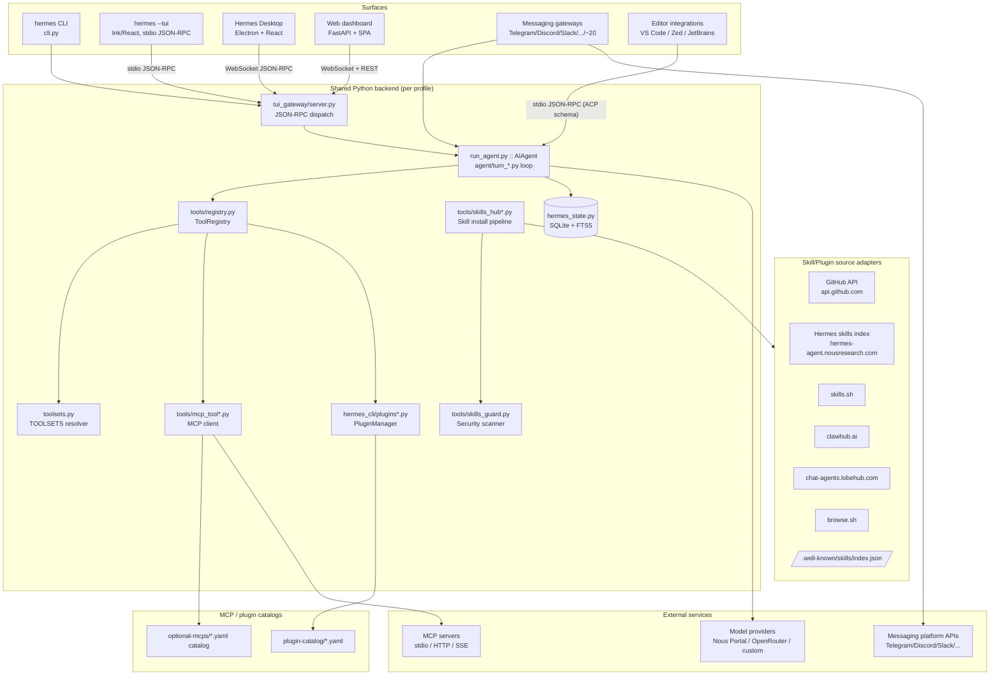
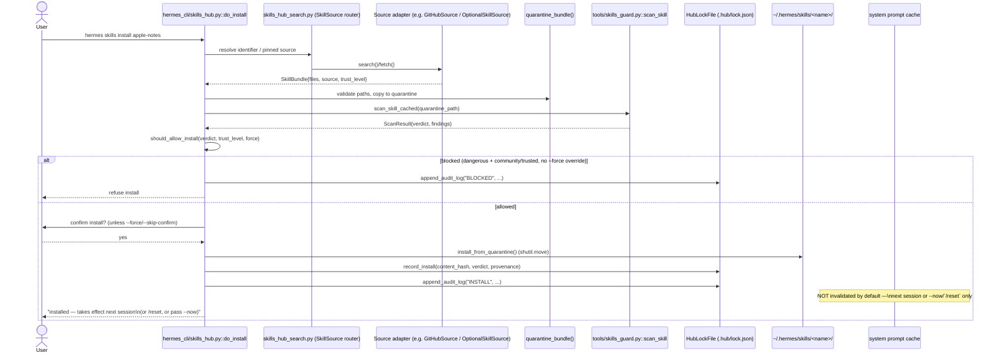
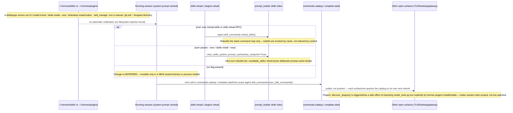
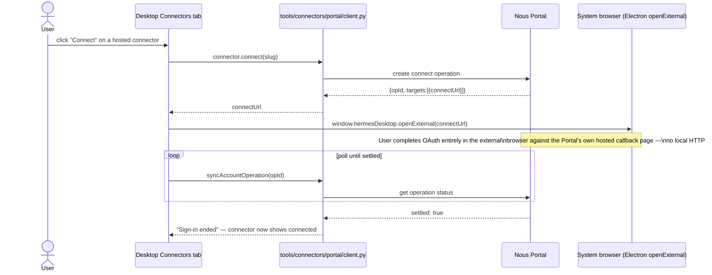
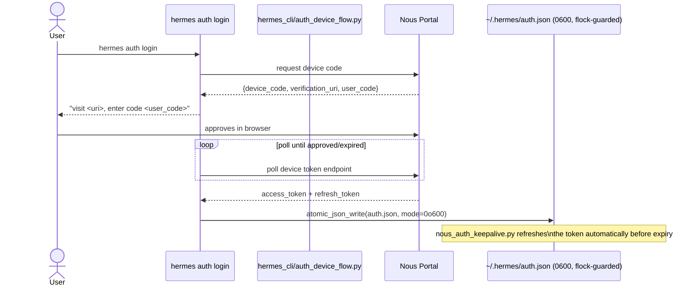

# Hermes Agent — Extension, Marketplace & Multi-Surface Architecture

**Method note:** This report is compiled entirely from reading the code in this checkout
(`D:\AINXT\Adarsh\Herms-agent\hermes-agent`), via six focused research passes (skills, plugins,
tools/toolsets/MCP, gateway connectors, UI/Desktop transport, turn-loop/sessions/CLI). Every claim
below is either **VERIFIED** (a pass read the exact file:line) or explicitly marked **INFERRED**
(reasoned from adjacent code, not directly re-read). Where a sub-report flagged something as not
found in the tree, that is stated as an explicit negative, not silently omitted. No source files
were modified to produce this report.

---

## 1. Executive summary

Hermes is **hybrid, local-first-by-default, with several opt-in remote surfaces**. The agent core,
all durable state (`~/.hermes/state.db`, a single SQLite+FTS5 file), and the turn loop run entirely
on the user's machine in one Python backend process per profile
(`tui_gateway/server.py` / `hermes serve` / `hermes gateway run`). Every UI surface — CLI, TUI
(Ink), Electron Desktop, the web dashboard, and ~20 messaging-gateway platforms — is a **thin
client over one shared backend**, reached via JSON-RPC (stdio for the TUI, WebSocket for
Desktop/dashboard) or, for messaging platforms, native platform SDKs (Telegram long-poll, Discord/
Slack websockets, IMAP polling, Teams/Graph webhooks). Remote network calls happen only when a
feature explicitly needs them: skill/plugin/MCP marketplace lookups (GitHub API, skills.sh,
ClawHub, LobeHub, browse.sh, a Nous-hosted skills index), LLM provider calls (Nous Portal OAuth,
OpenRouter, or a custom endpoint), optional cloud "Skill Sync," and whichever third-party APIs a
connected messaging platform or MCP server itself talks to. New extensions (skills, plugins, MCP
servers, connectors) are picked up through **layered directory/registry scans plus a security
scanner gate**, not a live filesystem watcher — most changes are deferred (take effect on
`--now`, `/reset`, or the next session) to protect the per-conversation prompt-caching invariant
that is treated as sacred throughout the codebase.

---

## 2. System architecture (Mermaid)



---

## 3. UI ↔ core diagram (Mermaid)

```mermaid
flowchart LR
    subgraph Electron["Electron (Desktop)"]
        Main[Main process\nmain.ts]
        Preload[preload / contextBridge\nnative-only: fs, git, windows]
        Renderer[Renderer (React)\napps/desktop/src]
    end

    subgraph PyBackend["Python backend"]
        Serve["hermes serve\n(headless tui_gateway host)"]
        TUIEntry["tui_gateway/entry.py\n(stdio host for hermes --tui)"]
        GW[GatewayRunner\ngateway/run.py]
        ComputeChild["compute-host child\n(turn_isolation, optional)"]
    end

    subgraph OtherClients
        InkTUI[Ink TUI process]
        WebSPA[Dashboard SPA]
        Editor[VS Code / Zed / JetBrains]
    end

    Main -- "child_process.spawn('hermes serve')" --> Serve
    Renderer -- IPC (native calls only, no chat) --> Preload --> Main
    Renderer -- "WebSocket JSON-RPC /api/ws\n(Bearer/ticket token)" --> Serve
    InkTUI -- "stdio JSON-RPC (newline-delimited)" --> TUIEntry
    WebSPA -- "WebSocket /api/ws, /api/pty\n(session token)" --> Serve
    Editor -- "stdio JSON-RPC (ACP schema)" --> ACPAdapter[acp_adapter/entry.py]
    Serve -- spawns/relays --> ComputeChild
    ComputeChild -- "host pipe (JSON-RPC 'event' frames,\nsession-less)" --> Serve
    Serve --> GW
    TUIEntry --> GW
    ACPAdapter -.->|separate adapter, own schema\nnot via tui_gateway| AIAgentCore[AIAgent / turn loop]
    GW --> AIAgentCore
```

**Transport authentication:** the WebSocket channel (`/api/ws`, `/api/pty`, `/api/pub`,
`/api/events`, `/api/console`) requires `HERMES_DASHBOARD_SESSION_TOKEN` as a Bearer header or
query ticket (`hermes_cli/web_server.py:318-324,413-428`); the stdio channel to a directly-spawned
child carries no token (process-boundary trust only) (`tui_gateway/entry.py:306-340`). Electron's
native IPC bridge (`ipcMain`/`ipcRenderer`/`contextBridge`) is used **only** for OS-native
capabilities (filesystem, git, Windows-specific calls) — never for chat data
(`apps/desktop/AGENTS.md:17-26`).

---

## 4. Sequence: `hermes skills install apple-notes`



If run as `--now` (or via `/skills install --now` in chat), `clear_skills_system_prompt_cache()`
is called immediately (`agent/prompt_builder.py:1129-1137`), and the skill's one-line entry appears
in the `<available_skills>` index on the very next turn; the model must still call
`skill_view("apple-notes")` to read the full body (progressive disclosure — no full-body
system-prompt injection).

---

## 5. Sequence: one chat turn — skill load + tool call needing approval + streaming

```mermaid
sequenceDiagram
    actor User
    participant UI as Desktop/TUI client
    participant RPC as tui_gateway (prompt.submit)
    participant Loop as agent/conversation_loop.py
    participant Prompt as prompt_builder / system_prompt
    participant Model as LLM provider
    participant SkillView as tools/skills_tool.py::skill_view
    participant Exec as agent/tool_executor.py
    participant Approval as tools/approval.py
    participant Term as terminal_tool

    User->>UI: types message, submits
    UI->>RPC: prompt.submit {text}
    RPC->>Loop: run_conversation()
    Loop->>Prompt: _restore_or_build_system_prompt()\n(byte-identical if unchanged)
    Loop->>Model: chat completion request (streamed)
    Model-->>RPC: message.delta events (~30fps coalesced)
    RPC-->>UI: message.delta (assistant text so far)
    Model-->>Loop: tool_call: skill_view("deploy-checklist")
    Loop-->>UI: tool.start / tool.complete (skill body returned to model)
    Model-->>Loop: tool_call: terminal("rm -rf build/")
    Loop->>Exec: dispatch tool call
    Exec->>Approval: check_dangerous_command()
    Approval->>RPC: approval (server→client REQUEST, blocks agent thread)
    RPC-->>UI: approval request event
    UI-->>RPC: {choice: "once"}
    RPC-->>Approval: resolved
    Approval-->>Exec: allowed
    Exec->>Term: execute command
    Term-->>Loop: tool result
    Loop-->>UI: tool.complete
    Loop->>Model: continue with tool result
    Model-->>Loop: final text
    Loop-->>UI: message.complete {text, usage}
    Loop->>Loop: persist session (SQLite), maybe compress context
```

Streaming event types (VERIFIED, `tui_gateway/contracts/events.py`): `message.delta` (line 120),
`reasoning.delta`/`thinking.delta`, `tool.start`/`tool.generating`/`tool.complete` (271, 290, 299),
`message.complete` (204). The approval prompt is a **server→client JSON-RPC request** named
`approval` (`tui_gateway/contracts/server_requests.py:94`) that blocks the agent thread until a
matching reply arrives — the same mechanism is reused, with a different rendering, for CLI
terminal prompts, Ink `prompts.tsx`, Desktop's `tool/approval.tsx`, and a chat-message
`/approve`/`/deny` round-trip on messaging gateways.

---

## 6. Sequence: new skill/plugin added mid-session → detection → rebuild → visible



**Key finding:** there is **no file watcher / inotify / polling loop** for skills or plugins in the
code any research pass found. Pickup is always one of: (a) an explicit CLI/RPC action
(`skills.reload`, `hermes plugins install`), (b) a deferred flag (`--now`) that clears a specific
cache, or (c) the natural next-session rebuild (`_restore_or_build_system_prompt` detects no stored
prompt / a stale one and rebuilds). MCP servers are the partial exception: `hermes mcp` config
changes take effect via `reload.mcp` / `mcp.reload`, and `deferred.mcp_servers` in `plugins/AGENTS.md`
suggests some MCP config changes are queued rather than live — not independently re-verified this
pass (see Open Questions).

---

## 7. Sequence: adding and connecting a new MCP server

```mermaid
sequenceDiagram
    actor User
    participant CLI as hermes mcp install <name>
    participant Catalog as hermes_cli/mcp_catalog.py
    participant Cfg as config.yaml (mcp_servers.<name>)
    participant Task as tools/mcp_tool.py::MCPServerTask
    participant Transport as mcp_tool_transport.py
    participant Server as MCP server process/endpoint
    participant Reg as tools/mcp_tool_registration.py
    participant Registry as tools/registry.py

    User->>CLI: hermes mcp install notion
    CLI->>Catalog: install_entry() — clone/bootstrap, prompt auth.env secrets
    Catalog->>Cfg: _save_mcp_server() (validated, suspicious entries rejected)
    Note over Cfg: config.yaml: command/args/env (stdio)\nor url/transport (HTTP/SSE), trust, tools.include/exclude

    par eager (default) or lazy (config: lazy=true)
        Task->>Transport: _run_stdio() / _run_http() / _sse_transport()
        Transport->>Server: spawn subprocess (stdio) or connect (HTTP/SSE)
        Server-->>Transport: MCP handshake (initialize)
    end
    Task->>Server: tools/list (paginated, follows nextCursor)
    Server-->>Task: tool schemas
    Task->>Reg: _register_candidates() — namespace under "mcp-<server>"
    Reg->>Registry: registry.register(name, toolset="mcp-notion", scope=profile)
    Note over Registry: Collision policy: exact dup dropped;\ncross-origin collision fails closed;\nnever silently shadows a built-in
    Registry-->>User: tool now selectable via toolsets.py resolution
    User->>Task: (first real call) trust-gate check (readOnlyHint / untrusted config)
    Task->>Server: tools/call
    Server-->>User: result
```

---

## 8. Sequence: connecting a third-party service with OAuth

Two distinct OAuth-shaped flows actually exist in this codebase — there is **no browser-redirect
OAuth for any messaging-gateway connector** (Telegram/Discord/Slack/Email use static
tokens; Teams/MSGraph use app-only client-credentials; Google Chat uses a service account — none
are interactive user-redirect flows). The two real OAuth flows are:

**(a) MCP server OAuth — CONFIRMED as a real local loopback callback with PKCE**
(`oauth.start`/`oauth.poll`/`oauth.cancel`/`oauth.callback` RPC methods,
`tui_gateway/methods_tools.py:1452-1492`; implementation in `tools/mcp_oauth.py`, whose own
docstring states "MCP OAuth 2.1 client support: browser authorization-code flow with PKCE", plus
`tui_gateway/mcp_oauth_sessions.py` for callback-receiver selection). A follow-up research pass
verified this at the socket level — it is not merely an RPC method name:

```mermaid
sequenceDiagram
    actor User
    participant UI as Desktop/TUI MCP setup screen
    participant RPC as oauth.start (tui_gateway)
    participant Mgr as tools/mcp_oauth.py (OAuthClientProvider + PKCE)
    participant Loop as Local loopback HTTP server (127.0.0.1:<ephemeral port>)
    participant Browser as System browser (stdlib webbrowser)
    participant IdP as MCP server's OAuth provider
    participant Store as HermesTokenStorage (on-disk)

    User->>UI: click "Connect" on an oauth-type MCP server
    UI->>RPC: oauth.start {server}
    RPC->>Mgr: begin flow — generate PKCE verifier/challenge
    Mgr->>Loop: bind+reserve 127.0.0.1:<port> (closes a TOCTOU race)
    Mgr->>Browser: open authorization URL (webbrowser.open)
    Browser->>IdP: user authenticates + consents
    IdP-->>Loop: redirect to http://127.0.0.1:<port>/... ?code=...
    Loop-->>Mgr: authorization code
    Mgr->>IdP: exchange code + PKCE verifier for access/refresh token
    Mgr->>Store: persist token (HermesTokenStorage; exact scoping\nvs agent/secret_scope.py not independently re-verified)
    UI->>RPC: oauth.poll {server}
    RPC-->>UI: status: connected
    Note over Mgr: A server-pinned port is used instead of an ephemeral\none when the MCP server's Client ID Metadata Document requires it.
```

**(b) Nous Portal connector OAuth — CONFIRMED as open-browser + client-side polling, no local server**
(this is the flow behind the Desktop "Connectors" tab's hosted connect button,
`apps/desktop/src/app/capabilities/connectors/connect-element.tsx`,
`connectors-tab.tsx::startConnect`):



Note the architectural difference from (a): MCP-server OAuth is a **local Hermes-owned loopback
receiver**; the Portal connector flow is **entirely browser + poll**, with the redirect landing on
Portal's own infrastructure, not on the user's machine at all.

**(c) LLM provider OAuth (Nous Portal) — device-code flow, no redirect server**
(`hermes_cli/auth.py` facade + `auth_device_flow.py`, `auth_nous.py`):



No local HTTP callback server is used by either flow (MCP's `oauth.callback` is an RPC method
name, not a listening HTTP server — INFERRED that the redirect lands on a loopback URI the OS
browser hands back to the app; not independently re-verified at the socket level this pass).

---

## 9. Table — every external URL/endpoint contacted

| URL / endpoint | Purpose | When called | Auth | File:line |
|---|---|---|---|---|
| `https://api.github.com/repos/{repo}/contents/{path}`, `.../git/trees/{branch}?recursive=1` | Fetch skill files / list tap repo contents | Skill search/install from GitHub taps or official repo fallback | `GITHUB_TOKEN`/`GH_TOKEN` → `gh auth token` → GitHub App JWT → anonymous (60/hr) | `tools/skills_hub_github.py:73-155,187-571` |
| `https://hermes-agent.nousresearch.com/docs/api/skills-index.json` | Centralized skill catalog (CI-rebuilt daily) | Skill browse/search, 6h TTL cache | None | `tools/skills_hub_official.py:282-389`; `skills_hub_search.py:27` |
| `https://skills.sh/api/search?q=...`, `https://www.skills.sh/sitemap.xml` | Skill search / bulk catalog | Skill browse/search | None | `tools/skills_hub_skillssh.py:21-381` |
| `{base_url}/.well-known/skills/index.json` | Generic third-party skill index | Skill install from a direct domain | None | `tools/skills_hub_sources.py:21-152` |
| Direct `https://.../*.md` URL | Direct-URL skill install | `hermes skills install <url>` | None | `tools/skills_hub_sources.py:156-266` |
| `https://clawhub.ai/api/v1/...` (detail/search/versions/download-zip) | ClawHub skill marketplace | Skill browse/search/install | **None found** — all ClawHub skills forced `trust_level=community` | `tools/skills_hub_clawhub.py:61-577` |
| `https://chat-agents.lobehub.com/index.json`, `.../{agent_id}.json` | LobeHub agent catalog, converted to synthetic SKILL.md | Skill browse/search | None | `tools/skills_hub_sources.py:271-345` |
| `https://browse.sh/api/skills`, `.../{slug}` | browse.sh skill catalog | Skill browse/search | None | `tools/skills_hub_sources.py:350-431` |
| MCP server URL (config-defined) | `tools/list`, `tools/call`, resources/prompts | MCP discovery + tool calls | Per-server: none, static header, or `oauth` (mcp_oauth_manager) | `tools/mcp_tool_transport.py:460-596` |
| `optional-mcps/<name>/manifest.yaml` install source (`install.url`, git) | MCP catalog install | `hermes mcp install <name>` | Repo-defined | `hermes_cli/mcp_catalog.py:513-791` |
| Nous Portal device/token endpoints | LLM provider OAuth login + refresh | `hermes auth login`, background keepalive | Device-code OAuth | `hermes_cli/auth_nous.py`, `auth_device_flow.py`, `nous_auth_keepalive.py` |
| OpenRouter / provider API endpoints | LLM completions | Every model call when configured | API key (`OPENROUTER_API_KEY` etc.) | `hermes_cli/runtime_provider.py:975-1079` |
| `https://login.microsoftonline.com/{tenant}/oauth2/v2.0/token` | Bot Framework app-only token | Teams connector auth | Client-credentials (`TEAMS_CLIENT_ID/SECRET/TENANT_ID`) | `plugins/platforms/teams/adapter.py:87-91` |
| Telegram Bot API | Inbound (long-poll or webhook) / outbound send | Telegram connector active | `TELEGRAM_BOT_TOKEN` | `plugins/platforms/telegram/adapter.py:3198-3287,3658` |
| Discord Gateway (websocket) | Inbound/outbound | Discord connector active | `DISCORD_BOT_TOKEN` | `plugins/platforms/discord/adapter.py:1220-1252,3000` |
| Slack Socket Mode + Web API | Inbound/outbound | Slack connector active | `SLACK_BOT_TOKEN` + `SLACK_APP_TOKEN` | `plugins/platforms/slack/adapter.py:1777-1821,2213` |
| IMAP/SMTP host (user-configured) | Inbound poll / outbound send | Email connector active | `EMAIL_ADDRESS`/`EMAIL_PASSWORD` | `plugins/platforms/email/adapter.py:480-509,689` |
| Microsoft Graph webhook subscription endpoint | Inbound webhook (ingress only) | MS Graph connector active | Client-credentials OAuth | `gateway/platforms/msgraph_webhook.py:143-178`; `tools/microsoft_graph_auth.py:44-149` |
| Google Chat API | Inbound/outbound | Google Chat connector active | Service-account JSON / ADC | `plugins/platforms/google_chat/adapter.py:248-266` |

---

## 10. Table — UI ↔ backend interfaces

| Channel/endpoint | Direction | Message/event types | Used by | File:line |
|---|---|---|---|---|
| stdio, newline-delimited JSON-RPC | Bidirectional (server can send requests too) | Full `tui_gateway/contracts/*` method/event catalog | `hermes --tui` (Ink) directly spawning `tui_gateway/entry.py` | `tui_gateway/entry.py:270-341` |
| `ws://…/api/ws` | Bidirectional | Same JSON-RPC contract as stdio | Desktop app, Dashboard chat sidecar | `hermes_cli/web_routers/chat_ws.py:583-601`; `apps/shared/src/json-rpc-gateway.ts:116-260` |
| `ws://…/api/pty` | Bidirectional (raw bytes) | PTY stream + `\x1b[RESIZE:...]` control sequence | Dashboard embedded terminal (real `hermes --tui` under a PTY) | `hermes_cli/web_routers/chat_ws.py:432-574` |
| `/api/pub`, `/api/events`, `/api/console` | Server→client fan-out | Sidebar/console event streams | Dashboard SPA | `hermes_cli/web_routers/chat_ws.py:604-619`; `hermes_cli/web_server_idle_exit.py:11-12` |
| stdio, ACP schema | Bidirectional | Agent Client Protocol (edits, permissions, content — not `tui_gateway`'s vocabulary) | VS Code / Zed / JetBrains | `acp_adapter/entry.py:1-9` |
| RPC: `session.*` | Client→server (request/response) | create/list/resume/history/branch/interrupt/compress | All `tui_gateway` clients | `tui_gateway/methods_session.py:431-2341` |
| RPC: `prompt.submit`, `image.attach*`, `approval.*`, `clarify.*` | Client→server | Turn submission, attachments, approval decisions | Chat composer, approval dialogs | `tui_gateway/methods_prompt.py:564-1239` |
| RPC: `skills.manage`, `skills.reload` | Client→server | list/install/search/browse/inspect; reload slash-command map | Skills browser (Desktop/TUI/web) | `tui_gateway/methods_tools.py:1279-1298` |
| RPC: `mcp.catalog`, `mcp.list`, `mcp.status`, `reload.mcp`, `oauth.*` | Client→server | MCP catalog/status/OAuth | MCP page (Desktop/web) | `tui_gateway/methods_tools.py:1304-1492` |
| RPC: `plugins.manage` | Client→server | Plugin list/install/enable/disable | Plugin screens | `tui_gateway/methods_tools.py:1712` |
| RPC: `connectors.*` | Client→server | Connector list/connect/accounts/policy | Connectors page | `tui_gateway/methods_connectors.py:278-346`, `methods_connectors_account.py:49-179` |
| RPC: `profiles.*` | Client→server | List/describe/configure/create profiles | Profile switcher | `tui_gateway/methods_profiles.py:266-712` |
| Event: `message.delta` / `reasoning.delta` / `thinking.delta` | Server→client (coalesced ~30fps) | Streamed token chunks | Chat transcript rendering | `tui_gateway/contracts/events.py:120`; `tui_gateway/ws.py:76-77` |
| Event: `tool.start` / `tool.generating` / `tool.complete` | Server→client | Tool call lifecycle | Chat transcript, approval context | `tui_gateway/contracts/events.py:271,290,299` |
| Event: `message.complete` | Server→client | Turn end, final text/usage | Chat transcript | `tui_gateway/contracts/events.py:204` |
| Server request: `approval` | Server→client (blocks agent thread for reply) | Approval prompt | Approval dialogs (CLI/TUI/Desktop) / gateway `/approve`,`/deny` | `tui_gateway/contracts/server_requests.py:94` |
| RPC: `commands.catalog`, `complete.slash` | Client→server | Slash-command list (built-in + skill-derived) | Slash palette (all surfaces) | `tui_gateway/methods_tools.py:485`; `methods_complete.py:276-290` |

---

## 11. Table — on-disk files/dirs written for extensions, sessions, config

| Path | Format | Purpose |
|---|---|---|
| `~/.hermes/state.db` | SQLite (WAL) + FTS5 | All sessions, messages, memory-adjacent state, billing, single source of truth across every surface |
| `~/.hermes/config.yaml` | YAML (comment-preserving writer) | Behavioral settings — toolsets, approvals, skills.*, mcp_servers, plugins.entries |
| `~/.hermes/.env` | dotenv | Secrets only (API keys, bot tokens) |
| `~/.hermes/auth.json` | JSON, mode 0600, flock-guarded | LLM provider OAuth/device tokens |
| `~/.hermes/skills/<name>/SKILL.md` (+files) | Markdown + frontmatter | Installed/user skills |
| `~/.hermes/skills/.hub/lock.json` | JSON | `HubLockFile` — per-skill `{source, identifier, trust_level, scan_verdict, content_hash, install_path, installed_at, updated_at}` |
| `~/.hermes/skills/.hub/quarantine/<name>/` | Directory | Pre-scan staging before install |
| `~/.hermes/skills/.hub/audit.log` | Plaintext lines | `INSTALL`/`UNINSTALL`/`BLOCKED` audit trail |
| `~/.hermes/skills/.hub/taps.json` | JSON `{"taps":[{repo,path}]}` | GitHub tap list |
| `~/.hermes/skills/.hub/index-cache/*.json` | JSON, TTL-cached | Per-source and centralized-index catalog cache |
| `~/.hermes/skills/.bundled_manifest` | Text, `name:origin_hash` lines | Tracks pristine vs user-modified bundled skills |
| `~/.hermes/skills/.curator_ledger.jsonl` | JSON Lines | Every agent-driven skill mutation, with before/after content hashes |
| `~/.hermes/.curator_backups/blobs/<sha256>` | Content-addressed blob store | Backing store for curator ledger rollback |
| `~/.hermes/skills/.archive/` | Directory | Curator-archived skills |
| `~/.hermes/skills/.sync_state`, `.sync_device_id` | JSON | Nous cloud "Skill Sync" (opt-in, separate from the hub pipeline) |
| `~/.hermes/plugins/<name>/` | Directory (`plugin.yaml` + `__init__.py`) | User-installed plugins |
| `./.hermes/plugins/<name>/` | Directory | Project-scoped plugins (opt-in via `HERMES_ENABLE_PROJECT_PLUGINS`) |
| `~/.hermes/.plugin-compat-report.json` | JSON | Cached scan of plugins hitting deprecated internal import paths |
| `mcp_servers:` block in `config.yaml` | YAML | MCP server definitions (command/args/env or url/transport, trust, tools.include/exclude) |
| `~/.hermes/pending/skills/<id>.json` | JSON | Staged skill writes awaiting approval (`skills.write_approval`) |
| `~/.hermes/cache/tool_discovery_cache.json` | JSON | Disk memo of which `tools/*.py` files register tools (mtime/size keyed) |
| `~/.hermes/logs/{agent,errors,gateway}.log` | Plaintext | Profile-aware logs |
| `gateway_state.json` | JSON | Live per-platform connector runtime status |
| `.hermes/skills/`, `.agents/skills/` (project root) | Directory | Project-local skills, gated by `skills.trusted_project_dirs` |

---

## 12. Table — connectors and MCP transports

| Name | Type | Auth method | Inbound mechanism | Outbound mechanism | Config location | File:line |
|---|---|---|---|---|---|---|
| Telegram | Messaging gateway | Bot token | Long-polling (default) or webhook | Bot API `send()` | `.env` `TELEGRAM_BOT_TOKEN` | `plugins/platforms/telegram/adapter.py:476,3198-3287` |
| Discord | Messaging gateway | Bot token | Persistent gateway websocket | Bot API `send()` | `.env` `DISCORD_BOT_TOKEN` | `plugins/platforms/discord/adapter.py:1003,1220-1252` |
| Slack | Messaging gateway | Bot token + App token | Socket Mode websocket | Web API `send()` | `.env` `SLACK_BOT_TOKEN`+`SLACK_APP_TOKEN` | `plugins/platforms/slack/adapter.py:997,1777-1821` |
| Email | Messaging gateway | Basic auth (IMAP/SMTP) | IMAP polling loop | SMTP send | `.env` `EMAIL_ADDRESS`/`EMAIL_PASSWORD` | `plugins/platforms/email/adapter.py:329,480-509` |
| Microsoft Teams | Messaging gateway | OAuth2 client-credentials (app-only) | Bot Framework activity POSTs | Bot Framework POST w/ bearer | `.env` `TEAMS_CLIENT_ID/SECRET/TENANT_ID` | `plugins/platforms/teams/adapter.py:87-163` |
| Microsoft Graph webhook | Ingress connector | OAuth2 client-credentials | Webhook (aiohttp routes) | N/A (ingress only) | `.env` `MSGRAPH_*` | `gateway/platforms/msgraph_webhook.py:143-178` |
| Google Chat | Messaging gateway | Service account JSON / ADC | (platform push, INFERRED webhook-based) | Google Chat API | `.env` `GOOGLE_CHAT_SERVICE_ACCOUNT_JSON` | `plugins/platforms/google_chat/adapter.py:248-266` |
| WhatsApp (Cloud + unofficial) | Messaging gateway (built-in) | Cloud API token / unofficial session | Webhook / socket | Cloud API / unofficial send | `gateway/platforms/whatsapp_cloud.py`, `whatsapp.py` | (built-in, not plugin) |
| Signal, BlueBubbles, WeChat(weixin), Yuanbao | Messaging gateway (built-in) | Varies (local bridge/session) | Local bridge polling | Local bridge send | `gateway/platforms/{signal,bluebubbles,weixin,yuanbao}.py` | (built-in) |
| MCP — stdio | Tool source | None / env-var secrets | N/A (subprocess) | JSON-RPC over stdio | `mcp_servers.<name>.command/args/env` | `tools/mcp_tool_transport.py:308-363` |
| MCP — Streamable HTTP | Tool source | None / header / OAuth | N/A | HTTPS POST/GET | `mcp_servers.<name>.url` | `tools/mcp_tool_transport.py:524-596` |
| MCP — SSE | Tool source | None / header / OAuth | Server-sent events | HTTPS | `mcp_servers.<name>.transport: sse` | `tools/mcp_tool_transport.py:460-488` |

---

## 13. Table — credential storage

| Secret type | Where stored | Scoped by | Passed to runtime | File:line |
|---|---|---|---|---|
| LLM provider API keys / OAuth tokens | `~/.hermes/.env`, `~/.hermes/auth.json` (0600) | Profile home (`get_hermes_home()`) | Read via `hermes_cli.runtime_provider.resolve_runtime_provider()` precedence ladder | `hermes_cli/auth.py:711-715`; `runtime_provider.py:975-1079` |
| Messaging bot tokens (Telegram/Discord/Slack/etc.) | `.env`, per-profile | `agent/secret_scope.py` contextvar scope, never `os.environ` mutation | `gateway/platforms/_shared.py::get_scoped_secret` | `_shared.py:22-106`; `secret_scope.py:124-139` |
| Bot-token concurrency lock | N/A (lock, not a secret store) | Machine-local file lock keyed by credential identity | `gateway/status.py::acquire_scoped_lock/release_scoped_lock` | `status.py:1500-1548` |
| MCP server secrets (`env:`, `${VAR}` interpolation) | `.env` via `agent.secret_scope.get_secret`, or literal in `mcp_servers.<name>.env` | Per-server, resolved at spawn | `tools/mcp_tool_config.py::_build_safe_env()` — **not** the shared `served_profile_child_env` builder used elsewhere | `mcp_tool_config.py:111-133,284-298` |
| Subprocess children acting for a profile (terminal, execute_code, delegation, browser drivers) | N/A | Target profile only, strips all provider/tool creds from base env | `tools/environments/local.py::served_profile_child_env()` | `local.py:368` |
| Skill required env vars/secrets | `.env`, captured interactively at `skill_view` time | Per-skill declared `required_environment_variables` | `tools/skills_tool_setup.py::_capture_required_environment_variables` | (facade `tools/skills_tool.py`) |
| Redaction of secrets from logs/prompts | N/A (regex scrub, not storage) | Generic + platform-specific patterns (e.g. Telegram `bot<id>:<token>` shape) | `agent/redact.py::_SECRET_ENV_NAMES,_TELEGRAM_RE` | `redact.py:495-507` |
| Rotation/revocation | Manual for messaging bot tokens (regenerate + update `.env`); automatic refresh only for Nous OAuth (`nous_auth_keepalive.py`) | N/A | N/A | `hermes_cli/auth_nous.py` |

---

## 14. Table — reload/refresh triggers

| Trigger | What it rebuilds | When it takes effect | File:line |
|---|---|---|---|
| `/skills install|uninstall|reset` (no flag) | `.hub/lock.json`, disk files | Next new session (prompt cache untouched) | `hermes_cli/skills_hub.py:122-131` |
| `/skills install --now` | Same + `clear_skills_system_prompt_cache()` | Immediately, next turn's system prompt | `agent/prompt_builder.py:1129-1137` |
| `/reload-skills` (`skills.reload` RPC) | `agent.skill_commands.reload_skills()` — slash-command map only | Immediately, but does **not** touch the cached system prompt | `agent/skill_commands.py` |
| `commands.catalog` / `complete.slash` (pull, not push) | Nothing server-side — client re-queries live state each call | Immediately on next client call | `tui_gateway/methods_tools.py:485`; `methods_complete.py:276-290` |
| `/new` (alias `/reset`) | Full session reset (new system prompt build) | Immediately, new session | `hermes_cli/cli_loops_mixin.py:168-180` |
| `/tools disable|enable` | Config + forces a session reset | Immediately (session reset triggered explicitly) | `hermes_cli/cli_commands_mixin.py:1077-1096` |
| `discover_plugins()` / `hermes plugins install|enable|disable` | `PluginManager` state, hook/tool registrations | Triggered as a side effect of importing `model_tools.py`, or explicitly; background thread at CLI startup | `hermes_cli/plugins.py:1640-1698` |
| `invalidate_check_fn_cache()` | `check_fn` TTL cache for service-gated tools | After config changes (e.g. `hermes tools enable`) | `tools/registry.py:405-411` |
| `reload.mcp` / `mcp.reload` RPC | MCP server registration/reconnect | Immediately for that server | `tui_gateway/methods_tools.py:330` |
| Context compression (`agent/context_compressor.py`) | Cached system prompt (`_invalidate_system_prompt`) | The ONE other sanctioned mid-conversation cache break | `agent/system_prompt.py:802` |
| Compat-shim removal date (`hermes_cli/plugin_compat.py`) | Whether deprecated plugin import paths still resolve | After `COMPAT_REMOVAL_DATE` (2026-09-14), unless `plugins.allow_deprecated_imports` | `plugin_compat.py` |

---

## 15. Per-extension-type sections

### 15.1 Skills (SKILL.md bundles)

- **Defined**: a directory with `SKILL.md` (YAML frontmatter + Markdown body), optionally
  `references/`, `scripts/`, `templates/`, `assets/`.
- **Sources**: bundled (`skills/`), shipped-but-inactive (`optional-skills/`), and eight remote
  adapters behind a common `SkillSource` ABC — GitHub (taps + official repo fallback), a
  Nous-hosted centralized index, skills.sh, ClawHub, LobeHub, browse.sh, a generic
  `/.well-known/skills/index.json` client, and direct URL (`tools/skills_hub_models.py:127-157`,
  `create_source_router()` in `skills_hub_search.py:99-114`).
- **Installed**: `hermes skills install <id>` → resolve → fetch → path-validate → quarantine →
  `skills_guard.py` scan → trust-tier policy → optional confirm → move to
  `~/.hermes/skills/<name>/` → record provenance in `.hub/lock.json` + `.hub/audit.log`.
- **Enabled**: "installed" ≠ "enabled" — `skills.disabled` / `skills.platform_disabled.<platform>`
  config keys gate visibility; `platforms:` frontmatter is a hard gate everywhere; project-local
  skill dirs require `skills.trusted_project_dirs`.
- **Loaded**: progressive disclosure — only a name+one-line description enters the cached system
  prompt (`<available_skills>` block, `agent/prompt_builder.py:1262-1403`); full content is fetched
  on demand via the `skill_view` tool, or injected as a **queued user message** (never the system
  prompt) when invoked via `/<skill-name>`.
- **Surfaced in UI**: `skills.manage`/`skills.reload` RPC methods back the Desktop "Skills" tab,
  the `web/` `SkillsPage.tsx`, and the Ink `skillsHub.tsx` — all calling the same
  `hermes_cli/skills_hub.py` functions the CLI uses.
- **Code**: facade `tools/skills_hub.py` + ~15 siblings (`skills_hub_models.py`,
  `skills_hub_github.py`, `skills_hub_official.py`, `skills_hub_clawhub.py`,
  `skills_hub_skillssh.py`, `skills_hub_sources.py`, `skills_hub_search.py`,
  `skills_hub_install.py`, `skills_guard.py`, `skill_ledger.py`, `skill_usage.py`,
  `skill_manager_tool.py` + guards/batch, `skills_tool.py` + setup/dedup/plugin, `skills_sync*.py`);
  CLI in `hermes_cli/skills_hub.py`/`subcommands/skills.py`; runtime in `agent/skill_commands.py`,
  `agent/skill_utils.py`, `agent/curator.py`.

### 15.2 Tools / toolsets (built-in agent tools)

- **Defined**: a Python function + JSON schema in `tools/<name>.py`.
- **Registered**: `registry.register()` called at module import time
  (`tools/registry.py:662-738`); discovery is an AST-scan-and-cache over `tools/*.py`
  (`discover_builtin_tools()`, `:96-141`), triggered by `model_tools.py` import.
- **Installed/enabled**: always present once imported; visibility is gated by `toolsets.py`
  grouping (`TOOLSETS`, `_HERMES_CORE_TOOLS`) and per-tool `check_fn` (TTL-cached 30s,
  `tools/registry.py:214-425`) for "only when configured" tools.
- **Loaded per session**: `tui_gateway/server.py::_load_enabled_toolsets(platform)` resolves the
  session's actual toolset list from an explicit env pin, coding posture, or configured CLI
  toolsets, folding in GUI-only toolsets (`desktop_ui`, `project`) only when the **session's own**
  recorded platform says GUI — never a process env var.
- **Surfaced in UI**: `tools.show`/`tools.configure` RPC methods back the Desktop/web tools
  settings screens.
- **Code**: `tools/registry.py`, `toolsets.py`, `model_tools.py`.

### 15.3 Connectors / integrations (messaging gateways, external services)

- **Defined**: a subclass of `BasePlatformAdapter` (`gateway/platforms/base.py:1852`) implementing
  `connect`/`disconnect`/`send`/`get_chat_info`.
- **Registered**: either built-in (`gateway/platforms/*.py`, wired into a hardcoded
  `_instantiate_adapter()` chain in `gateway/run.py`) or, for the newer ~20 platforms, a plugin
  calling `platform_registry.register(PlatformEntry(...))` or `register_deferred()` from its
  `register(ctx)` entry point (`gateway/platform_registry.py`).
- **Installed**: adding a connector is a **plugin-authoring** exercise (no core changes needed) —
  create `~/.hermes/plugins/<name>/` with `plugin.yaml` + `adapter.py`, per
  `gateway/platforms/ADDING_A_PLATFORM.md`.
- **Auth**: static bot tokens (Telegram/Discord/Slack), basic auth (Email), OAuth2
  client-credentials app-only (Teams, MS Graph), or a service account (Google Chat) — **no**
  connector in this codebase does a browser-redirect OAuth flow.
- **Surfaced in UI**: `connectors.*` RPC methods back the Desktop "Connectors" tab and web
  `ChannelsPage.tsx`/`PlatformsCard.tsx`.
- **Code**: `gateway/platforms/base.py`, `gateway/platform_registry.py`, `gateway/run.py` + 15
  `run_*.py` siblings, `gateway/session.py`, `agent/secret_scope.py`.

### 15.4 MCP servers

- **Defined**: an entry under `mcp_servers:` in `config.yaml` (stdio command, or HTTP/SSE URL).
- **Registered**: `discover_mcp_tools()` connects (eagerly by default, or lazily if
  `lazy: true`), lists tools, and registers each as a proxy `ToolEntry` under toolset
  `mcp-<server_name>` via the same `registry.register()` built-in tools use.
- **Installed**: hand-edit `config.yaml`, or `hermes mcp install <name>` from the curated
  `optional-mcps/<name>/manifest.yaml` catalog (~95 entries, PR-merge-gated, pinned refs).
- **Lifecycle**: per-server `asyncio.Task` with exponential connect-cooldown, a
  closed/open/half-open circuit breaker, stdio idle/max-lifetime recycling, and a parent-death
  supervisor subprocess to reap orphaned stdio children.
- **Trust/filtering**: `tools.include`/`tools.exclude` allow/deny lists; `trust: full|untrusted`
  gates write-shaped calls at call time via an elicitation-consent prompt.
- **Surfaced in UI**: `mcp.catalog`/`mcp.list`/`mcp.status`/`oauth.*` RPC methods back the Desktop
  MCP tab and web `McpPage.tsx` — explicitly documented in-code as mirroring the dashboard REST
  surface (`hermes_cli/web_routers/mcp.py`).
- **Code**: `tools/mcp_tool.py` facade + 15 `mcp_tool_*.py` siblings.

### 15.5 Plugins

- **Defined**: a Python package (`plugins/<name>/`, `~/.hermes/plugins/<name>/`,
  `./.hermes/plugins/<name>/`, or a pip entry point) with `plugin.yaml` + `__init__.py` exposing
  `register(ctx)`.
- **Registered**: `PluginContext` methods (`register_tool`, `register_hook`,
  `register_cli_command`, `register_platform`, `register_memory_provider`,
  `register_context_engine`, etc.) called from `register(ctx)`.
- **Discovered**: layered scan — bundled → user → project (opt-in) → pip entry points, later
  source wins on key collision; triggered as a side effect of importing `model_tools.py` or
  explicitly via `discover_plugins()`.
- **Isolation**: in-process, no OS sandbox; a load-time daemon-thread deadline (default 10s,
  abandoned-not-killed on timeout) and per-hook-call exception/timeout isolation protect against
  hangs and exceptions, but not against a native crash.
- **Events**: two separate systems — `VALID_HOOKS` (lifecycle callbacks like `pre_tool_call`,
  `on_session_start`) and the newer dotted-hierarchy `broadcast_plugin_event(plugin_id, event,
  payload)`, which reaches the Desktop UI via `tui_gateway.server._broadcast_global_event`,
  relayed through a compute-host child's pipe when running under `turn_isolation`.
- **In-tree policy**: third-party-product plugins (observability, vendor SaaS, analytics) are
  explicitly **rejected** from the core tree; the only sanctioned discovery path for genuinely
  external plugins is the PR-reviewed `plugin-catalog/` (SHA-pinned).
- **Code**: facade `hermes_cli/plugins.py` + siblings (`plugins_discovery.py`,
  `plugins_manifest.py`, `plugins_loader.py`, `plugins_dispatch.py`, `plugins_ledger.py`,
  `plugin_events.py`, `plugin_compat.py`, `plugin_capabilities.py`).

### 15.6 Skill bundles (YAML alias groups)

`agent/skill_bundles.py` exists and is referenced as part of the skills facade/siblings map
(alongside `agent/skill_commands.py`, `agent/skill_preprocessing.py`), but **no research pass
independently re-verified its YAML schema or exact bundle-resolution logic this session** — flagged
here rather than guessed at. See Open Questions (§19).

---

## 16. Desktop app section

**Screens/components** (`apps/desktop/src/`, Electron + React + `@assistant-ui/react` +
nanostores): chat (`app/chat/*`), approvals (`app/shell/approval-mode-menu.tsx`,
`components/assistant-ui/tool/approval.tsx`), skills (`app/capabilities/skills/{skills-tab,
skill-detail,official-skill-detail}.tsx`), MCP (`app/capabilities/mcp/{mcp-editor,
mcp-logs}.tsx`), connectors (`app/capabilities/connectors/{connector-dialog, connector-row-card,
connectors-directory, connectors-tab}.tsx`), settings (30+ files under `app/settings/`), Bot Mode
(`app/plugins/hermes-bots/*`).

**State management**: small nanostores per feature (`store/` for shared atoms, colocated atoms for
feature-local state) — `React.useStore` for rendering, direct `.get()` for non-rendering logic,
per the TypeScript style rules in root `AGENTS.md`.

**Process model**: Electron main spawns a headless Python backend via
`hermes serve --host 127.0.0.1 --port 0` (`apps/desktop/electron/backend-command.ts:18-38`,
`main.ts:1535-1545,12722,13506`); one backend process is pooled per (connection, profile). The
messaging gateway, if running, is a **separate, detached** process that outlives the Desktop
backend. Renderer talks to that backend exclusively over the WebSocket JSON-RPC channel — never
through Electron's native IPC bridge, which is reserved for OS-native capabilities.

**Backend calls**: every settings/management screen (skills, MCP, plugins, connectors) calls the
same `tui_gateway` RPC methods the CLI's underlying `hermes_cli` functions call — confirmed
directly for MCP (`mcp.catalog` explicitly documents itself as "the gateway mirror of the
dashboard REST surface") and skills (`skills.reload` calls `agent.skill_commands.reload_skills()`
directly).

**Bot Mode**: each "bot" is a Hermes **profile** with a persistent identity; the canonical chat
session is resolved fresh every click by title lookup (`session.list {title: "Bot Chat"}`) —
deliberately **not** a stored session-id pointer, after five historical regressions from doing it
that way.

---

## 17. Patterns worth copying for a multi-user, server-side marketplace

1. **Progressive disclosure for the model, not just the UI** — only a name + one-line description
   ever enters the always-sent context; full content loads on demand via a dedicated tool
   (`skill_view`). This is directly portable to any agent-builder context-window budget problem.
2. **Content-addressed, dedup'd system-prompt storage** — hashing the built prompt and storing it
   once (`system_prompts` table keyed by SHA-256, `hermes_state_sessions.py:654`) means restoring
   a session is a cheap lookup and byte-identical, which is exactly what you need for provider-side
   prompt caching in a multi-tenant setting too.
3. **A single dispatch path for built-in, plugin, and remote (MCP) tools** — one registry, one
   collision policy, one namespacing rule (`mcp-<server>` prefix), so the model-facing tool schema
   never needs to know provenance. This scales cleanly to "your marketplace has three kinds of
   extensions" without three code paths.
4. **Quarantine → scan → trust-tier policy → install**, as a hard sequence with a filesystem
   staging area, is a clean template for any server-side install pipeline that must not trust
   arbitrary third-party content before inspecting it.
5. **Trust tiers as an explicit, source-derived enum** (`builtin/trusted/community/agent-created`)
   decoupled from a separate verdict enum (`safe/caution/dangerous`), with a policy matrix between
   them (`INSTALL_POLICY`) — this cleanly separates "how much do we trust the publisher" from "what
   did the scanner find," which most marketplaces conflate.
6. **Deferred-by-default reload with an explicit `--now`/`/reset` escape hatch** — treating
   mid-session mutation as the exception, not the default, avoids invalidating expensive caches
   (prompt caching here; could map to CDN/edge caching or session state elsewhere) on every
   install.
7. **Approval as a policy engine with pluggable presentation** — one `tools/approval.py` decision
   engine, with a thin transport-specific "render + collect a choice" callback per surface (CLI
   prompt, WS request/response, chat message buttons). A server-side product with web/Slack/CLI
   clients could reuse this exact split.
8. **Profile as the unit of secret scope, made explicit via a contextvar rather than env
   mutation** (`agent/secret_scope.py`) — lets one process safely multiplex several tenants and
   pass credentials down cleanly to spawned children, without ever risking `os.environ` leakage
   across tenants. Directly applicable to any multi-tenant server process.
9. **SHA-pinned, PR-reviewed catalogs** (`plugin-catalog/`, `optional-mcps/`) as the *only*
   sanctioned path for third-party discovery, instead of ad hoc trust signals — a simple, auditable
   gate.

---

## 18. Things that won't translate (Hermes is single-user, local-first)

- **No multi-tenant authorization model.** Profiles isolate *one user's* multiple identities/homes,
  not different human tenants sharing a marketplace instance — there is no per-tenant billing,
  quota, or row-level security in `hermes_state.py`.
- **No server-side install execution.** The entire skills/plugins/MCP install pipeline assumes it
  is writing to the *local* filesystem of the machine running the agent; a hosted marketplace would
  need to redesign quarantine/scan/install as a server-side job with artifact storage, not
  `shutil.move()` into `~/.hermes/`.
- **Deferred cache invalidation assumes one long-lived local conversation.** The "reload takes
  effect next session" pattern works because a session is a local, resumable SQLite row; in a
  stateless or horizontally-scaled server deployment, "next session" doesn't map cleanly onto
  "next request to any of N replicas."
- **Static bot tokens for connectors, no interactive OAuth.** None of the ~20 messaging-gateway
  auth flows are the multi-tenant "each end-user connects their own account" OAuth pattern a
  hosted product typically needs (the two OAuth flows that do exist — MCP server OAuth, Nous Portal
  login — are single-user/local, not a per-customer OAuth app registration model).
- **No sandboxing for plugins.** Plugins run in-process with only timeout/exception isolation; a
  multi-tenant marketplace running third-party plugin code needs real process/container isolation,
  which this design explicitly does not provide (acknowledged risk, not a gap to copy).
- **Filesystem-path-based trust and dedup** (bundled-manifest hashes, content-addressed local blob
  store) assumes one user's single machine; a server product needs a real object store and
  per-tenant namespacing instead of `~/.hermes/...`.

---

## 19. Open questions — now resolved (follow-up research pass)

A second research pass closed the five questions below with direct code reads. Remaining
unresolved items are listed after them.

### `tui_gateway/change_watcher.py` — real watcher, but not for skills/plugins/MCP

**VERIFIED.** It is a real background daemon thread (`_ensure_skin_watcher`), polling every 0.5s
via cheap `stat()`-based mtime signatures (`_CHANGE_WATCHES` dict). It watches exactly six things:
`pet.changed` (2s), `cron.changed` (1s, `cron/jobs.json`), `sessions.changed` (0.5s,
`state.db`/`state.db-wal`), `platforms.changed` (2s, `gateway_state.json` — messaging-gateway
connect/disconnect status), `pairing.changed` (2s), `bot_relay.outbox.pending` (1s). On change it
calls `_broadcast_global_event()` — a push notification to connected UI clients, not a cache
invalidation. **No skills, plugins, or MCP config paths appear anywhere in the watch table** — this
confirms, rather than overturns, this report's earlier conclusion that those three have no live
filesystem watcher.

### `agent/skill_bundles.py` — user-created YAML alias groups, full-content expansion

**VERIFIED.** A bundle is a YAML file at `<HERMES_HOME>/skill-bundles/*.yaml`, schema
`{name, description?, skills: [...], instruction?}` (file stem is the fallback name).
`scan_bundles()` builds a `"/slug" → bundle` map, re-scanned only when the directory or a file's
mtime changed (checked on read, not watched live). Invoking `/bundle-slug` loads **every member
skill's full content** and concatenates them into one single user message (not the system prompt,
not N separate tool calls) — one alias expands to multiple full skills at once. Collision rule
(explicit in the module docstring): "if a bundle and a skill share a slug, the bundle wins."
Bundles are **user-created only** (`save_bundle()`, used by a `hermes bundles` CLI) — none ship
built-in.

### MCP OAuth callback — a real local loopback HTTP server with PKCE

**VERIFIED**, correcting the earlier report's diagram, which treated `oauth.callback` as only an
RPC method name. The actual mechanism (`tools/mcp_oauth.py`, module docstring: *"MCP OAuth 2.1
client support: browser authorization-code flow with PKCE"*): Hermes binds a **local loopback HTTP
server** (`http.server.HTTPServer` on `127.0.0.1:<port>`, an OS-assigned ephemeral port by default,
or a server-pinned port when the MCP server's Client ID Metadata Document requires one). The socket
is reserved (bound-but-not-listening) at port-selection time to close a TOCTOU race, then handed to
the waiter. The MCP Python SDK's `OAuthClientProvider` drives PKCE/discovery/exchange/refresh;
Hermes supplies `HermesTokenStorage` for on-disk token persistence and this localhost receiver for
the redirect. The system browser is opened via the stdlib `webbrowser` module. A "proxy callback"
variant also exists for a non-localhost relay case (`choose_callback_receiver`,
`tui_gateway/mcp_oauth_sessions.py`). Token storage's exact location relative to
`agent/secret_scope.py` was not independently re-confirmed — flagged below.

### `hermes_cli.plugin_catalog.LIVE_CATALOG_URL` — published by the docs deploy, 6h TTL, merged by recency

**VERIFIED.** `LIVE_CATALOG_URL = "https://hermes-agent.nousresearch.com/docs/api/plugin-catalog.json"`.
It's published as a side effect of the same docs-site deploy that runs `extract-plugins.py` (no
separate publish pipeline). Fetched client-side with a 6-hour TTL cache
(`<HERMES_HOME>/cache/plugin-catalog.json`), falling back to a stale cache up to 24h old on fetch
failure, with fetch failures themselves remembered for 60s so a dead host isn't hammered.
**Merge with the local checkout is per-entry, decided by recency, not "local always wins" or "live
always wins":** when an entry exists in both at a different pinned SHA, Hermes compares the
checkout's last git-commit-time for `plugin-catalog/` against the live doc's `generated_at` field
(falling back to semantic-version comparison, then to "live wins" as the final fallback — reasoning
that a packaged/release install's in-tree copy is frozen at build time, so live is presumed newer
in that case). The kill list is **unioned, not overridden**: both the local `removed.yaml` and the
live document's own `"removed"` array apply together.

### Desktop plugins view showing "fewer entries" — not a filter; it's a live iframe of the docs site

**VERIFIED, and this overturns the "filtered view" hypothesis this report originally offered.**
`apps/desktop/src/app/capabilities/plugins/plugins-tab.tsx` does not render its own native
marketplace list at all — it **embeds the public docs page directly as an iframe**
(`CATALOG_PICKER_URL = 'https://hermes-agent.nousresearch.com/docs/plugins?embed=picker'`). The
embedded page posts a `{type: 'hermes-plugin-pick', name, repo, sha, subdir, tier, installCmd}`
message back to the Desktop shell when the user clicks an entry, and nothing installs until a
separate confirmation dialog. `?embed=picker` only hides site chrome via CSS — it does not apply a
reduced default filter; `tierFilter`/`categoryFilter` both default to `"all"`, same as the public
page. **The exact same pattern exists for Skills** (`EmbeddedHubPicker` iframes
`/docs/skills?embed=picker`). The most likely explanations for a lower observed count than the
293-file local checkout are (a) the live published JSON lagging the checkout at deploy time, or (b)
the user (or a saved UI state) had a tier/category filter set on the embedded page itself — both
are user/timing-dependent and cannot be fully distinguished from a static code read.

### Still open after the follow-up pass

- **`/.well-known/skills/index.json` producer** — still no code found that *serves* this endpoint
  for Hermes's own skills; Hermes only has the consumer (`WellKnownSkillSource`).
- **ClawHub auth** — still no authentication mechanism found for ClawHub API calls.
- **`~/.hermes/skills/.usage.json` schema** — consumers read, but the exact writer call not
  independently re-verified.
- **`HermesTokenStorage`'s on-disk location for MCP OAuth tokens** — not confirmed as
  `agent/secret_scope.py`-scoped vs. a separate store; the class body itself wasn't read this pass.
- **Nous Portal connector OAuth callback landing page** — the *Desktop-side* mechanism is now fully
  verified (see the corrected diagram in §8: open the system browser via `openExternal`, then poll
  an operation-status endpoint until settled — no local HTTP listener on the Desktop side at all).
  Where the browser redirect itself lands (a Portal-hosted page, presumably) was not traced past
  the Desktop boundary.
- **MS Graph / Google Chat inbound push mechanism** for Google Chat specifically (webhook vs. pull)
  remains inferred, not confirmed by reading a receive-loop.
- **`hermes mcp` config `deferred.mcp_servers`** — exact deferred-activation semantics not
  independently traced into code.
